# Class Diagram PlantUML - UC01-UC39

Mỗi use case bên dưới là một class diagram độc lập, trích theo các lớp đang có trong project Spring Boot. Có thể copy từng block `@startuml ... @enduml` lên PlantText hoặc PlantUML Online Server để render hình.

## UC01 - Đăng ký tài khoản bằng email trường

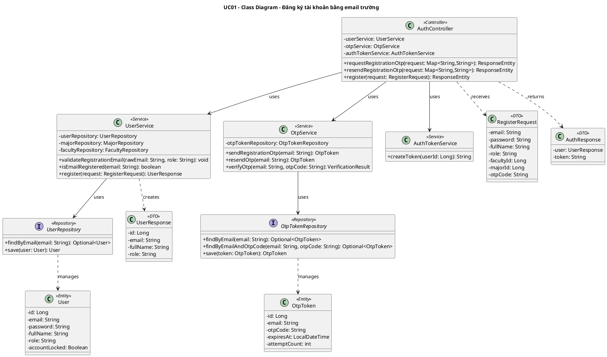
```plantuml
@startuml
title UC01 - Class Diagram - Đăng ký tài khoản bằng email trường
skinparam classAttributeIconSize 0

class AuthController <<Controller>> {
  -userService: UserService
  -otpService: OtpService
  -authTokenService: AuthTokenService
  +requestRegistrationOtp(request: Map<String,String>): ResponseEntity
  +resendRegistrationOtp(request: Map<String,String>): ResponseEntity
  +register(request: RegisterRequest): ResponseEntity
}
class UserService <<Service>> {
  -userRepository: UserRepository
  -majorRepository: MajorRepository
  -facultyRepository: FacultyRepository
  +validateRegistrationEmail(rawEmail: String, role: String): void
  +isEmailRegistered(email: String): boolean
  +register(request: RegisterRequest): UserResponse
}
class OtpService <<Service>> {
  -otpTokenRepository: OtpTokenRepository
  +sendRegistrationOtp(email: String): OtpToken
  +resendOtp(email: String): OtpToken
  +verifyOtp(email: String, otpCode: String): VerificationResult
}
class AuthTokenService <<Service>> {
  +createToken(userId: Long): String
}
interface UserRepository <<Repository>> {
  +findByEmail(email: String): Optional<User>
  +save(user: User): User
}
interface OtpTokenRepository <<Repository>> {
  +findByEmail(email: String): Optional<OtpToken>
  +findByEmailAndOtpCode(email: String, otpCode: String): Optional<OtpToken>
  +save(token: OtpToken): OtpToken
}
class RegisterRequest <<DTO>> {
  -email: String
  -password: String
  -fullName: String
  -role: String
  -facultyId: Long
  -majorId: Long
  -otpCode: String
}
class UserResponse <<DTO>> {
  -id: Long
  -email: String
  -fullName: String
  -role: String
}
class AuthResponse <<DTO>> {
  -user: UserResponse
  -token: String
}
class User <<Entity>> {
  -id: Long
  -email: String
  -password: String
  -fullName: String
  -role: String
  -accountLocked: Boolean
}
class OtpToken <<Entity>> {
  -id: Long
  -email: String
  -otpCode: String
  -expiresAt: LocalDateTime
  -attemptCount: int
}

AuthController --> UserService : uses
AuthController --> OtpService : uses
AuthController --> AuthTokenService : uses
AuthController ..> RegisterRequest : receives
AuthController ..> AuthResponse : returns
UserService --> UserRepository : uses
UserService ..> UserResponse : creates
OtpService --> OtpTokenRepository : uses
UserRepository ..> User : manages
OtpTokenRepository ..> OtpToken : manages
@enduml
```

## UC02 - Đăng nhập bằng email trường

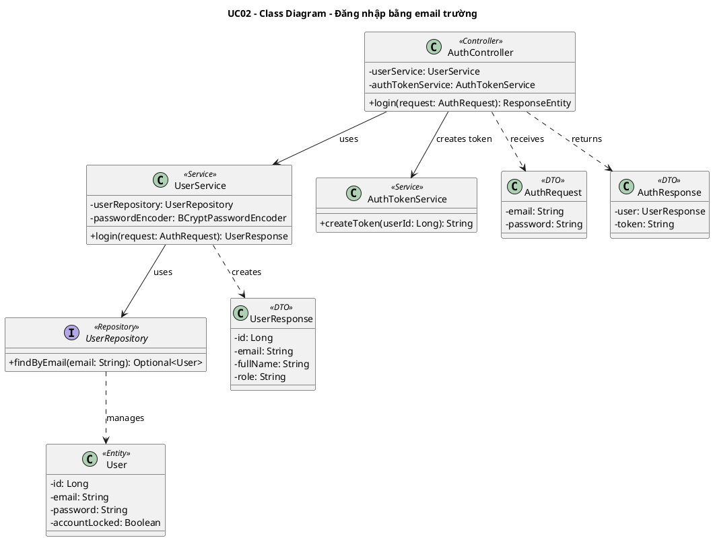
```plantuml
@startuml
title UC02 - Class Diagram - Đăng nhập bằng email trường
skinparam classAttributeIconSize 0

class AuthController <<Controller>> {
  -userService: UserService
  -authTokenService: AuthTokenService
  +login(request: AuthRequest): ResponseEntity
}
class UserService <<Service>> {
  -userRepository: UserRepository
  -passwordEncoder: BCryptPasswordEncoder
  +login(request: AuthRequest): UserResponse
}
class AuthTokenService <<Service>> {
  +createToken(userId: Long): String
}
interface UserRepository <<Repository>> {
  +findByEmail(email: String): Optional<User>
}
class AuthRequest <<DTO>> {
  -email: String
  -password: String
}
class AuthResponse <<DTO>> {
  -user: UserResponse
  -token: String
}
class UserResponse <<DTO>> {
  -id: Long
  -email: String
  -fullName: String
  -role: String
}
class User <<Entity>> {
  -id: Long
  -email: String
  -password: String
  -accountLocked: Boolean
}

AuthController --> UserService : uses
AuthController --> AuthTokenService : creates token
AuthController ..> AuthRequest : receives
AuthController ..> AuthResponse : returns
UserService --> UserRepository : uses
UserService ..> UserResponse : creates
UserRepository ..> User : manages
@enduml
```

## UC03 - Đăng xuất

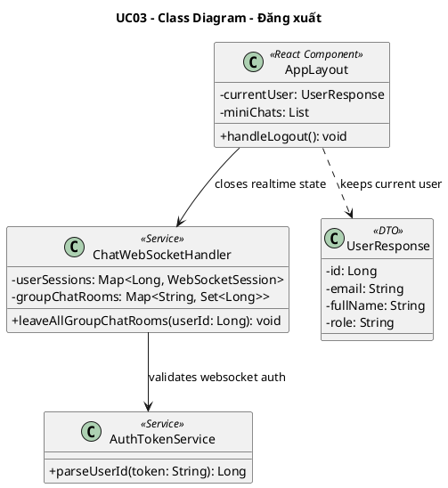
```plantuml
@startuml
title UC03 - Class Diagram - Đăng xuất
skinparam classAttributeIconSize 0

class AppLayout <<React Component>> {
  -currentUser: UserResponse
  -miniChats: List
  +handleLogout(): void
}
class ChatWebSocketHandler <<Service>> {
  -userSessions: Map<Long, WebSocketSession>
  -groupChatRooms: Map<String, Set<Long>>
  +leaveAllGroupChatRooms(userId: Long): void
}
class AuthTokenService <<Service>> {
  +parseUserId(token: String): Long
}
class UserResponse <<DTO>> {
  -id: Long
  -email: String
  -fullName: String
  -role: String
}

AppLayout --> ChatWebSocketHandler : closes realtime state
ChatWebSocketHandler --> AuthTokenService : validates websocket auth
AppLayout ..> UserResponse : keeps current user
@enduml
```

## UC04 - Đổi mật khẩu

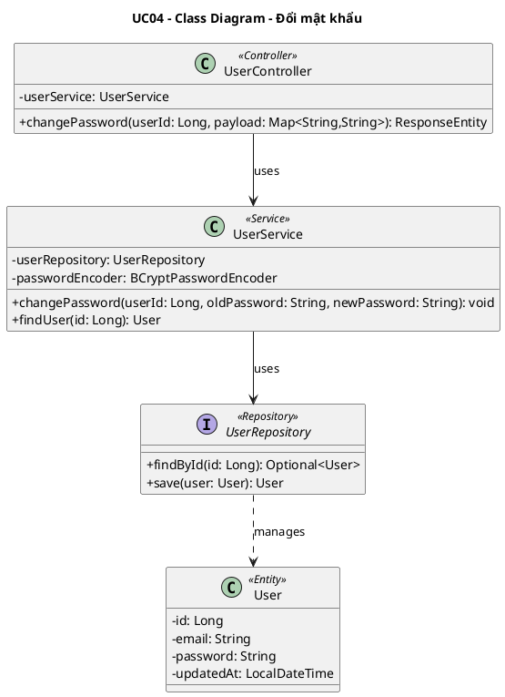
```plantuml
@startuml
title UC04 - Class Diagram - Đổi mật khẩu
skinparam classAttributeIconSize 0

class UserController <<Controller>> {
  -userService: UserService
  +changePassword(userId: Long, payload: Map<String,String>): ResponseEntity
}
class UserService <<Service>> {
  -userRepository: UserRepository
  -passwordEncoder: BCryptPasswordEncoder
  +changePassword(userId: Long, oldPassword: String, newPassword: String): void
  +findUser(id: Long): User
}
interface UserRepository <<Repository>> {
  +findById(id: Long): Optional<User>
  +save(user: User): User
}
class User <<Entity>> {
  -id: Long
  -email: String
  -password: String
  -updatedAt: LocalDateTime
}

UserController --> UserService : uses
UserService --> UserRepository : uses
UserRepository ..> User : manages
@enduml
```

## UC05 - Cập nhật thông tin cá nhân

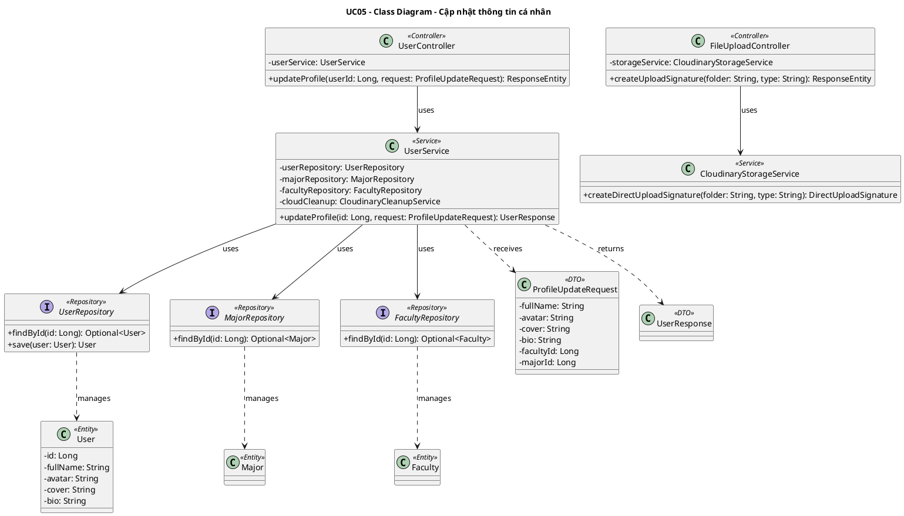
```plantuml
@startuml
title UC05 - Class Diagram - Cập nhật thông tin cá nhân
skinparam classAttributeIconSize 0

class UserController <<Controller>> {
  -userService: UserService
  +updateProfile(userId: Long, request: ProfileUpdateRequest): ResponseEntity
}
class FileUploadController <<Controller>> {
  -storageService: CloudinaryStorageService
  +createUploadSignature(folder: String, type: String): ResponseEntity
}
class UserService <<Service>> {
  -userRepository: UserRepository
  -majorRepository: MajorRepository
  -facultyRepository: FacultyRepository
  -cloudCleanup: CloudinaryCleanupService
  +updateProfile(id: Long, request: ProfileUpdateRequest): UserResponse
}
class CloudinaryStorageService <<Service>> {
  +createDirectUploadSignature(folder: String, type: String): DirectUploadSignature
}
interface UserRepository <<Repository>> {
  +findById(id: Long): Optional<User>
  +save(user: User): User
}
interface MajorRepository <<Repository>> {
  +findById(id: Long): Optional<Major>
}
interface FacultyRepository <<Repository>> {
  +findById(id: Long): Optional<Faculty>
}
class ProfileUpdateRequest <<DTO>> {
  -fullName: String
  -avatar: String
  -cover: String
  -bio: String
  -facultyId: Long
  -majorId: Long
}
class UserResponse <<DTO>>
class User <<Entity>> {
  -id: Long
  -fullName: String
  -avatar: String
  -cover: String
  -bio: String
}
class Major <<Entity>>
class Faculty <<Entity>>

UserController --> UserService : uses
FileUploadController --> CloudinaryStorageService : uses
UserService --> UserRepository : uses
UserService --> MajorRepository : uses
UserService --> FacultyRepository : uses
UserService ..> ProfileUpdateRequest : receives
UserService ..> UserResponse : returns
UserRepository ..> User : manages
MajorRepository ..> Major : manages
FacultyRepository ..> Faculty : manages
@enduml
```

## UC06 - Đăng bài viết

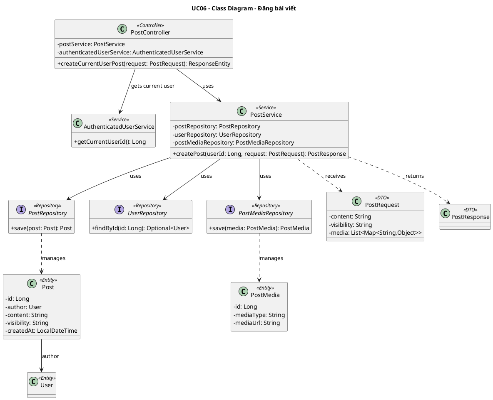
```plantuml
@startuml
title UC06 - Class Diagram - Đăng bài viết
skinparam classAttributeIconSize 0

class PostController <<Controller>> {
  -postService: PostService
  -authenticatedUserService: AuthenticatedUserService
  +createCurrentUserPost(request: PostRequest): ResponseEntity
}
class AuthenticatedUserService <<Service>> {
  +getCurrentUserId(): Long
}
class PostService <<Service>> {
  -postRepository: PostRepository
  -userRepository: UserRepository
  -postMediaRepository: PostMediaRepository
  +createPost(userId: Long, request: PostRequest): PostResponse
}
interface PostRepository <<Repository>> {
  +save(post: Post): Post
}
interface UserRepository <<Repository>> {
  +findById(id: Long): Optional<User>
}
interface PostMediaRepository <<Repository>> {
  +save(media: PostMedia): PostMedia
}
class PostRequest <<DTO>> {
  -content: String
  -visibility: String
  -media: List<Map<String,Object>>
}
class PostResponse <<DTO>>
class Post <<Entity>> {
  -id: Long
  -author: User
  -content: String
  -visibility: String
  -createdAt: LocalDateTime
}
class PostMedia <<Entity>> {
  -id: Long
  -mediaType: String
  -mediaUrl: String
}
class User <<Entity>>

PostController --> AuthenticatedUserService : gets current user
PostController --> PostService : uses
PostService --> PostRepository : uses
PostService --> UserRepository : uses
PostService --> PostMediaRepository : uses
PostService ..> PostRequest : receives
PostService ..> PostResponse : returns
PostRepository ..> Post : manages
PostMediaRepository ..> PostMedia : manages
Post --> User : author
@enduml
```

## UC07 - Chỉnh sửa bài viết

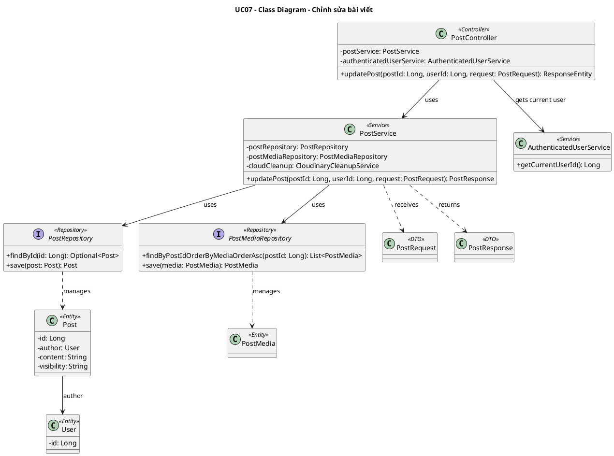
```plantuml
@startuml
title UC07 - Class Diagram - Chỉnh sửa bài viết
skinparam classAttributeIconSize 0

class PostController <<Controller>> {
  -postService: PostService
  -authenticatedUserService: AuthenticatedUserService
  +updatePost(postId: Long, userId: Long, request: PostRequest): ResponseEntity
}
class PostService <<Service>> {
  -postRepository: PostRepository
  -postMediaRepository: PostMediaRepository
  -cloudCleanup: CloudinaryCleanupService
  +updatePost(postId: Long, userId: Long, request: PostRequest): PostResponse
}
class AuthenticatedUserService <<Service>> {
  +getCurrentUserId(): Long
}
interface PostRepository <<Repository>> {
  +findById(id: Long): Optional<Post>
  +save(post: Post): Post
}
interface PostMediaRepository <<Repository>> {
  +findByPostIdOrderByMediaOrderAsc(postId: Long): List<PostMedia>
  +save(media: PostMedia): PostMedia
}
class PostRequest <<DTO>>
class PostResponse <<DTO>>
class Post <<Entity>> {
  -id: Long
  -author: User
  -content: String
  -visibility: String
}
class PostMedia <<Entity>>
class User <<Entity>> {
  -id: Long
}

PostController --> AuthenticatedUserService : gets current user
PostController --> PostService : uses
PostService --> PostRepository : uses
PostService --> PostMediaRepository : uses
PostService ..> PostRequest : receives
PostService ..> PostResponse : returns
PostRepository ..> Post : manages
PostMediaRepository ..> PostMedia : manages
Post --> User : author
@enduml
```

## UC08 - Xóa bài viết

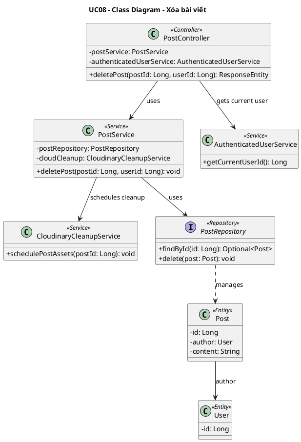
```plantuml
@startuml
title UC08 - Class Diagram - Xóa bài viết
skinparam classAttributeIconSize 0

class PostController <<Controller>> {
  -postService: PostService
  -authenticatedUserService: AuthenticatedUserService
  +deletePost(postId: Long, userId: Long): ResponseEntity
}
class PostService <<Service>> {
  -postRepository: PostRepository
  -cloudCleanup: CloudinaryCleanupService
  +deletePost(postId: Long, userId: Long): void
}
class AuthenticatedUserService <<Service>> {
  +getCurrentUserId(): Long
}
class CloudinaryCleanupService <<Service>> {
  +schedulePostAssets(postId: Long): void
}
interface PostRepository <<Repository>> {
  +findById(id: Long): Optional<Post>
  +delete(post: Post): void
}
class Post <<Entity>> {
  -id: Long
  -author: User
  -content: String
}
class User <<Entity>> {
  -id: Long
}

PostController --> AuthenticatedUserService : gets current user
PostController --> PostService : uses
PostService --> PostRepository : uses
PostService --> CloudinaryCleanupService : schedules cleanup
PostRepository ..> Post : manages
Post --> User : author
@enduml
```

## UC09 - Đăng bình chọn

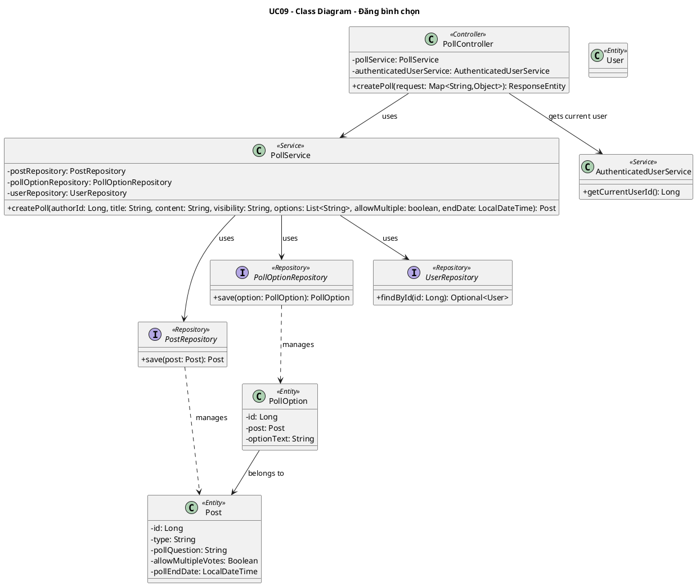
```plantuml
@startuml
title UC09 - Class Diagram - Đăng bình chọn
skinparam classAttributeIconSize 0

class PollController <<Controller>> {
  -pollService: PollService
  -authenticatedUserService: AuthenticatedUserService
  +createPoll(request: Map<String,Object>): ResponseEntity
}
class PollService <<Service>> {
  -postRepository: PostRepository
  -pollOptionRepository: PollOptionRepository
  -userRepository: UserRepository
  +createPoll(authorId: Long, title: String, content: String, visibility: String, options: List<String>, allowMultiple: boolean, endDate: LocalDateTime): Post
}
class AuthenticatedUserService <<Service>> {
  +getCurrentUserId(): Long
}
interface PostRepository <<Repository>> {
  +save(post: Post): Post
}
interface PollOptionRepository <<Repository>> {
  +save(option: PollOption): PollOption
}
interface UserRepository <<Repository>> {
  +findById(id: Long): Optional<User>
}
class Post <<Entity>> {
  -id: Long
  -type: String
  -pollQuestion: String
  -allowMultipleVotes: Boolean
  -pollEndDate: LocalDateTime
}
class PollOption <<Entity>> {
  -id: Long
  -post: Post
  -optionText: String
}
class User <<Entity>>

PollController --> AuthenticatedUserService : gets current user
PollController --> PollService : uses
PollService --> PostRepository : uses
PollService --> PollOptionRepository : uses
PollService --> UserRepository : uses
PostRepository ..> Post : manages
PollOptionRepository ..> PollOption : manages
PollOption --> Post : belongs to
@enduml
```

## UC10 - Bình chọn

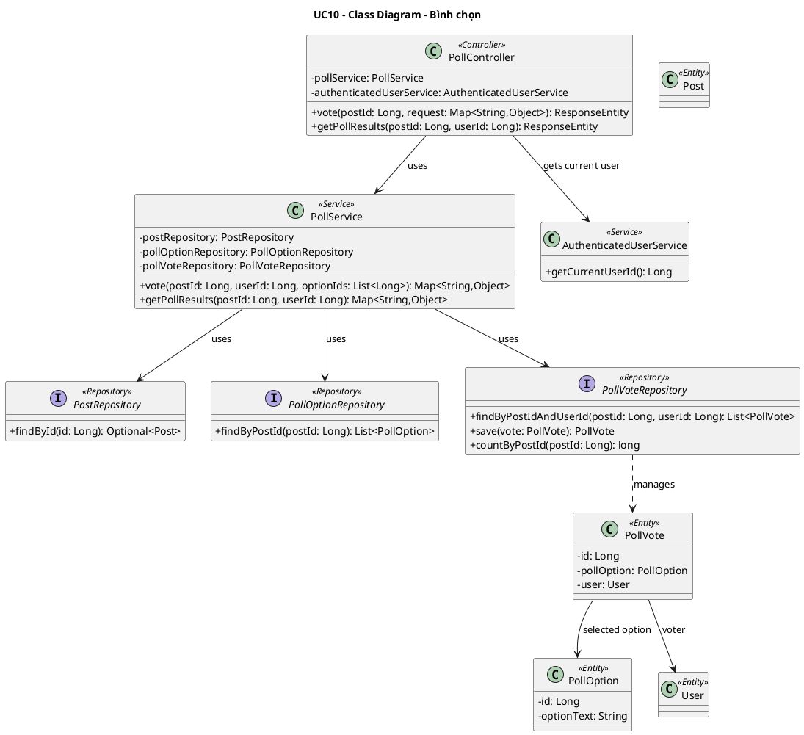
```plantuml
@startuml
title UC10 - Class Diagram - Bình chọn
skinparam classAttributeIconSize 0

class PollController <<Controller>> {
  -pollService: PollService
  -authenticatedUserService: AuthenticatedUserService
  +vote(postId: Long, request: Map<String,Object>): ResponseEntity
  +getPollResults(postId: Long, userId: Long): ResponseEntity
}
class PollService <<Service>> {
  -postRepository: PostRepository
  -pollOptionRepository: PollOptionRepository
  -pollVoteRepository: PollVoteRepository
  +vote(postId: Long, userId: Long, optionIds: List<Long>): Map<String,Object>
  +getPollResults(postId: Long, userId: Long): Map<String,Object>
}
class AuthenticatedUserService <<Service>> {
  +getCurrentUserId(): Long
}
interface PostRepository <<Repository>> {
  +findById(id: Long): Optional<Post>
}
interface PollOptionRepository <<Repository>> {
  +findByPostId(postId: Long): List<PollOption>
}
interface PollVoteRepository <<Repository>> {
  +findByPostIdAndUserId(postId: Long, userId: Long): List<PollVote>
  +save(vote: PollVote): PollVote
  +countByPostId(postId: Long): long
}
class Post <<Entity>>
class PollOption <<Entity>> {
  -id: Long
  -optionText: String
}
class PollVote <<Entity>> {
  -id: Long
  -pollOption: PollOption
  -user: User
}
class User <<Entity>>

PollController --> AuthenticatedUserService : gets current user
PollController --> PollService : uses
PollService --> PostRepository : uses
PollService --> PollOptionRepository : uses
PollService --> PollVoteRepository : uses
PollVoteRepository ..> PollVote : manages
PollVote --> PollOption : selected option
PollVote --> User : voter
@enduml
```

## UC11 - Thích bài viết

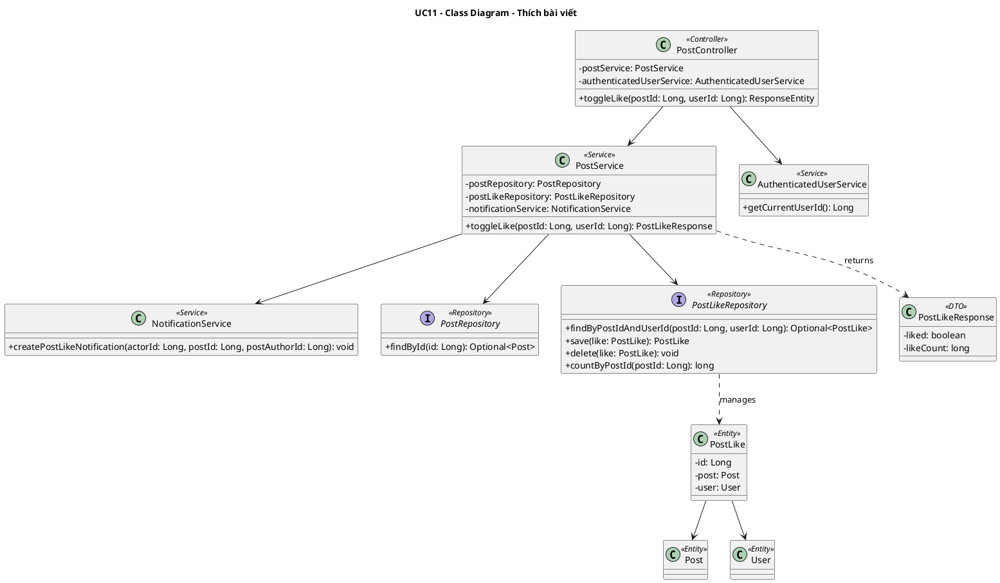
```plantuml
@startuml
title UC11 - Class Diagram - Thích bài viết
skinparam classAttributeIconSize 0

class PostController <<Controller>> {
  -postService: PostService
  -authenticatedUserService: AuthenticatedUserService
  +toggleLike(postId: Long, userId: Long): ResponseEntity
}
class PostService <<Service>> {
  -postRepository: PostRepository
  -postLikeRepository: PostLikeRepository
  -notificationService: NotificationService
  +toggleLike(postId: Long, userId: Long): PostLikeResponse
}
class NotificationService <<Service>> {
  +createPostLikeNotification(actorId: Long, postId: Long, postAuthorId: Long): void
}
class AuthenticatedUserService <<Service>> {
  +getCurrentUserId(): Long
}
interface PostRepository <<Repository>> {
  +findById(id: Long): Optional<Post>
}
interface PostLikeRepository <<Repository>> {
  +findByPostIdAndUserId(postId: Long, userId: Long): Optional<PostLike>
  +save(like: PostLike): PostLike
  +delete(like: PostLike): void
  +countByPostId(postId: Long): long
}
class PostLikeResponse <<DTO>> {
  -liked: boolean
  -likeCount: long
}
class Post <<Entity>>
class PostLike <<Entity>> {
  -id: Long
  -post: Post
  -user: User
}
class User <<Entity>>

PostController --> AuthenticatedUserService
PostController --> PostService
PostService --> PostRepository
PostService --> PostLikeRepository
PostService --> NotificationService
PostService ..> PostLikeResponse : returns
PostLikeRepository ..> PostLike : manages
PostLike --> Post
PostLike --> User
@enduml
```

## UC12 - Bình luận trong bài viết

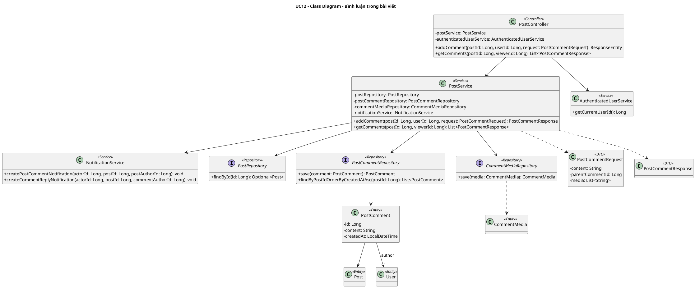
```plantuml
@startuml
title UC12 - Class Diagram - Bình luận trong bài viết
skinparam classAttributeIconSize 0

class PostController <<Controller>> {
  -postService: PostService
  -authenticatedUserService: AuthenticatedUserService
  +addComment(postId: Long, userId: Long, request: PostCommentRequest): ResponseEntity
  +getComments(postId: Long, viewerId: Long): List<PostCommentResponse>
}
class PostService <<Service>> {
  -postRepository: PostRepository
  -postCommentRepository: PostCommentRepository
  -commentMediaRepository: CommentMediaRepository
  -notificationService: NotificationService
  +addComment(postId: Long, userId: Long, request: PostCommentRequest): PostCommentResponse
  +getComments(postId: Long, viewerId: Long): List<PostCommentResponse>
}
class NotificationService <<Service>> {
  +createPostCommentNotification(actorId: Long, postId: Long, postAuthorId: Long): void
  +createCommentReplyNotification(actorId: Long, postId: Long, commentAuthorId: Long): void
}
class AuthenticatedUserService <<Service>> {
  +getCurrentUserId(): Long
}
interface PostRepository <<Repository>> {
  +findById(id: Long): Optional<Post>
}
interface PostCommentRepository <<Repository>> {
  +save(comment: PostComment): PostComment
  +findByPostIdOrderByCreatedAtAsc(postId: Long): List<PostComment>
}
interface CommentMediaRepository <<Repository>> {
  +save(media: CommentMedia): CommentMedia
}
class PostCommentRequest <<DTO>> {
  -content: String
  -parentCommentId: Long
  -media: List<String>
}
class PostCommentResponse <<DTO>>
class PostComment <<Entity>> {
  -id: Long
  -content: String
  -createdAt: LocalDateTime
}
class CommentMedia <<Entity>>
class Post <<Entity>>
class User <<Entity>>

PostController --> AuthenticatedUserService
PostController --> PostService
PostService --> PostRepository
PostService --> PostCommentRepository
PostService --> CommentMediaRepository
PostService --> NotificationService
PostService ..> PostCommentRequest
PostService ..> PostCommentResponse
PostCommentRepository ..> PostComment
CommentMediaRepository ..> CommentMedia
PostComment --> Post
PostComment --> User : author
@enduml
```

## UC13 - Chia sẻ bài viết

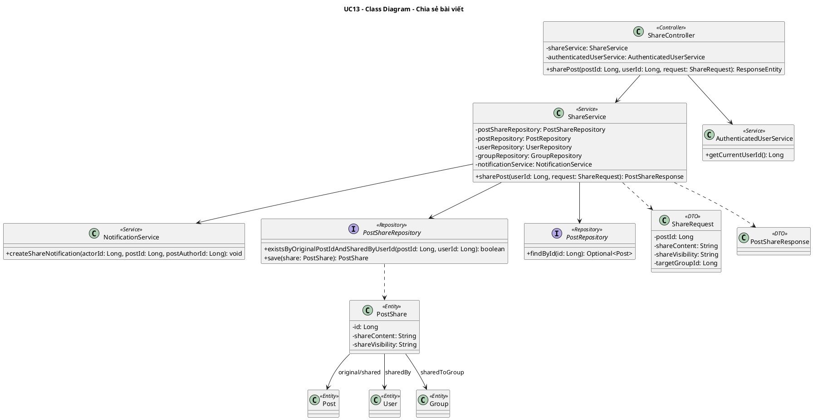
```plantuml
@startuml
title UC13 - Class Diagram - Chia sẻ bài viết
skinparam classAttributeIconSize 0

class ShareController <<Controller>> {
  -shareService: ShareService
  -authenticatedUserService: AuthenticatedUserService
  +sharePost(postId: Long, userId: Long, request: ShareRequest): ResponseEntity
}
class ShareService <<Service>> {
  -postShareRepository: PostShareRepository
  -postRepository: PostRepository
  -userRepository: UserRepository
  -groupRepository: GroupRepository
  -notificationService: NotificationService
  +sharePost(userId: Long, request: ShareRequest): PostShareResponse
}
class NotificationService <<Service>> {
  +createShareNotification(actorId: Long, postId: Long, postAuthorId: Long): void
}
class AuthenticatedUserService <<Service>> {
  +getCurrentUserId(): Long
}
interface PostShareRepository <<Repository>> {
  +existsByOriginalPostIdAndSharedByUserId(postId: Long, userId: Long): boolean
  +save(share: PostShare): PostShare
}
interface PostRepository <<Repository>> {
  +findById(id: Long): Optional<Post>
}
class ShareRequest <<DTO>> {
  -postId: Long
  -shareContent: String
  -shareVisibility: String
  -targetGroupId: Long
}
class PostShareResponse <<DTO>>
class PostShare <<Entity>> {
  -id: Long
  -shareContent: String
  -shareVisibility: String
}
class Post <<Entity>>
class User <<Entity>>
class Group <<Entity>>

ShareController --> AuthenticatedUserService
ShareController --> ShareService
ShareService --> PostShareRepository
ShareService --> PostRepository
ShareService --> NotificationService
ShareService ..> ShareRequest
ShareService ..> PostShareResponse
PostShareRepository ..> PostShare
PostShare --> Post : original/shared
PostShare --> User : sharedBy
PostShare --> Group : sharedToGroup
@enduml
```

## UC14 - Gửi tin nhắn

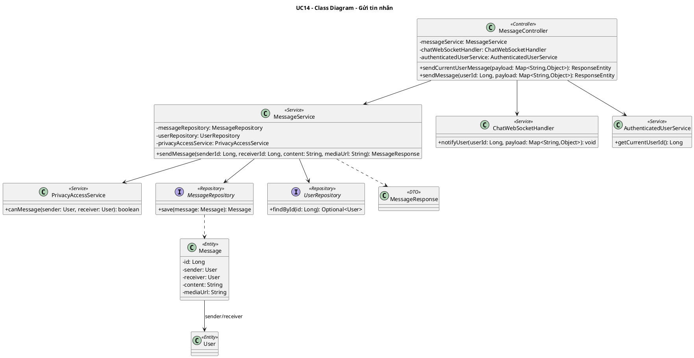
```plantuml
@startuml
title UC14 - Class Diagram - Gửi tin nhắn
skinparam classAttributeIconSize 0

class MessageController <<Controller>> {
  -messageService: MessageService
  -chatWebSocketHandler: ChatWebSocketHandler
  -authenticatedUserService: AuthenticatedUserService
  +sendCurrentUserMessage(payload: Map<String,Object>): ResponseEntity
  +sendMessage(userId: Long, payload: Map<String,Object>): ResponseEntity
}
class MessageService <<Service>> {
  -messageRepository: MessageRepository
  -userRepository: UserRepository
  -privacyAccessService: PrivacyAccessService
  +sendMessage(senderId: Long, receiverId: Long, content: String, mediaUrl: String): MessageResponse
}
class PrivacyAccessService <<Service>> {
  +canMessage(sender: User, receiver: User): boolean
}
class ChatWebSocketHandler <<Service>> {
  +notifyUser(userId: Long, payload: Map<String,Object>): void
}
class AuthenticatedUserService <<Service>> {
  +getCurrentUserId(): Long
}
interface MessageRepository <<Repository>> {
  +save(message: Message): Message
}
interface UserRepository <<Repository>> {
  +findById(id: Long): Optional<User>
}
class MessageResponse <<DTO>>
class Message <<Entity>> {
  -id: Long
  -sender: User
  -receiver: User
  -content: String
  -mediaUrl: String
}
class User <<Entity>>

MessageController --> AuthenticatedUserService
MessageController --> MessageService
MessageController --> ChatWebSocketHandler
MessageService --> MessageRepository
MessageService --> UserRepository
MessageService --> PrivacyAccessService
MessageService ..> MessageResponse
MessageRepository ..> Message
Message --> User : sender/receiver
@enduml
```

## UC15 - Thu hồi tin nhắn

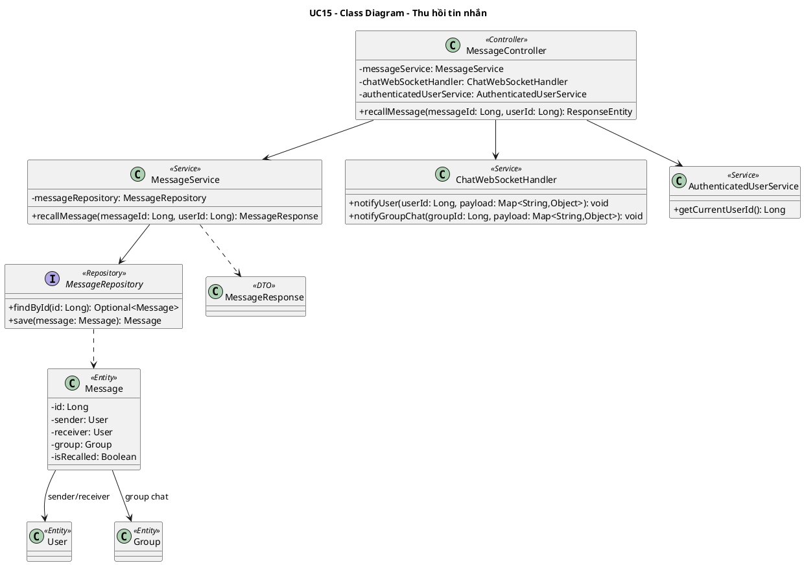
```plantuml
@startuml
title UC15 - Class Diagram - Thu hồi tin nhắn
skinparam classAttributeIconSize 0

class MessageController <<Controller>> {
  -messageService: MessageService
  -chatWebSocketHandler: ChatWebSocketHandler
  -authenticatedUserService: AuthenticatedUserService
  +recallMessage(messageId: Long, userId: Long): ResponseEntity
}
class MessageService <<Service>> {
  -messageRepository: MessageRepository
  +recallMessage(messageId: Long, userId: Long): MessageResponse
}
class ChatWebSocketHandler <<Service>> {
  +notifyUser(userId: Long, payload: Map<String,Object>): void
  +notifyGroupChat(groupId: Long, payload: Map<String,Object>): void
}
class AuthenticatedUserService <<Service>> {
  +getCurrentUserId(): Long
}
interface MessageRepository <<Repository>> {
  +findById(id: Long): Optional<Message>
  +save(message: Message): Message
}
class MessageResponse <<DTO>>
class Message <<Entity>> {
  -id: Long
  -sender: User
  -receiver: User
  -group: Group
  -isRecalled: Boolean
}
class User <<Entity>>
class Group <<Entity>>

MessageController --> AuthenticatedUserService
MessageController --> MessageService
MessageController --> ChatWebSocketHandler
MessageService --> MessageRepository
MessageService ..> MessageResponse
MessageRepository ..> Message
Message --> User : sender/receiver
Message --> Group : group chat
@enduml
```

## UC16 - Gửi lời mời kết bạn

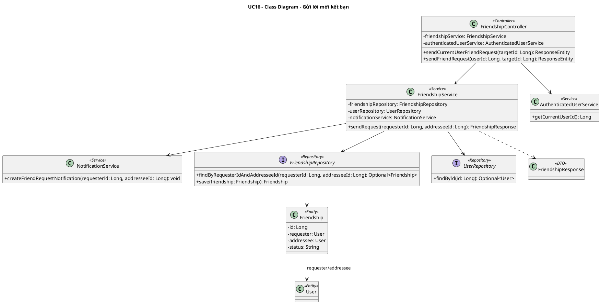
```plantuml
@startuml
title UC16 - Class Diagram - Gửi lời mời kết bạn
skinparam classAttributeIconSize 0

class FriendshipController <<Controller>> {
  -friendshipService: FriendshipService
  -authenticatedUserService: AuthenticatedUserService
  +sendCurrentUserFriendRequest(targetId: Long): ResponseEntity
  +sendFriendRequest(userId: Long, targetId: Long): ResponseEntity
}
class FriendshipService <<Service>> {
  -friendshipRepository: FriendshipRepository
  -userRepository: UserRepository
  -notificationService: NotificationService
  +sendRequest(requesterId: Long, addresseeId: Long): FriendshipResponse
}
class NotificationService <<Service>> {
  +createFriendRequestNotification(requesterId: Long, addresseeId: Long): void
}
class AuthenticatedUserService <<Service>> {
  +getCurrentUserId(): Long
}
interface FriendshipRepository <<Repository>> {
  +findByRequesterIdAndAddresseeId(requesterId: Long, addresseeId: Long): Optional<Friendship>
  +save(friendship: Friendship): Friendship
}
interface UserRepository <<Repository>> {
  +findById(id: Long): Optional<User>
}
class FriendshipResponse <<DTO>>
class Friendship <<Entity>> {
  -id: Long
  -requester: User
  -addressee: User
  -status: String
}
class User <<Entity>>

FriendshipController --> AuthenticatedUserService
FriendshipController --> FriendshipService
FriendshipService --> FriendshipRepository
FriendshipService --> UserRepository
FriendshipService --> NotificationService
FriendshipService ..> FriendshipResponse
FriendshipRepository ..> Friendship
Friendship --> User : requester/addressee
@enduml
```

## UC17 - Chấp nhận kết bạn

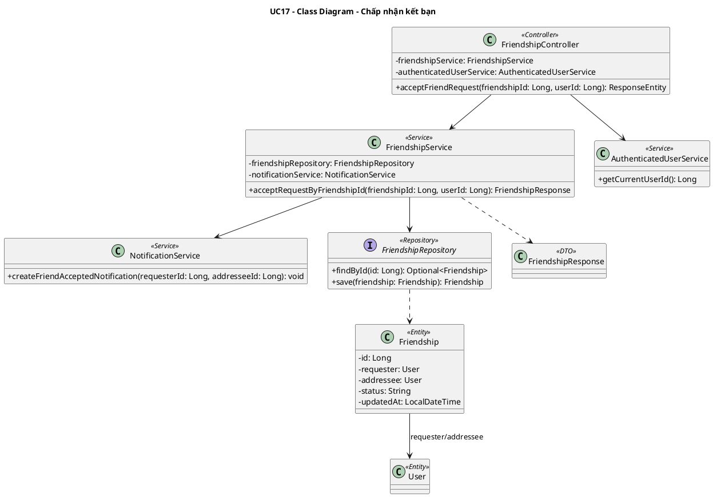
```plantuml
@startuml
title UC17 - Class Diagram - Chấp nhận kết bạn
skinparam classAttributeIconSize 0

class FriendshipController <<Controller>> {
  -friendshipService: FriendshipService
  -authenticatedUserService: AuthenticatedUserService
  +acceptFriendRequest(friendshipId: Long, userId: Long): ResponseEntity
}
class FriendshipService <<Service>> {
  -friendshipRepository: FriendshipRepository
  -notificationService: NotificationService
  +acceptRequestByFriendshipId(friendshipId: Long, userId: Long): FriendshipResponse
}
class NotificationService <<Service>> {
  +createFriendAcceptedNotification(requesterId: Long, addresseeId: Long): void
}
class AuthenticatedUserService <<Service>> {
  +getCurrentUserId(): Long
}
interface FriendshipRepository <<Repository>> {
  +findById(id: Long): Optional<Friendship>
  +save(friendship: Friendship): Friendship
}
class FriendshipResponse <<DTO>>
class Friendship <<Entity>> {
  -id: Long
  -requester: User
  -addressee: User
  -status: String
  -updatedAt: LocalDateTime
}
class User <<Entity>>

FriendshipController --> AuthenticatedUserService
FriendshipController --> FriendshipService
FriendshipService --> FriendshipRepository
FriendshipService --> NotificationService
FriendshipService ..> FriendshipResponse
FriendshipRepository ..> Friendship
Friendship --> User : requester/addressee
@enduml
```

## UC18 - Hủy kết bạn

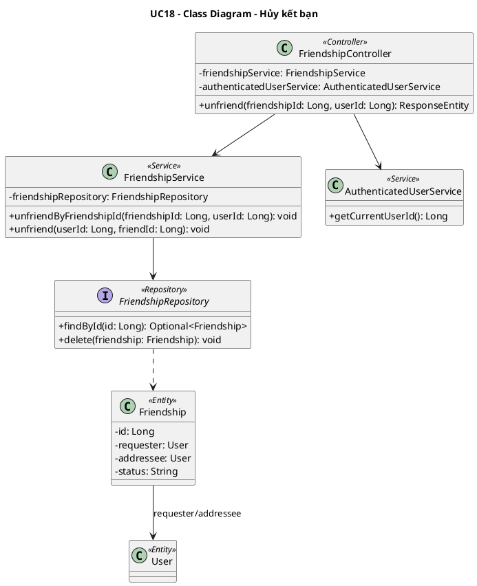
```plantuml
@startuml
title UC18 - Class Diagram - Hủy kết bạn
skinparam classAttributeIconSize 0

class FriendshipController <<Controller>> {
  -friendshipService: FriendshipService
  -authenticatedUserService: AuthenticatedUserService
  +unfriend(friendshipId: Long, userId: Long): ResponseEntity
}
class FriendshipService <<Service>> {
  -friendshipRepository: FriendshipRepository
  +unfriendByFriendshipId(friendshipId: Long, userId: Long): void
  +unfriend(userId: Long, friendId: Long): void
}
class AuthenticatedUserService <<Service>> {
  +getCurrentUserId(): Long
}
interface FriendshipRepository <<Repository>> {
  +findById(id: Long): Optional<Friendship>
  +delete(friendship: Friendship): void
}
class Friendship <<Entity>> {
  -id: Long
  -requester: User
  -addressee: User
  -status: String
}
class User <<Entity>>

FriendshipController --> AuthenticatedUserService
FriendshipController --> FriendshipService
FriendshipService --> FriendshipRepository
FriendshipRepository ..> Friendship
Friendship --> User : requester/addressee
@enduml
```

## UC19 - Xem thông báo

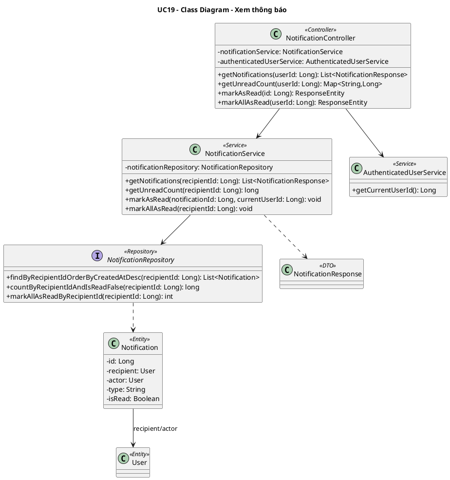
```plantuml
@startuml
title UC19 - Class Diagram - Xem thông báo
skinparam classAttributeIconSize 0

class NotificationController <<Controller>> {
  -notificationService: NotificationService
  -authenticatedUserService: AuthenticatedUserService
  +getNotifications(userId: Long): List<NotificationResponse>
  +getUnreadCount(userId: Long): Map<String,Long>
  +markAsRead(id: Long): ResponseEntity
  +markAllAsRead(userId: Long): ResponseEntity
}
class NotificationService <<Service>> {
  -notificationRepository: NotificationRepository
  +getNotifications(recipientId: Long): List<NotificationResponse>
  +getUnreadCount(recipientId: Long): long
  +markAsRead(notificationId: Long, currentUserId: Long): void
  +markAllAsRead(recipientId: Long): void
}
class AuthenticatedUserService <<Service>> {
  +getCurrentUserId(): Long
}
interface NotificationRepository <<Repository>> {
  +findByRecipientIdOrderByCreatedAtDesc(recipientId: Long): List<Notification>
  +countByRecipientIdAndIsReadFalse(recipientId: Long): long
  +markAllAsReadByRecipientId(recipientId: Long): int
}
class NotificationResponse <<DTO>>
class Notification <<Entity>> {
  -id: Long
  -recipient: User
  -actor: User
  -type: String
  -isRead: Boolean
}
class User <<Entity>>

NotificationController --> AuthenticatedUserService
NotificationController --> NotificationService
NotificationService --> NotificationRepository
NotificationService ..> NotificationResponse
NotificationRepository ..> Notification
Notification --> User : recipient/actor
@enduml
```

## UC20 - Tìm kiếm

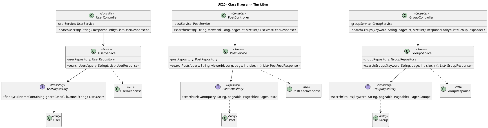
```plantuml
@startuml
title UC20 - Class Diagram - Tìm kiếm
skinparam classAttributeIconSize 0

class UserController <<Controller>> {
  -userService: UserService
  +searchUsers(q: String): ResponseEntity<List<UserResponse>>
}
class PostController <<Controller>> {
  -postService: PostService
  +searchPosts(q: String, viewerId: Long, page: int, size: int): List<PostFeedResponse>
}
class GroupController <<Controller>> {
  -groupService: GroupService
  +searchGroups(keyword: String, page: int, size: int): ResponseEntity<List<GroupResponse>>
}
class UserService <<Service>> {
  -userRepository: UserRepository
  +searchUsers(query: String): List<UserResponse>
}
class PostService <<Service>> {
  -postRepository: PostRepository
  +searchPosts(query: String, viewerId: Long, page: int, size: int): List<PostFeedResponse>
}
class GroupService <<Service>> {
  -groupRepository: GroupRepository
  +searchGroups(keyword: String, page: int, size: int): List<GroupResponse>
}
interface UserRepository <<Repository>> {
  +findByFullNameContainingIgnoreCase(fullName: String): List<User>
}
interface PostRepository <<Repository>> {
  +searchRelevant(query: String, pageable: Pageable): Page<Post>
}
interface GroupRepository <<Repository>> {
  +searchGroups(keyword: String, pageable: Pageable): Page<Group>
}
class UserResponse <<DTO>>
class PostFeedResponse <<DTO>>
class GroupResponse <<DTO>>
class User <<Entity>>
class Post <<Entity>>
class Group <<Entity>>

UserController --> UserService
PostController --> PostService
GroupController --> GroupService
UserService --> UserRepository
PostService --> PostRepository
GroupService --> GroupRepository
UserService ..> UserResponse
PostService ..> PostFeedResponse
GroupService ..> GroupResponse
UserRepository ..> User
PostRepository ..> Post
GroupRepository ..> Group
@enduml
```

## UC21 - Tạo nhóm

```plantuml
@startuml
title UC21 - Class Diagram - Tạo nhóm
skinparam classAttributeIconSize 0

class GroupController <<Controller>> {
  -groupService: GroupService
  -authenticatedUserService: AuthenticatedUserService
  +createGroup(body: Map<String,Object>): ResponseEntity<GroupResponse>
}
class GroupService <<Service>> {
  -groupRepository: GroupRepository
  -userRepository: UserRepository
  -groupMemberRepository: GroupMemberRepository
  +createGroup(userId: Long, request: GroupRequest): GroupResponse
}
class AuthenticatedUserService <<Service>> {
  +getCurrentUserId(): Long
}
interface GroupRepository <<Repository>> {
  +save(group: Group): Group
}
interface GroupMemberRepository <<Repository>> {
  +save(member: GroupMember): GroupMember
}
interface UserRepository <<Repository>> {
  +findById(id: Long): Optional<User>
}
class GroupRequest <<DTO>> {
  -name: String
  -description: String
  -privacy: String
}
class GroupResponse <<DTO>>
class Group <<Entity>> {
  -id: Long
  -name: String
  -privacy: String
  -creator: User
}
class GroupMember <<Entity>> {
  -id: Long
  -role: String
  -status: String
}
class User <<Entity>>

GroupController --> AuthenticatedUserService
GroupController --> GroupService
GroupService --> GroupRepository
GroupService --> GroupMemberRepository
GroupService --> UserRepository
GroupService ..> GroupRequest
GroupService ..> GroupResponse
GroupRepository ..> Group
GroupMemberRepository ..> GroupMember
Group --> User : creator
GroupMember --> Group
GroupMember --> User
@enduml
```

## UC22 - Xin vào nhóm

```plantuml
@startuml
title UC22 - Class Diagram - Xin vào nhóm
skinparam classAttributeIconSize 0

class GroupController <<Controller>> {
  -groupService: GroupService
  -authenticatedUserService: AuthenticatedUserService
  +joinGroup(groupId: Long, userId: Long): ResponseEntity
}
class GroupService <<Service>> {
  -groupRepository: GroupRepository
  -groupMemberRepository: GroupMemberRepository
  -joinRequestRepository: GroupJoinRequestRepository
  +joinGroup(groupId: Long, userId: Long): GroupMemberResponse
}
class AuthenticatedUserService <<Service>> {
  +getCurrentUserId(): Long
}
interface GroupRepository <<Repository>> {
  +findById(id: Long): Optional<Group>
}
interface GroupMemberRepository <<Repository>> {
  +findByGroupIdAndUserId(groupId: Long, userId: Long): Optional<GroupMember>
  +save(member: GroupMember): GroupMember
}
interface GroupJoinRequestRepository <<Repository>> {
  +existsByGroupIdAndUserIdAndStatus(groupId: Long, userId: Long, status: String): boolean
  +save(request: GroupJoinRequest): GroupJoinRequest
}
class GroupMemberResponse <<DTO>>
class Group <<Entity>>
class GroupMember <<Entity>>
class GroupJoinRequest <<Entity>> {
  -id: Long
  -status: String
}
class User <<Entity>>

GroupController --> AuthenticatedUserService
GroupController --> GroupService
GroupService --> GroupRepository
GroupService --> GroupMemberRepository
GroupService --> GroupJoinRequestRepository
GroupService ..> GroupMemberResponse
GroupMemberRepository ..> GroupMember
GroupJoinRequestRepository ..> GroupJoinRequest
GroupMember --> Group
GroupMember --> User
GroupJoinRequest --> Group
GroupJoinRequest --> User
@enduml
```

## UC23 - Xóa nhóm

```plantuml
@startuml
title UC23 - Class Diagram - Xóa nhóm
skinparam classAttributeIconSize 0

class GroupController <<Controller>> {
  -groupService: GroupService
  -authenticatedUserService: AuthenticatedUserService
  +deleteGroup(groupId: Long, userId: Long): ResponseEntity<Void>
}
class GroupService <<Service>> {
  -groupRepository: GroupRepository
  -groupPostRepository: GroupPostRepository
  -postRepository: PostRepository
  -cloudCleanup: CloudinaryCleanupService
  +deleteGroup(groupId: Long, userId: Long): void
}
class CloudinaryCleanupService <<Service>> {
  +scheduleGroupAssets(groupId: Long): void
}
class AuthenticatedUserService <<Service>> {
  +getCurrentUserId(): Long
}
interface GroupRepository <<Repository>> {
  +findById(id: Long): Optional<Group>
  +delete(group: Group): void
}
interface GroupPostRepository <<Repository>> {
  +findByGroupId(groupId: Long): List<GroupPost>
}
interface PostRepository <<Repository>> {
  +deleteAllById(ids: Iterable<Long>): void
}
class Group <<Entity>>
class GroupPost <<Entity>>
class Post <<Entity>>

GroupController --> AuthenticatedUserService
GroupController --> GroupService
GroupService --> GroupRepository
GroupService --> GroupPostRepository
GroupService --> PostRepository
GroupService --> CloudinaryCleanupService
GroupRepository ..> Group
GroupPostRepository ..> GroupPost
GroupPost --> Group
GroupPost --> Post
@enduml
```

## UC24 - Rời nhóm

```plantuml
@startuml
title UC24 - Class Diagram - Rời nhóm
skinparam classAttributeIconSize 0

class GroupController <<Controller>> {
  -groupService: GroupService
  -authenticatedUserService: AuthenticatedUserService
  +leaveGroup(groupId: Long, userId: Long): ResponseEntity<Void>
}
class GroupService <<Service>> {
  -groupMemberRepository: GroupMemberRepository
  +leaveGroup(groupId: Long, userId: Long): void
}
class AuthenticatedUserService <<Service>> {
  +getCurrentUserId(): Long
}
interface GroupMemberRepository <<Repository>> {
  +findByGroupIdAndUserId(groupId: Long, userId: Long): Optional<GroupMember>
  +countAdmins(groupId: Long): long
  +delete(member: GroupMember): void
}
class GroupMember <<Entity>> {
  -id: Long
  -role: String
  -status: String
}
class Group <<Entity>>
class User <<Entity>>

GroupController --> AuthenticatedUserService
GroupController --> GroupService
GroupService --> GroupMemberRepository
GroupMemberRepository ..> GroupMember
GroupMember --> Group
GroupMember --> User
@enduml
```

## UC25 - Phê duyệt thành viên

```plantuml
@startuml
title UC25 - Class Diagram - Phê duyệt thành viên
skinparam classAttributeIconSize 0

class GroupController <<Controller>> {
  -groupService: GroupService
  -authenticatedUserService: AuthenticatedUserService
  +getPendingJoinRequests(groupId: Long, userId: Long): ResponseEntity<List<GroupJoinRequestResponse>>
  +approveJoinRequest(groupId: Long, requestId: Long, userId: Long): ResponseEntity<GroupMemberResponse>
}
class GroupService <<Service>> {
  -joinRequestRepository: GroupJoinRequestRepository
  -groupMemberRepository: GroupMemberRepository
  +getPendingJoinRequests(groupId: Long, adminId: Long): List<GroupJoinRequestResponse>
  +approveJoinRequest(groupId: Long, requestId: Long, adminId: Long): GroupMemberResponse
}
class AuthenticatedUserService <<Service>> {
  +getCurrentUserId(): Long
}
interface GroupJoinRequestRepository <<Repository>> {
  +findPendingRequests(groupId: Long): List<GroupJoinRequest>
  +findById(id: Long): Optional<GroupJoinRequest>
  +save(request: GroupJoinRequest): GroupJoinRequest
}
interface GroupMemberRepository <<Repository>> {
  +save(member: GroupMember): GroupMember
}
class GroupJoinRequestResponse <<DTO>>
class GroupMemberResponse <<DTO>>
class GroupJoinRequest <<Entity>>
class GroupMember <<Entity>>
class Group <<Entity>>
class User <<Entity>>

GroupController --> AuthenticatedUserService
GroupController --> GroupService
GroupService --> GroupJoinRequestRepository
GroupService --> GroupMemberRepository
GroupService ..> GroupJoinRequestResponse
GroupService ..> GroupMemberResponse
GroupJoinRequestRepository ..> GroupJoinRequest
GroupMemberRepository ..> GroupMember
GroupJoinRequest --> Group
GroupJoinRequest --> User
GroupMember --> Group
GroupMember --> User
@enduml
```

## UC26 - Xóa thành viên trong nhóm

```plantuml
@startuml
title UC26 - Class Diagram - Xóa thành viên trong nhóm
skinparam classAttributeIconSize 0

class GroupController <<Controller>> {
  -groupService: GroupService
  -authenticatedUserService: AuthenticatedUserService
  +removeMember(groupId: Long, memberId: Long, userId: Long): ResponseEntity<Void>
}
class GroupService <<Service>> {
  -groupMemberRepository: GroupMemberRepository
  +removeMember(groupId: Long, memberId: Long, adminId: Long): void
}
class AuthenticatedUserService <<Service>> {
  +getCurrentUserId(): Long
}
interface GroupMemberRepository <<Repository>> {
  +findByGroupIdAndUserId(groupId: Long, userId: Long): Optional<GroupMember>
  +findById(id: Long): Optional<GroupMember>
  +delete(member: GroupMember): void
}
class GroupMember <<Entity>> {
  -id: Long
  -role: String
  -status: String
}
class Group <<Entity>>
class User <<Entity>>

GroupController --> AuthenticatedUserService
GroupController --> GroupService
GroupService --> GroupMemberRepository
GroupMemberRepository ..> GroupMember
GroupMember --> Group
GroupMember --> User
@enduml
```

## UC27 - Báo cáo người dùng

```plantuml
@startuml
title UC27 - Class Diagram - Báo cáo người dùng
skinparam classAttributeIconSize 0

class ReportController <<Controller>> {
  -reportService: ReportService
  -authenticatedUserService: AuthenticatedUserService
  +create(reporterId: Long, request: ReportRequest): ResponseEntity
}
class ReportService <<Service>> {
  -reportRepository: ReportRepository
  -userRepository: UserRepository
  +create(reporterId: Long, request: ReportRequest): ReportResponse
}
class AuthenticatedUserService <<Service>> {
  +getCurrentUserId(): Long
}
interface ReportRepository <<Repository>> {
  +existsByReporterIdAndTargetTypeAndTargetIdAndStatus(reporterId: Long, targetType: String, targetId: Long, status: String): boolean
  +save(report: Report): Report
}
interface UserRepository <<Repository>> {
  +findById(id: Long): Optional<User>
}
class ReportRequest <<DTO>> {
  -targetType: String
  -targetId: Long
  -reason: String
  -details: String
}
class ReportResponse <<DTO>>
class Report <<Entity>> {
  -id: Long
  -targetType: String
  -targetId: Long
  -reason: String
  -status: String
}
class User <<Entity>>

ReportController --> AuthenticatedUserService
ReportController --> ReportService
ReportService --> ReportRepository
ReportService --> UserRepository
ReportService ..> ReportRequest
ReportService ..> ReportResponse
ReportRepository ..> Report
Report --> User : reporter
@enduml
```

## UC28 - Báo cáo bài viết

```plantuml
@startuml
title UC28 - Class Diagram - Báo cáo bài viết
skinparam classAttributeIconSize 0

class ReportController <<Controller>> {
  -reportService: ReportService
  -authenticatedUserService: AuthenticatedUserService
  +create(reporterId: Long, request: ReportRequest): ResponseEntity
}
class ReportService <<Service>> {
  -reportRepository: ReportRepository
  -postRepository: PostRepository
  -userRepository: UserRepository
  +create(reporterId: Long, request: ReportRequest): ReportResponse
}
class AuthenticatedUserService <<Service>> {
  +getCurrentUserId(): Long
}
interface ReportRepository <<Repository>> {
  +existsByReporterIdAndTargetTypeAndTargetIdAndStatus(reporterId: Long, targetType: String, targetId: Long, status: String): boolean
  +save(report: Report): Report
}
interface PostRepository <<Repository>> {
  +findById(id: Long): Optional<Post>
}
class ReportRequest <<DTO>>
class ReportResponse <<DTO>>
class Report <<Entity>>
class Post <<Entity>> {
  -id: Long
  -author: User
  -content: String
}
class User <<Entity>>

ReportController --> AuthenticatedUserService
ReportController --> ReportService
ReportService --> ReportRepository
ReportService --> PostRepository
ReportService ..> ReportRequest
ReportService ..> ReportResponse
ReportRepository ..> Report
PostRepository ..> Post
Report --> User : reporter
Post --> User : author
@enduml
```

## UC29 - Thêm sinh viên vào nhóm bằng file Excel

```plantuml
@startuml
title UC29 - Class Diagram - Thêm sinh viên vào nhóm bằng file Excel
skinparam classAttributeIconSize 0

class GroupController <<Controller>> {
  -groupService: GroupService
  -userRepository: UserRepository
  -mailSender: JavaMailSender
  -authenticatedUserService: AuthenticatedUserService
  +bulkInviteStudents(groupId: Long, userId: Long, file: MultipartFile): ResponseEntity
  -parseMssvFromExcel(file: MultipartFile): List<String>
  -sendStudentInviteEmail(toEmail: String, groupName: String, inviteLink: String, qrImageUrl: String): void
}
class GroupService <<Service>> {
  -groupMemberRepository: GroupMemberRepository
  +validateStudentManager(groupId: Long, adminId: Long): GroupMember
  +addStudentToGroup(groupId: Long, studentId: Long, adminId: Long): void
}
class AuthenticatedUserService <<Service>> {
  +getCurrentUserId(): Long
}
interface UserRepository <<Repository>> {
  +findByEmail(email: String): Optional<User>
}
interface GroupMemberRepository <<Repository>> {
  +findByGroupIdAndUserId(groupId: Long, userId: Long): Optional<GroupMember>
  +save(member: GroupMember): GroupMember
}
class User <<Entity>>
class GroupMember <<Entity>>
class Group <<Entity>>

GroupController --> AuthenticatedUserService
GroupController --> GroupService
GroupController --> UserRepository
GroupService --> GroupMemberRepository
UserRepository ..> User
GroupMemberRepository ..> GroupMember
GroupMember --> Group
GroupMember --> User
@enduml
```

## UC30 - Thêm cố vấn học tập vào nhóm

```plantuml
@startuml
title UC30 - Class Diagram - Thêm cố vấn học tập vào nhóm
skinparam classAttributeIconSize 0

class GroupController <<Controller>> {
  -groupService: GroupService
  -userRepository: UserRepository
  -authenticatedUserService: AuthenticatedUserService
  +getAdvisorsByFaculty(userId: Long): ResponseEntity<List<UserResponse>>
  +addAdvisorToGroup(groupId: Long, advisorId: Long, userId: Long): ResponseEntity
}
class GroupService <<Service>> {
  -groupMemberRepository: GroupMemberRepository
  -userRepository: UserRepository
  +addAdvisorToGroup(groupId: Long, advisorId: Long, adminId: Long): GroupMemberResponse
}
class AuthenticatedUserService <<Service>> {
  +getCurrentUserId(): Long
}
interface UserRepository <<Repository>> {
  +findByRoleAndFaculty(role: String, faculty: String): List<User>
  +findById(id: Long): Optional<User>
}
interface GroupMemberRepository <<Repository>> {
  +findByGroupIdAndUserId(groupId: Long, userId: Long): Optional<GroupMember>
  +save(member: GroupMember): GroupMember
}
class UserResponse <<DTO>>
class GroupMemberResponse <<DTO>>
class User <<Entity>> {
  -id: Long
  -role: String
  -faculty: String
}
class GroupMember <<Entity>>
class Group <<Entity>>

GroupController --> AuthenticatedUserService
GroupController --> GroupService
GroupController --> UserRepository
GroupService --> UserRepository
GroupService --> GroupMemberRepository
GroupService ..> GroupMemberResponse
GroupController ..> UserResponse
GroupMemberRepository ..> GroupMember
GroupMember --> Group
GroupMember --> User
@enduml
```

## UC31 - Tạo nhóm bằng file Excel

```plantuml
@startuml
title UC31 - Class Diagram - Tạo nhóm bằng file Excel
skinparam classAttributeIconSize 0

class GroupController <<Controller>> {
  -groupService: GroupService
  -userRepository: UserRepository
  -authenticatedUserService: AuthenticatedUserService
  +createGroup(body: Map<String,Object>): ResponseEntity<GroupResponse>
  +bulkInviteStudents(groupId: Long, userId: Long, file: MultipartFile): ResponseEntity
  -parseMssvFromExcel(file: MultipartFile): List<String>
}
class GroupService <<Service>> {
  -groupRepository: GroupRepository
  -groupMemberRepository: GroupMemberRepository
  +createGroup(userId: Long, request: GroupRequest): GroupResponse
  +validateStudentManager(groupId: Long, adminId: Long): GroupMember
  +addStudentToGroup(groupId: Long, studentId: Long, adminId: Long): void
}
class AuthenticatedUserService <<Service>> {
  +getCurrentUserId(): Long
}
interface GroupRepository <<Repository>> {
  +save(group: Group): Group
}
interface GroupMemberRepository <<Repository>> {
  +save(member: GroupMember): GroupMember
}
interface UserRepository <<Repository>> {
  +findByEmail(email: String): Optional<User>
}
class GroupRequest <<DTO>>
class GroupResponse <<DTO>>
class Group <<Entity>>
class GroupMember <<Entity>>
class User <<Entity>>

GroupController --> AuthenticatedUserService
GroupController --> GroupService
GroupController --> UserRepository
GroupService --> GroupRepository
GroupService --> GroupMemberRepository
GroupService ..> GroupRequest
GroupService ..> GroupResponse
GroupRepository ..> Group
GroupMemberRepository ..> GroupMember
UserRepository ..> User
GroupMember --> Group
GroupMember --> User
@enduml
```

## UC32 - Gửi thông báo đến các nhóm

```plantuml
@startuml
title UC32 - Class Diagram - Gửi thông báo đến các nhóm
skinparam classAttributeIconSize 0

class GroupController <<Controller>> {
  -groupService: GroupService
  -authenticatedUserService: AuthenticatedUserService
  +createGroupAnnouncement(groupId: Long, userId: Long, request: PostRequest): ResponseEntity<GroupPostResponse>
}
class GroupService <<Service>> {
  -groupPostRepository: GroupPostRepository
  -groupNotificationRepository: GroupNotificationRepository
  -postRepository: PostRepository
  +createGroupAnnouncement(groupId: Long, userId: Long, request: PostRequest): GroupPostResponse
}
class AuthenticatedUserService <<Service>> {
  +getCurrentUserId(): Long
}
interface GroupPostRepository <<Repository>> {
  +save(groupPost: GroupPost): GroupPost
}
interface GroupNotificationRepository <<Repository>> {
  +save(notification: GroupNotification): GroupNotification
}
interface PostRepository <<Repository>> {
  +save(post: Post): Post
}
class PostRequest <<DTO>>
class GroupPostResponse <<DTO>>
class GroupPost <<Entity>>
class GroupNotification <<Entity>> {
  -id: Long
  -type: String
  -message: String
  -isRead: Boolean
}
class Post <<Entity>>
class Group <<Entity>>

GroupController --> AuthenticatedUserService
GroupController --> GroupService
GroupService --> GroupPostRepository
GroupService --> GroupNotificationRepository
GroupService --> PostRepository
GroupService ..> PostRequest
GroupService ..> GroupPostResponse
GroupPostRepository ..> GroupPost
GroupNotificationRepository ..> GroupNotification
GroupPost --> Group
GroupPost --> Post
GroupNotification --> Group
@enduml
```

## UC33 - Gửi thông báo cho các đoàn khoa

```plantuml
@startuml
title UC33 - Class Diagram - Gửi thông báo cho các đoàn khoa
skinparam classAttributeIconSize 0

class UserController <<Controller>> {
  -userService: UserService
  -authenticatedUserService: AuthenticatedUserService
  +getFacultyUnions(requesterId: Long): ResponseEntity
}
class UserService <<Service>> {
  -userRepository: UserRepository
  +getFacultyUnionsForSchoolUnion(requesterId: Long): List<UserResponse>
}
class GroupController <<Controller>> {
  -groupService: GroupService
  +createGroupAnnouncement(groupId: Long, userId: Long, request: PostRequest): ResponseEntity<GroupPostResponse>
}
class GroupService <<Service>> {
  -groupNotificationRepository: GroupNotificationRepository
  +createGroupAnnouncement(groupId: Long, userId: Long, request: PostRequest): GroupPostResponse
}
interface UserRepository <<Repository>> {
  +findByRole(role: String): List<User>
}
interface GroupNotificationRepository <<Repository>> {
  +save(notification: GroupNotification): GroupNotification
}
class UserResponse <<DTO>>
class PostRequest <<DTO>>
class GroupPostResponse <<DTO>>
class User <<Entity>> {
  -id: Long
  -role: String
  -faculty: String
}
class GroupNotification <<Entity>>

UserController --> UserService
GroupController --> GroupService
UserService --> UserRepository
GroupService --> GroupNotificationRepository
UserService ..> UserResponse
GroupService ..> PostRequest
GroupService ..> GroupPostResponse
UserRepository ..> User
GroupNotificationRepository ..> GroupNotification
@enduml
```

## UC34 - Phê duyệt báo cáo người dùng

```plantuml
@startuml
title UC34 - Class Diagram - Phê duyệt báo cáo người dùng
skinparam classAttributeIconSize 0

class ReportController <<Controller>> {
  -reportService: ReportService
  -authenticatedUserService: AuthenticatedUserService
  +list(adminId: Long, status: String, page: int, size: int): ResponseEntity
  +resolve(reportId: Long, adminId: Long, request: ReportResolveRequest): ResponseEntity
}
class ReportService <<Service>> {
  -reportRepository: ReportRepository
  -userRepository: UserRepository
  +list(adminId: Long, status: String, page: int, size: int): List<ReportResponse>
  +resolve(reportId: Long, adminId: Long, request: ReportResolveRequest): ReportResponse
}
class AuthenticatedUserService <<Service>> {
  +getCurrentUserId(): Long
}
interface ReportRepository <<Repository>> {
  +findByStatusOrderByCreatedAtDesc(status: String, pageable: Pageable): Page<Report>
  +findById(id: Long): Optional<Report>
  +save(report: Report): Report
}
interface UserRepository <<Repository>> {
  +findById(id: Long): Optional<User>
  +delete(user: User): void
}
class ReportResolveRequest <<DTO>> {
  -action: String
  -adminNote: String
}
class ReportResponse <<DTO>>
class Report <<Entity>> {
  -id: Long
  -targetType: String
  -targetId: Long
  -status: String
  -resolution: String
}
class User <<Entity>>

ReportController --> AuthenticatedUserService
ReportController --> ReportService
ReportService --> ReportRepository
ReportService --> UserRepository
ReportService ..> ReportResolveRequest
ReportService ..> ReportResponse
ReportRepository ..> Report
Report --> User : reporter/handledBy
@enduml
```

## UC35 - Xem danh sách bài viết

```plantuml
@startuml
title UC35 - Class Diagram - Xem danh sách bài viết
skinparam classAttributeIconSize 0

class AdminController <<Controller>> {
  -service: AdminService
  -authenticatedUserService: AuthenticatedUserService
  +posts(adminId: Long, q: String, visibility: String, page: int, size: int): ResponseEntity
}
class AdminService <<Service>> {
  -users: UserRepository
  -posts: PostRepository
  -comments: PostCommentRepository
  -groupPosts: GroupPostRepository
  +listPosts(adminId: Long, query: String, visibility: String, page: int, size: int): List<Map<String,Object>>
}
class AuthenticatedUserService <<Service>> {
  +getCurrentUserId(): Long
}
interface UserRepository <<Repository>> {
  +findById(id: Long): Optional<User>
}
interface PostRepository <<Repository>> {
  +findAll(): List<Post>
}
interface PostCommentRepository <<Repository>> {
  +countByPostId(postId: Long): long
}
interface GroupPostRepository <<Repository>> {
  +findByPostId(postId: Long): Optional<GroupPost>
}
class User <<Entity>> {
  -id: Long
  -role: String
}
class Post <<Entity>>
class PostComment <<Entity>>
class GroupPost <<Entity>>

AdminController --> AuthenticatedUserService
AdminController --> AdminService
AdminService --> UserRepository : requireAdmin()
AdminService --> PostRepository
AdminService --> PostCommentRepository
AdminService --> GroupPostRepository
PostRepository ..> Post
PostCommentRepository ..> PostComment
GroupPostRepository ..> GroupPost
@enduml
```

## UC36 - Xóa bài viết (Kiểm duyệt)

```plantuml
@startuml
title UC36 - Class Diagram - Xóa bài viết (Kiểm duyệt)
skinparam classAttributeIconSize 0

class AdminController <<Controller>> {
  -service: AdminService
  -authenticatedUserService: AuthenticatedUserService
  +deletePost(adminId: Long, id: Long): ResponseEntity
}
class AdminService <<Service>> {
  -users: UserRepository
  -posts: PostRepository
  -cloudCleanup: CloudinaryCleanupService
  +deletePost(adminId: Long, id: Long): void
}
class CloudinaryCleanupService <<Service>> {
  +schedulePostAssets(postId: Long): void
}
class AuthenticatedUserService <<Service>> {
  +getCurrentUserId(): Long
}
interface UserRepository <<Repository>> {
  +findById(id: Long): Optional<User>
}
interface PostRepository <<Repository>> {
  +findById(id: Long): Optional<Post>
  +delete(post: Post): void
}
class User <<Entity>> {
  -id: Long
  -role: String
}
class Post <<Entity>>

AdminController --> AuthenticatedUserService
AdminController --> AdminService
AdminService --> UserRepository : requireAdmin()
AdminService --> PostRepository
AdminService --> CloudinaryCleanupService
PostRepository ..> Post
UserRepository ..> User
@enduml
```

## UC37 - Xem danh sách người dùng

```plantuml
@startuml
title UC37 - Class Diagram - Xem danh sách người dùng
skinparam classAttributeIconSize 0

class AdminController <<Controller>> {
  -service: AdminService
  -authenticatedUserService: AuthenticatedUserService
  +users(adminId: Long, q: String, role: String, status: String, page: int, size: int): ResponseEntity
}
class AdminService <<Service>> {
  -users: UserRepository
  +listUsers(adminId: Long, query: String, role: String, status: String, page: int, size: int): List<Map<String,Object>>
}
class AuthenticatedUserService <<Service>> {
  +getCurrentUserId(): Long
}
interface UserRepository <<Repository>> {
  +findById(id: Long): Optional<User>
  +findAll(): List<User>
}
class User <<Entity>> {
  -id: Long
  -email: String
  -fullName: String
  -role: String
  -accountLocked: Boolean
  -createdAt: LocalDateTime
}

AdminController --> AuthenticatedUserService
AdminController --> AdminService
AdminService --> UserRepository : requireAdmin(), query users
UserRepository ..> User : manages
@enduml
```

## UC38 - Xóa người dùng

```plantuml
@startuml
title UC38 - Class Diagram - Xóa người dùng
skinparam classAttributeIconSize 0

class AdminController <<Controller>> {
  -service: AdminService
  -authenticatedUserService: AuthenticatedUserService
  +deleteUser(adminId: Long, id: Long): ResponseEntity
}
class AdminService <<Service>> {
  -users: UserRepository
  -groups: GroupRepository
  -messages: MessageRepository
  -reports: ReportRepository
  -otpTokens: OtpTokenRepository
  -cloudCleanup: CloudinaryCleanupService
  +deleteUser(adminId: Long, id: Long): void
}
class CloudinaryCleanupService <<Service>> {
  +scheduleUserAssets(userId: Long): void
}
class AuthenticatedUserService <<Service>> {
  +getCurrentUserId(): Long
}
interface UserRepository <<Repository>> {
  +findById(id: Long): Optional<User>
  +delete(user: User): void
  +flush(): void
}
interface GroupRepository <<Repository>> {
  +findByCreatorId(creatorId: Long): List<Group>
}
interface MessageRepository <<Repository>> {
  +deleteBySenderIdOrReceiverId(senderId: Long, receiverId: Long): long
}
interface ReportRepository <<Repository>> {
  +deleteByTargetOwnerId(targetOwnerId: Long): long
}
interface OtpTokenRepository <<Repository>> {
  +deleteByEmail(email: String): long
}
class User <<Entity>>
class Group <<Entity>>
class Message <<Entity>>
class Report <<Entity>>
class OtpToken <<Entity>>

AdminController --> AuthenticatedUserService
AdminController --> AdminService
AdminService --> UserRepository : requireAdmin(), delete user
AdminService --> GroupRepository : owned groups
AdminService --> MessageRepository : cleanup messages
AdminService --> ReportRepository : cleanup reports
AdminService --> OtpTokenRepository : cleanup otp
AdminService --> CloudinaryCleanupService
UserRepository ..> User
GroupRepository ..> Group
MessageRepository ..> Message
ReportRepository ..> Report
OtpTokenRepository ..> OtpToken
@enduml
```

## UC39 - Khóa người dùng

```plantuml
@startuml
title UC39 - Class Diagram - Khóa người dùng
skinparam classAttributeIconSize 0

class AdminController <<Controller>> {
  -service: AdminService
  -authenticatedUserService: AuthenticatedUserService
  +lock(adminId: Long, id: Long, locked: boolean): ResponseEntity
}
class AdminService <<Service>> {
  -users: UserRepository
  +setUserLocked(adminId: Long, userId: Long, locked: boolean): Map<String,Object>
}
class AuthenticatedUserService <<Service>> {
  +getCurrentUserId(): Long
}
interface UserRepository <<Repository>> {
  +findById(id: Long): Optional<User>
  +save(user: User): User
}
class User <<Entity>> {
  -id: Long
  -email: String
  -fullName: String
  -role: String
  -accountLocked: Boolean
  -createdAt: LocalDateTime
}

AdminController --> AuthenticatedUserService
AdminController --> AdminService
AdminService --> UserRepository : requireAdmin(), update locked
UserRepository ..> User : manages
@enduml
```
