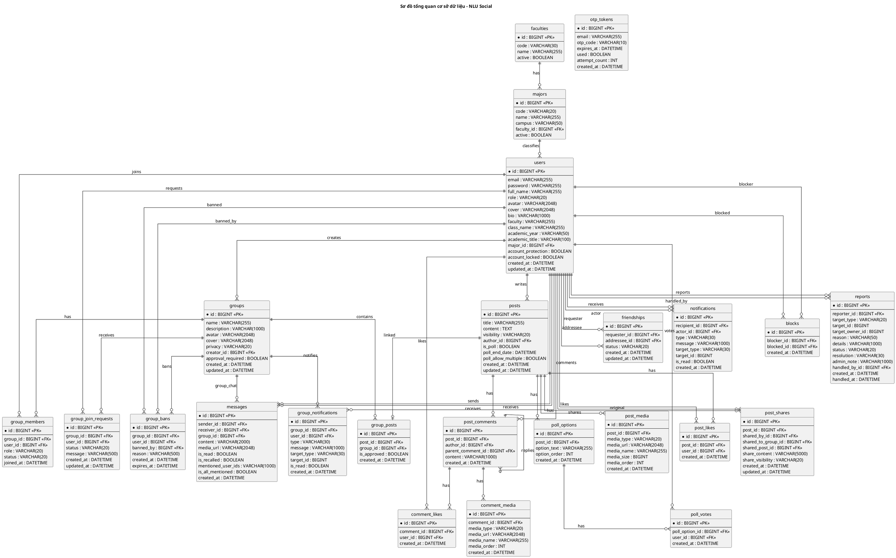
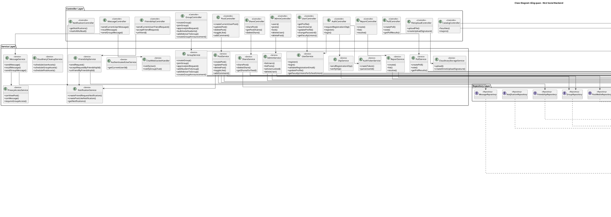

# UML tổng quan hệ thống

## 1. Sơ đồ tổng quan CSDL

```plantuml
@startuml
title Sơ đồ tổng quan cơ sở dữ liệu - NLU Social
hide circle
skinparam linetype ortho
skinparam entity {
  BackgroundColor #FFFFFF
  BorderColor #333333
}

entity faculties {
  * id : BIGINT <<PK>>
  --
  code : VARCHAR(30)
  name : VARCHAR(255)
  active : BOOLEAN
}

entity majors {
  * id : BIGINT <<PK>>
  --
  code : VARCHAR(20)
  name : VARCHAR(255)
  campus : VARCHAR(50)
  faculty_id : BIGINT <<FK>>
  active : BOOLEAN
}

entity users {
  * id : BIGINT <<PK>>
  --
  email : VARCHAR(255)
  password : VARCHAR(255)
  full_name : VARCHAR(255)
  role : VARCHAR(20)
  avatar : VARCHAR(2048)
  cover : VARCHAR(2048)
  bio : VARCHAR(1000)
  faculty : VARCHAR(255)
  class_name : VARCHAR(255)
  academic_year : VARCHAR(50)
  academic_title : VARCHAR(100)
  major_id : BIGINT <<FK>>
  account_protection : BOOLEAN
  account_locked : BOOLEAN
  created_at : DATETIME
  updated_at : DATETIME
}

entity groups {
  * id : BIGINT <<PK>>
  --
  name : VARCHAR(255)
  description : VARCHAR(1000)
  avatar : VARCHAR(2048)
  cover : VARCHAR(2048)
  privacy : VARCHAR(20)
  creator_id : BIGINT <<FK>>
  approval_required : BOOLEAN
  created_at : DATETIME
  updated_at : DATETIME
}

entity group_members {
  * id : BIGINT <<PK>>
  --
  group_id : BIGINT <<FK>>
  user_id : BIGINT <<FK>>
  role : VARCHAR(20)
  status : VARCHAR(20)
  joined_at : DATETIME
}

entity group_join_requests {
  * id : BIGINT <<PK>>
  --
  group_id : BIGINT <<FK>>
  user_id : BIGINT <<FK>>
  status : VARCHAR(20)
  message : VARCHAR(500)
  created_at : DATETIME
  updated_at : DATETIME
}

entity group_bans {
  * id : BIGINT <<PK>>
  --
  group_id : BIGINT <<FK>>
  user_id : BIGINT <<FK>>
  banned_by : BIGINT <<FK>>
  reason : VARCHAR(500)
  created_at : DATETIME
  expires_at : DATETIME
}

entity posts {
  * id : BIGINT <<PK>>
  --
  title : VARCHAR(255)
  content : TEXT
  visibility : VARCHAR(20)
  author_id : BIGINT <<FK>>
  is_poll : BOOLEAN
  poll_end_date : DATETIME
  poll_allow_multiple : BOOLEAN
  created_at : DATETIME
  updated_at : DATETIME
}

entity post_media {
  * id : BIGINT <<PK>>
  --
  post_id : BIGINT <<FK>>
  media_type : VARCHAR(20)
  media_url : VARCHAR(2048)
  media_name : VARCHAR(255)
  media_size : BIGINT
  media_order : INT
  created_at : DATETIME
}

entity post_comments {
  * id : BIGINT <<PK>>
  --
  post_id : BIGINT <<FK>>
  author_id : BIGINT <<FK>>
  parent_comment_id : BIGINT <<FK>>
  content : VARCHAR(1000)
  created_at : DATETIME
}

entity comment_media {
  * id : BIGINT <<PK>>
  --
  comment_id : BIGINT <<FK>>
  media_type : VARCHAR(20)
  media_url : VARCHAR(2048)
  media_name : VARCHAR(255)
  media_order : INT
  created_at : DATETIME
}

entity post_likes {
  * id : BIGINT <<PK>>
  --
  post_id : BIGINT <<FK>>
  user_id : BIGINT <<FK>>
  created_at : DATETIME
}

entity comment_likes {
  * id : BIGINT <<PK>>
  --
  comment_id : BIGINT <<FK>>
  user_id : BIGINT <<FK>>
  created_at : DATETIME
}

entity poll_options {
  * id : BIGINT <<PK>>
  --
  post_id : BIGINT <<FK>>
  option_text : VARCHAR(255)
  option_order : INT
  created_at : DATETIME
}

entity poll_votes {
  * id : BIGINT <<PK>>
  --
  poll_option_id : BIGINT <<FK>>
  user_id : BIGINT <<FK>>
  created_at : DATETIME
}

entity post_shares {
  * id : BIGINT <<PK>>
  --
  post_id : BIGINT <<FK>>
  shared_by_id : BIGINT <<FK>>
  shared_to_group_id : BIGINT <<FK>>
  shared_post_id : BIGINT <<FK>>
  share_content : VARCHAR(5000)
  share_visibility : VARCHAR(20)
  created_at : DATETIME
  updated_at : DATETIME
}

entity group_posts {
  * id : BIGINT <<PK>>
  --
  post_id : BIGINT <<FK>>
  group_id : BIGINT <<FK>>
  is_approved : BOOLEAN
  created_at : DATETIME
}

entity messages {
  * id : BIGINT <<PK>>
  --
  sender_id : BIGINT <<FK>>
  receiver_id : BIGINT <<FK>>
  group_id : BIGINT <<FK>>
  content : VARCHAR(2000)
  media_url : VARCHAR(2048)
  is_read : BOOLEAN
  is_recalled : BOOLEAN
  mentioned_user_ids : VARCHAR(1000)
  is_all_mentioned : BOOLEAN
  created_at : DATETIME
}

entity friendships {
  * id : BIGINT <<PK>>
  --
  requester_id : BIGINT <<FK>>
  addressee_id : BIGINT <<FK>>
  status : VARCHAR(20)
  created_at : DATETIME
  updated_at : DATETIME
}

entity notifications {
  * id : BIGINT <<PK>>
  --
  recipient_id : BIGINT <<FK>>
  actor_id : BIGINT <<FK>>
  type : VARCHAR(30)
  message : VARCHAR(1000)
  target_type : VARCHAR(30)
  target_id : BIGINT
  is_read : BOOLEAN
  created_at : DATETIME
}

entity group_notifications {
  * id : BIGINT <<PK>>
  --
  group_id : BIGINT <<FK>>
  user_id : BIGINT <<FK>>
  type : VARCHAR(30)
  message : VARCHAR(1000)
  target_type : VARCHAR(30)
  target_id : BIGINT
  is_read : BOOLEAN
  created_at : DATETIME
}

entity blocks {
  * id : BIGINT <<PK>>
  --
  blocker_id : BIGINT <<FK>>
  blocked_id : BIGINT <<FK>>
  created_at : DATETIME
}

entity reports {
  * id : BIGINT <<PK>>
  --
  reporter_id : BIGINT <<FK>>
  target_type : VARCHAR(20)
  target_id : BIGINT
  target_owner_id : BIGINT
  reason : VARCHAR(50)
  details : VARCHAR(1000)
  status : VARCHAR(20)
  resolution : VARCHAR(30)
  admin_note : VARCHAR(1000)
  handled_by_id : BIGINT <<FK>>
  created_at : DATETIME
  handled_at : DATETIME
}

entity otp_tokens {
  * id : BIGINT <<PK>>
  --
  email : VARCHAR(255)
  otp_code : VARCHAR(10)
  expires_at : DATETIME
  used : BOOLEAN
  attempt_count : INT
  created_at : DATETIME
}

faculties ||--o{ majors : has
majors ||--o{ users : classifies
users ||--o{ groups : creates
users ||--o{ posts : writes
users ||--o{ post_comments : comments
users ||--o{ post_likes : likes
users ||--o{ comment_likes : likes
users ||--o{ poll_votes : votes
users ||--o{ post_shares : shares
users ||--o{ messages : sends
users ||--o{ notifications : receives
users ||--o{ reports : reports

groups ||--o{ group_members : has
groups ||--o{ group_join_requests : receives
groups ||--o{ group_bans : bans
groups ||--o{ group_posts : contains
groups ||--o{ group_notifications : notifies
groups ||--o{ messages : group_chat

posts ||--o{ post_media : has
posts ||--o{ post_comments : has
posts ||--o{ post_likes : has
posts ||--o{ poll_options : has
posts ||--o{ post_shares : original
posts ||--o| group_posts : linked

post_comments ||--o{ comment_media : has
post_comments ||--o{ comment_likes : has
post_comments ||--o{ post_comments : replies
poll_options ||--o{ poll_votes : has

users ||--o{ friendships : requester
users ||--o{ friendships : addressee
users ||--o{ blocks : blocker
users ||--o{ blocks : blocked
users ||--o{ group_members : joins
users ||--o{ group_join_requests : requests
users ||--o{ group_bans : banned
users ||--o{ group_bans : banned_by
users ||--o{ messages : receives
users ||--o{ notifications : actor
users ||--o{ group_notifications : receives
users ||--o{ reports : handled_by
@enduml
```

## 2. Class diagram tổng quan

```plantuml
@startuml
title Class Diagram tổng quan - NLU Social Backend
skinparam classAttributeIconSize 0
skinparam linetype ortho

package "Controller Layer" {
  class AuthController <<Controller>> {
    +requestRegistrationOtp()
    +register()
    +login()
  }
  class UserController <<Controller>> {
    +getProfile()
    +searchUsers()
    +updateProfile()
    +changePassword()
    +getFacultyUnions()
  }
  class PostController <<Controller>> {
    +createCurrentUserPost()
    +updatePost()
    +deletePost()
    +toggleLike()
    +addComment()
  }
  class PollController <<Controller>> {
    +createPoll()
    +vote()
    +getPollResults()
  }
  class ShareController <<Controller>> {
    +sharePost()
    +getPostShares()
    +deleteShare()
  }
  class FriendshipController <<Controller>> {
    +sendCurrentUserFriendRequest()
    +acceptFriendRequest()
    +unfriend()
  }
  class MessageController <<Controller>> {
    +sendCurrentUserMessage()
    +recallMessage()
    +sendGroupMessage()
  }
  class GroupController <<Controller>> {
    +createGroup()
    +joinGroup()
    +approveJoinRequest()
    +bulkInviteStudents()
    +addAdvisorToGroup()
    +createGroupAnnouncement()
  }
  class NotificationController <<Controller>> {
    +getNotifications()
    +markAllAsRead()
  }
  class ReportController <<Controller>> {
    +create()
    +list()
    +resolve()
  }
  class AdminController <<Controller>> {
    +users()
    +posts()
    +lock()
    +deleteUser()
    +deletePost()
  }
  class FileUploadController <<Controller>> {
    +uploadFile()
    +createUploadSignature()
  }
  class CatalogController <<Controller>> {
    +faculties()
    +majors()
  }
}

package "Service Layer" {
  class UserService <<Service>> {
    +register()
    +login()
    +validateRegistrationEmail()
    +updateProfile()
    +getFacultyUnionsForSchoolUnion()
  }
  class PostService <<Service>> {
    +createPost()
    +updatePost()
    +deletePost()
    +toggleLike()
    +addComment()
  }
  class PollService <<Service>> {
    +createPoll()
    +vote()
    +getPollResults()
  }
  class ShareService <<Service>> {
    +sharePost()
    +deleteShare()
    +getSharesForFeed()
  }
  class FriendshipService <<Service>> {
    +sendRequest()
    +acceptRequestByFriendshipId()
    +unfriendByFriendshipId()
  }
  class MessageService <<Service>> {
    +sendMessage()
    +recallMessage()
    +sendGroupMessage()
  }
  class GroupService <<Service>> {
    +createGroup()
    +joinGroup()
    +approveJoinRequest()
    +addStudentToGroup()
    +addAdvisorToGroup()
    +createGroupAnnouncement()
  }
  class NotificationService <<Service>> {
    +createFriendRequestNotification()
    +createPostLikeNotification()
    +getNotifications()
  }
  class ReportService <<Service>> {
    +create()
    +list()
    +resolve()
  }
  class AdminService <<Service>> {
    +listUsers()
    +listPosts()
    +setUserLocked()
    +deleteUser()
  }
  class OtpService <<Service>> {
    +sendRegistrationOtp()
    +verifyOtp()
  }
  class AuthTokenService <<Service>> {
    +createToken()
    +parseUserId()
  }
  class AuthenticatedUserService <<Service>> {
    +getCurrentUserId()
  }
  class PrivacyAccessService <<Service>> {
    +canViewPost()
    +canMessage()
    +requireGroupAccess()
  }
  class CloudinaryStorageService <<Service>> {
    +upload()
    +createDirectUploadSignature()
  }
  class CloudinaryCleanupService <<Service>> {
    +scheduleUserAssets()
    +scheduleGroupAssets()
    +schedulePostAssets()
  }
  class ChatWebSocketHandler <<Service>> {
    +notifyUser()
    +notifyGroupChat()
  }
}

package "Repository Layer" {
  interface UserRepository <<Repository>>
  interface PostRepository <<Repository>>
  interface PostCommentRepository <<Repository>>
  interface PostLikeRepository <<Repository>>
  interface PostMediaRepository <<Repository>>
  interface PollOptionRepository <<Repository>>
  interface PollVoteRepository <<Repository>>
  interface PostShareRepository <<Repository>>
  interface FriendshipRepository <<Repository>>
  interface MessageRepository <<Repository>>
  interface NotificationRepository <<Repository>>
  interface GroupRepository <<Repository>>
  interface GroupMemberRepository <<Repository>>
  interface GroupJoinRequestRepository <<Repository>>
  interface GroupPostRepository <<Repository>>
  interface GroupNotificationRepository <<Repository>>
  interface GroupBanRepository <<Repository>>
  interface ReportRepository <<Repository>>
  interface OtpTokenRepository <<Repository>>
  interface FacultyRepository <<Repository>>
  interface MajorRepository <<Repository>>
}

package "Domain Entity" {
  class User <<Entity>>
  class Faculty <<Entity>>
  class Major <<Entity>>
  class Post <<Entity>>
  class PostComment <<Entity>>
  class PostMedia <<Entity>>
  class PostLike <<Entity>>
  class CommentLike <<Entity>>
  class CommentMedia <<Entity>>
  class PollOption <<Entity>>
  class PollVote <<Entity>>
  class PostShare <<Entity>>
  class Friendship <<Entity>>
  class Message <<Entity>>
  class Notification <<Entity>>
  class Group <<Entity>>
  class GroupMember <<Entity>>
  class GroupJoinRequest <<Entity>>
  class GroupPost <<Entity>>
  class GroupNotification <<Entity>>
  class GroupBan <<Entity>>
  class Report <<Entity>>
  class OtpToken <<Entity>>
}

AuthController --> UserService
AuthController --> OtpService
AuthController --> AuthTokenService
UserController --> UserService
PostController --> PostService
PollController --> PollService
ShareController --> ShareService
FriendshipController --> FriendshipService
MessageController --> MessageService
MessageController --> ChatWebSocketHandler
GroupController --> GroupService
NotificationController --> NotificationService
ReportController --> ReportService
AdminController --> AdminService
FileUploadController --> CloudinaryStorageService
CatalogController --> FacultyRepository
CatalogController --> MajorRepository

UserService --> UserRepository
UserService --> FacultyRepository
UserService --> MajorRepository
PostService --> PostRepository
PostService --> PostCommentRepository
PostService --> PostLikeRepository
PostService --> PostMediaRepository
PostService --> NotificationService
PollService --> PostRepository
PollService --> PollOptionRepository
PollService --> PollVoteRepository
ShareService --> PostShareRepository
ShareService --> PostRepository
FriendshipService --> FriendshipRepository
FriendshipService --> NotificationService
MessageService --> MessageRepository
MessageService --> PrivacyAccessService
GroupService --> GroupRepository
GroupService --> GroupMemberRepository
GroupService --> GroupJoinRequestRepository
GroupService --> GroupPostRepository
GroupService --> GroupNotificationRepository
ReportService --> ReportRepository
ReportService --> UserRepository
AdminService --> UserRepository
AdminService --> PostRepository
AdminService --> GroupRepository
OtpService --> OtpTokenRepository

UserRepository ..> User
FacultyRepository ..> Faculty
MajorRepository ..> Major
PostRepository ..> Post
PostCommentRepository ..> PostComment
PostLikeRepository ..> PostLike
PostMediaRepository ..> PostMedia
PollOptionRepository ..> PollOption
PollVoteRepository ..> PollVote
PostShareRepository ..> PostShare
FriendshipRepository ..> Friendship
MessageRepository ..> Message
NotificationRepository ..> Notification
GroupRepository ..> Group
GroupMemberRepository ..> GroupMember
GroupJoinRequestRepository ..> GroupJoinRequest
GroupPostRepository ..> GroupPost
GroupNotificationRepository ..> GroupNotification
GroupBanRepository ..> GroupBan
ReportRepository ..> Report
OtpTokenRepository ..> OtpToken

Faculty "1" -- "0..*" Major
Major "1" -- "0..*" User
User "1" -- "0..*" Post
User "1" -- "0..*" Group
Group "1" -- "0..*" GroupMember
Group "1" -- "0..*" GroupPost
Post "1" -- "0..*" PostComment
Post "1" -- "0..*" PostLike
Post "1" -- "0..*" PollOption
PollOption "1" -- "0..*" PollVote
User "1" -- "0..*" Message
User "1" -- "0..*" Notification
User "1" -- "0..*" Report
@enduml
```
