# 3.2.1 Mô Tả Chương Trình

Hệ thống NLU-social là một mạng xã hội trực tuyến được phát triển nhằm đáp ứng nhu cầu kết nối, chia sẻ thông tin và tương tác giữa các thành viên trong cộng đồng sinh viên. Chương trình được xây dựng dựa trên kiến trúc client-server với frontend sử dụng React (TypeScript) và backend sử dụng Spring Boot (Java), kết hợp với cơ sở dữ liệu MySQL để lưu trữ dữ liệu.

Chương trình cung cấp các chức năng chính của một mạng xã hội bao gồm: quản lý tài khoản (đăng ký, đăng nhập), quản lý hồ sơ cá nhân (cập nhật thông tin, ảnh đại diện, bảo vệ tài khoản), quản lý bài viết (đăng, chỉnh sửa, xóa bài), tương tác với bài viết (thích, bình luận, trả lời, thích bình luận), kết nối bạn bè (gửi yêu cầu, chấp nhận, hủy kết bạn), nhắn tin cá nhân thời gian thực (gửi tin nhắn văn bản và hình ảnh, thu hồi tin nhắn), hệ thống thông báo và tìm kiếm người dùng. Các tính năng giao tiếp thời gian thực được hỗ trợ qua WebSocket.

---

# 3.2.2.3 Sequence Diagram Các Chức Năng

## 3.2.2.3.1 Quản Lý Tài Khoản

### 3.2.2.3.1.1 Đăng Ký Tài Khoản

**Mô tả:** Cho phép người dùng mới tạo tài khoản bằng email, mật khẩu và thông tin cá nhân.

**API:** `POST /api/auth/register`

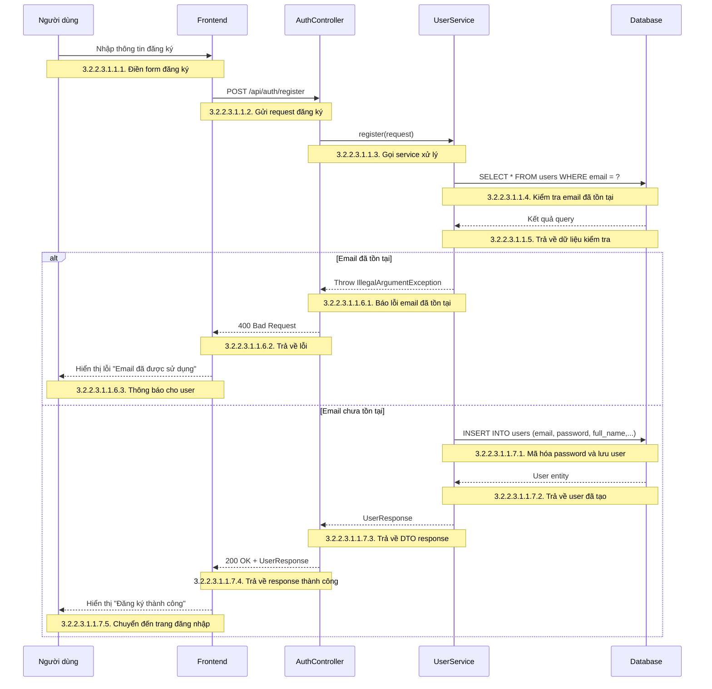
```mermaid
sequenceDiagram
    participant U as Người dùng
    participant UI as Frontend
    participant C as AuthController
    participant S as UserService
    participant DB as Database

    U->>UI: Nhập thông tin đăng ký
    Note over U,UI: 3.2.2.3.1.1.1. Điền form đăng ký
    UI->>C: POST /api/auth/register
    Note over UI,C: 3.2.2.3.1.1.2. Gửi request đăng ký
    C->>S: register(request)
    Note over C,S: 3.2.2.3.1.1.3. Gọi service xử lý
    S->>DB: SELECT * FROM users WHERE email = ?
    Note over S,DB: 3.2.2.3.1.1.4. Kiểm tra email đã tồn tại
    DB-->>S: Kết quả query
    Note over DB,S: 3.2.2.3.1.1.5. Trả về dữ liệu kiểm tra
    alt Email đã tồn tại
        S-->>C: Throw IllegalArgumentException
        Note over S,C: 3.2.2.3.1.1.6.1. Báo lỗi email đã tồn tại
        C-->>UI: 400 Bad Request
        Note over C,UI: 3.2.2.3.1.1.6.2. Trả về lỗi
        UI-->>U: Hiển thị lỗi "Email đã được sử dụng"
        Note over UI,U: 3.2.2.3.1.1.6.3. Thông báo cho user
    else Email chưa tồn tại
        S->>DB: INSERT INTO users (email, password, full_name,...)
        Note over S,DB: 3.2.2.3.1.1.7.1. Mã hóa password và lưu user
        DB-->>S: User entity
        Note over DB,S: 3.2.2.3.1.1.7.2. Trả về user đã tạo
        S-->>C: UserResponse
        Note over S,C: 3.2.2.3.1.1.7.3. Trả về DTO response
        C-->>UI: 200 OK + UserResponse
        Note over C,UI: 3.2.2.3.1.1.7.4. Trả về response thành công
        UI-->>U: Hiển thị "Đăng ký thành công"
        Note over UI,U: 3.2.2.3.1.1.7.5. Chuyển đến trang đăng nhập
    end
```

### 3.2.2.3.1.2 Đăng Nhập

**Mô tả:** Xác thực người dùng với email và mật khẩu.

**API:** `POST /api/auth/login`

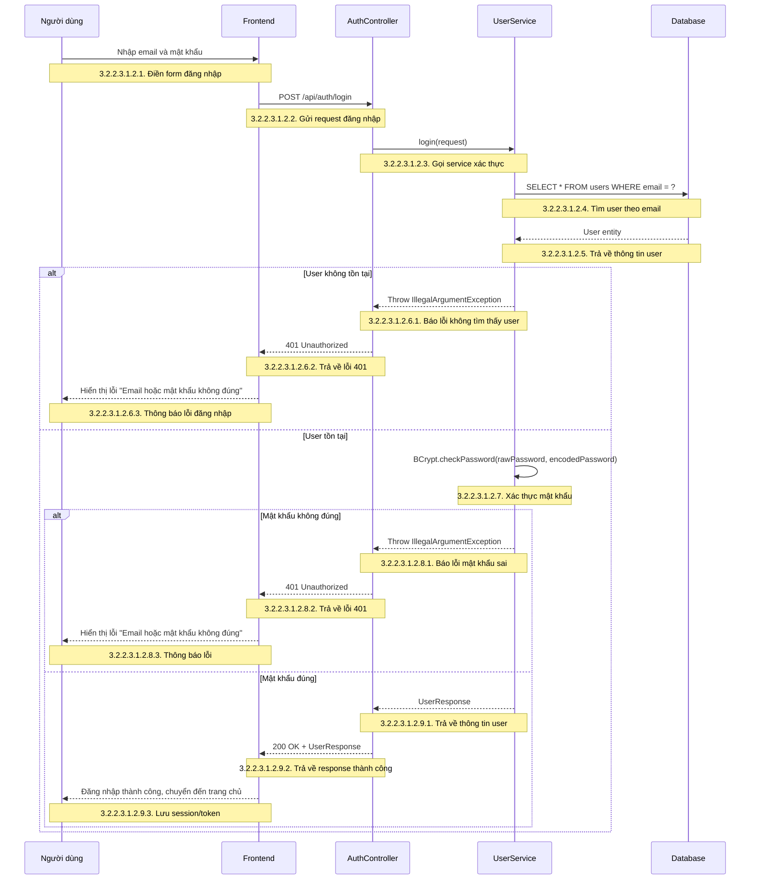
```mermaid
sequenceDiagram
    participant U as Người dùng
    participant UI as Frontend
    participant C as AuthController
    participant S as UserService
    participant DB as Database

    U->>UI: Nhập email và mật khẩu
    Note over U,UI: 3.2.2.3.1.2.1. Điền form đăng nhập
    UI->>C: POST /api/auth/login
    Note over UI,C: 3.2.2.3.1.2.2. Gửi request đăng nhập
    C->>S: login(request)
    Note over C,S: 3.2.2.3.1.2.3. Gọi service xác thực
    S->>DB: SELECT * FROM users WHERE email = ?
    Note over S,DB: 3.2.2.3.1.2.4. Tìm user theo email
    DB-->>S: User entity
    Note over DB,S: 3.2.2.3.1.2.5. Trả về thông tin user
    alt User không tồn tại
        S-->>C: Throw IllegalArgumentException
        Note over S,C: 3.2.2.3.1.2.6.1. Báo lỗi không tìm thấy user
        C-->>UI: 401 Unauthorized
        Note over C,UI: 3.2.2.3.1.2.6.2. Trả về lỗi 401
        UI-->>U: Hiển thị lỗi "Email hoặc mật khẩu không đúng"
        Note over UI,U: 3.2.2.3.1.2.6.3. Thông báo lỗi đăng nhập
    else User tồn tại
        S->>S: BCrypt.checkPassword(rawPassword, encodedPassword)
        Note over S: 3.2.2.3.1.2.7. Xác thực mật khẩu
        alt Mật khẩu không đúng
            S-->>C: Throw IllegalArgumentException
            Note over S,C: 3.2.2.3.1.2.8.1. Báo lỗi mật khẩu sai
            C-->>UI: 401 Unauthorized
            Note over C,UI: 3.2.2.3.1.2.8.2. Trả về lỗi 401
            UI-->>U: Hiển thị lỗi "Email hoặc mật khẩu không đúng"
            Note over UI,U: 3.2.2.3.1.2.8.3. Thông báo lỗi
        else Mật khẩu đúng
            S-->>C: UserResponse
            Note over S,C: 3.2.2.3.1.2.9.1. Trả về thông tin user
            C-->>UI: 200 OK + UserResponse
            Note over C,UI: 3.2.2.3.1.2.9.2. Trả về response thành công
            UI-->>U: Đăng nhập thành công, chuyển đến trang chủ
            Note over UI,U: 3.2.2.3.1.2.9.3. Lưu session/token
        end
    end
```

## 3.2.2.3.2 Quản Lý Hồ Sơ

### 3.2.2.3.2.1 Cập Nhật Thông Tin Cá Nhân

**Mô tả:** Cho phép người dùng cập nhật họ tên, bio, khoa, lớp, năm học và ảnh đại diện.

**API:** `PUT /api/users/{userId}`

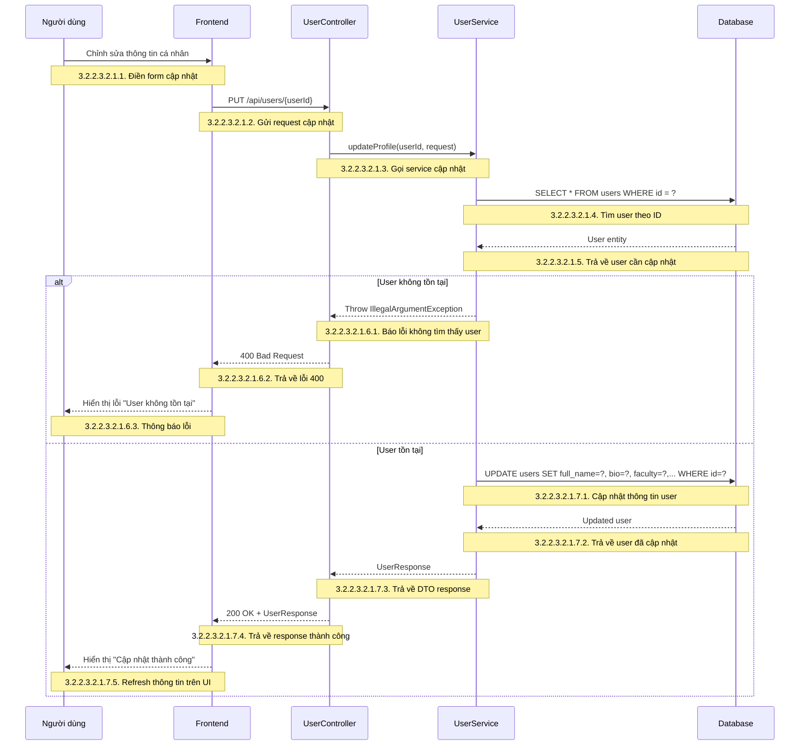
```mermaid
sequenceDiagram
    participant U as Người dùng
    participant UI as Frontend
    participant C as UserController
    participant S as UserService
    participant DB as Database

    U->>UI: Chỉnh sửa thông tin cá nhân
    Note over U,UI: 3.2.2.3.2.1.1. Điền form cập nhật
    UI->>C: PUT /api/users/{userId}
    Note over UI,C: 3.2.2.3.2.1.2. Gửi request cập nhật
    C->>S: updateProfile(userId, request)
    Note over C,S: 3.2.2.3.2.1.3. Gọi service cập nhật
    S->>DB: SELECT * FROM users WHERE id = ?
    Note over S,DB: 3.2.2.3.2.1.4. Tìm user theo ID
    DB-->>S: User entity
    Note over DB,S: 3.2.2.3.2.1.5. Trả về user cần cập nhật
    alt User không tồn tại
        S-->>C: Throw IllegalArgumentException
        Note over S,C: 3.2.2.3.2.1.6.1. Báo lỗi không tìm thấy user
        C-->>UI: 400 Bad Request
        Note over C,UI: 3.2.2.3.2.1.6.2. Trả về lỗi 400
        UI-->>U: Hiển thị lỗi "User không tồn tại"
        Note over UI,U: 3.2.2.3.2.1.6.3. Thông báo lỗi
    else User tồn tại
        S->>DB: UPDATE users SET full_name=?, bio=?, faculty=?,... WHERE id=?
        Note over S,DB: 3.2.2.3.2.1.7.1. Cập nhật thông tin user
        DB-->>S: Updated user
        Note over DB,S: 3.2.2.3.2.1.7.2. Trả về user đã cập nhật
        S-->>C: UserResponse
        Note over S,C: 3.2.2.3.2.1.7.3. Trả về DTO response
        C-->>UI: 200 OK + UserResponse
        Note over C,UI: 3.2.2.3.2.1.7.4. Trả về response thành công
        UI-->>U: Hiển thị "Cập nhật thành công"
        Note over UI,U: 3.2.2.3.2.1.7.5. Refresh thông tin trên UI
    end
```

### 3.2.2.3.2.2 Đổi Mật Khẩu

**Mô tả:** Cho phép người dùng thay đổi mật khẩu hiện tại.

**API:** `POST /api/users/{userId}/change-password`

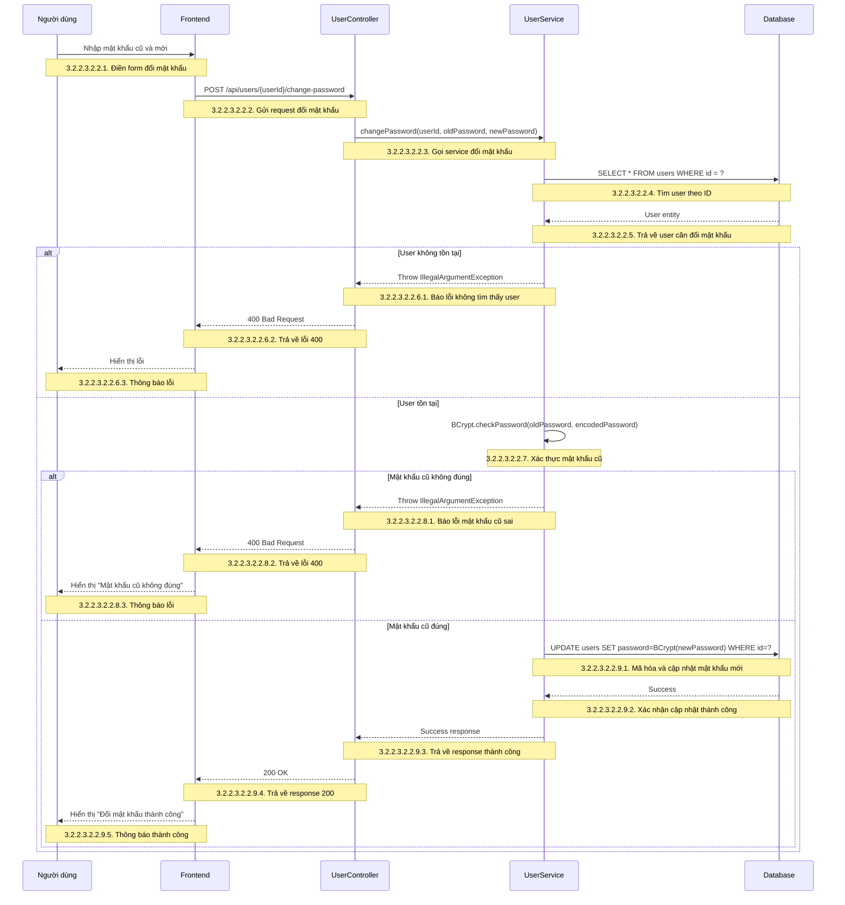
```mermaid
sequenceDiagram
    participant U as Người dùng
    participant UI as Frontend
    participant C as UserController
    participant S as UserService
    participant DB as Database

    U->>UI: Nhập mật khẩu cũ và mới
    Note over U,UI: 3.2.2.3.2.2.1. Điền form đổi mật khẩu
    UI->>C: POST /api/users/{userId}/change-password
    Note over UI,C: 3.2.2.3.2.2.2. Gửi request đổi mật khẩu
    C->>S: changePassword(userId, oldPassword, newPassword)
    Note over C,S: 3.2.2.3.2.2.3. Gọi service đổi mật khẩu
    S->>DB: SELECT * FROM users WHERE id = ?
    Note over S,DB: 3.2.2.3.2.2.4. Tìm user theo ID
    DB-->>S: User entity
    Note over DB,S: 3.2.2.3.2.2.5. Trả về user cần đổi mật khẩu
    alt User không tồn tại
        S-->>C: Throw IllegalArgumentException
        Note over S,C: 3.2.2.3.2.2.6.1. Báo lỗi không tìm thấy user
        C-->>UI: 400 Bad Request
        Note over C,UI: 3.2.2.3.2.2.6.2. Trả về lỗi 400
        UI-->>U: Hiển thị lỗi
        Note over UI,U: 3.2.2.3.2.2.6.3. Thông báo lỗi
    else User tồn tại
        S->>S: BCrypt.checkPassword(oldPassword, encodedPassword)
        Note over S: 3.2.2.3.2.2.7. Xác thực mật khẩu cũ
        alt Mật khẩu cũ không đúng
            S-->>C: Throw IllegalArgumentException
            Note over S,C: 3.2.2.3.2.2.8.1. Báo lỗi mật khẩu cũ sai
            C-->>UI: 400 Bad Request
            Note over C,UI: 3.2.2.3.2.2.8.2. Trả về lỗi 400
            UI-->>U: Hiển thị "Mật khẩu cũ không đúng"
            Note over UI,U: 3.2.2.3.2.2.8.3. Thông báo lỗi
        else Mật khẩu cũ đúng
            S->>DB: UPDATE users SET password=BCrypt(newPassword) WHERE id=?
            Note over S,DB: 3.2.2.3.2.2.9.1. Mã hóa và cập nhật mật khẩu mới
            DB-->>S: Success
            Note over DB,S: 3.2.2.3.2.2.9.2. Xác nhận cập nhật thành công
            S-->>C: Success response
            Note over S,C: 3.2.2.3.2.2.9.3. Trả về response thành công
            C-->>UI: 200 OK
            Note over C,UI: 3.2.2.3.2.2.9.4. Trả về response 200
            UI-->>U: Hiển thị "Đổi mật khẩu thành công"
            Note over UI,U: 3.2.2.3.2.2.9.5. Thông báo thành công
        end
    end
```

### 3.2.2.3.2.3 Thiết Lập Quyền Riêng Tư Tài Khoản

**Mô tả:** Cho phép người dùng bật/tắt chế độ bảo vệ tài khoản.

**API:** `POST /api/users/{userId}/toggle-protection`

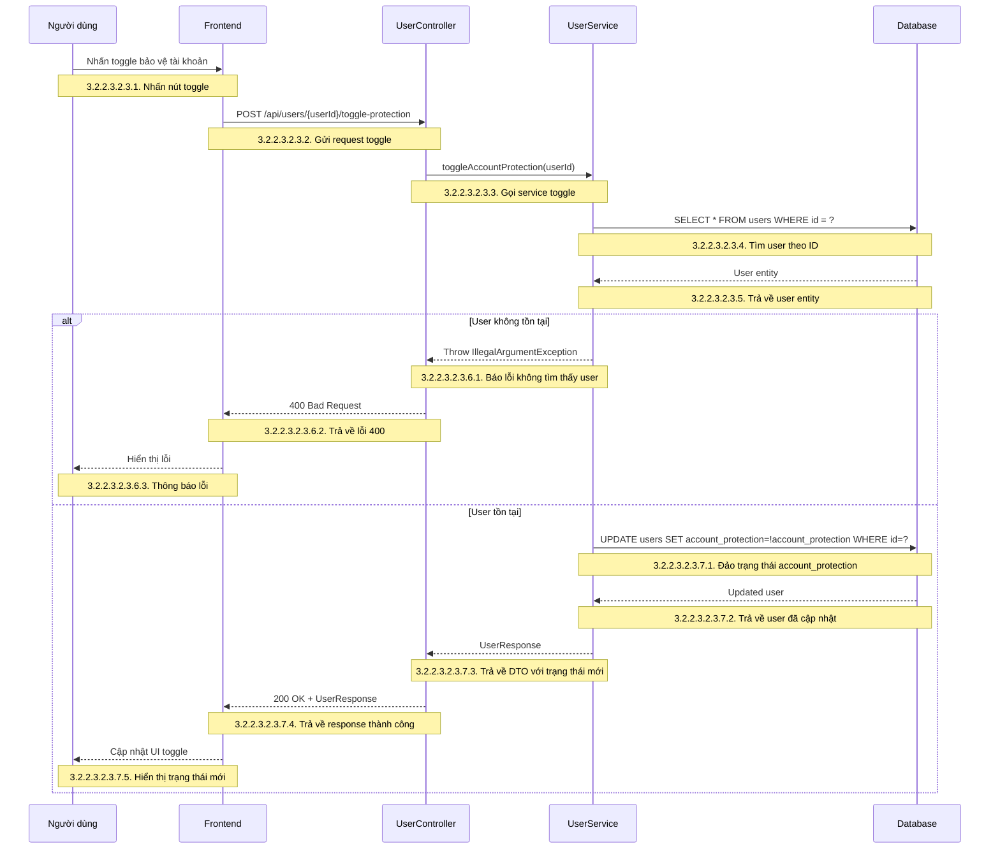
```mermaid
sequenceDiagram
    participant U as Người dùng
    participant UI as Frontend
    participant C as UserController
    participant S as UserService
    participant DB as Database

    U->>UI: Nhấn toggle bảo vệ tài khoản
    Note over U,UI: 3.2.2.3.2.3.1. Nhấn nút toggle
    UI->>C: POST /api/users/{userId}/toggle-protection
    Note over UI,C: 3.2.2.3.2.3.2. Gửi request toggle
    C->>S: toggleAccountProtection(userId)
    Note over C,S: 3.2.2.3.2.3.3. Gọi service toggle
    S->>DB: SELECT * FROM users WHERE id = ?
    Note over S,DB: 3.2.2.3.2.3.4. Tìm user theo ID
    DB-->>S: User entity
    Note over DB,S: 3.2.2.3.2.3.5. Trả về user entity
    alt User không tồn tại
        S-->>C: Throw IllegalArgumentException
        Note over S,C: 3.2.2.3.2.3.6.1. Báo lỗi không tìm thấy user
        C-->>UI: 400 Bad Request
        Note over C,UI: 3.2.2.3.2.3.6.2. Trả về lỗi 400
        UI-->>U: Hiển thị lỗi
        Note over UI,U: 3.2.2.3.2.3.6.3. Thông báo lỗi
    else User tồn tại
        S->>DB: UPDATE users SET account_protection=!account_protection WHERE id=?
        Note over S,DB: 3.2.2.3.2.3.7.1. Đảo trạng thái account_protection
        DB-->>S: Updated user
        Note over DB,S: 3.2.2.3.2.3.7.2. Trả về user đã cập nhật
        S-->>C: UserResponse
        Note over S,C: 3.2.2.3.2.3.7.3. Trả về DTO với trạng thái mới
        C-->>UI: 200 OK + UserResponse
        Note over C,UI: 3.2.2.3.2.3.7.4. Trả về response thành công
        UI-->>U: Cập nhật UI toggle
        Note over UI,U: 3.2.2.3.2.3.7.5. Hiển thị trạng thái mới
    end
```

## 3.2.2.3.3 Quản Lý Bài Viết

### 3.2.2.3.3.1 Đăng Bài Viết

**Mô tả:** Cho phép người dùng tạo bài viết mới với tiêu đề, nội dung và media.

**API:** `POST /api/posts/user/{userId}`

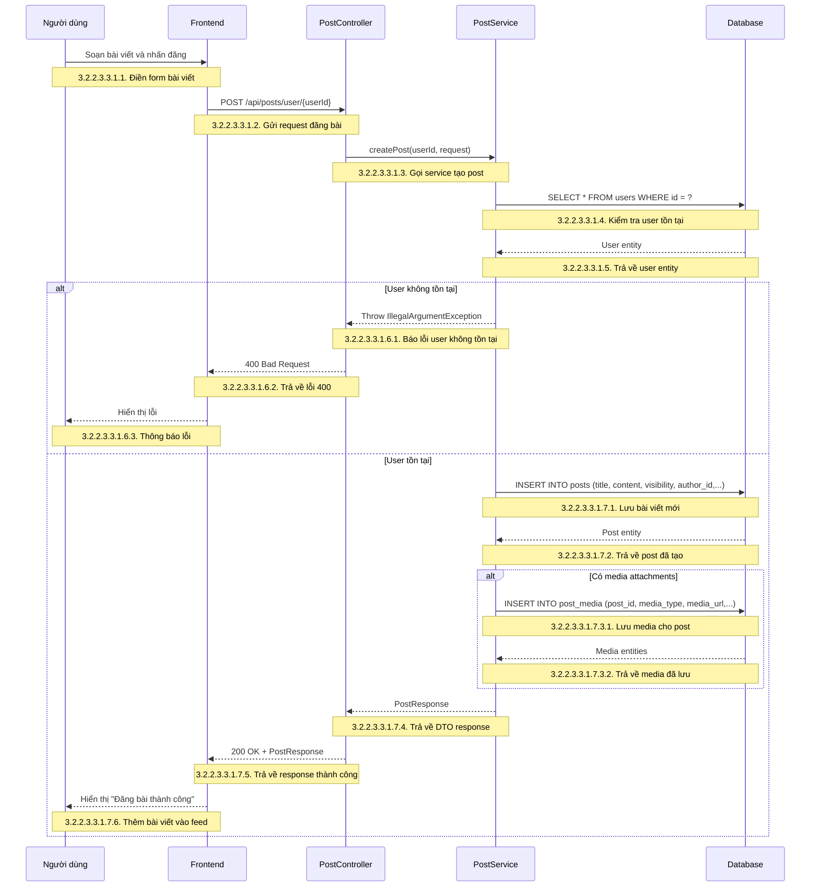
```mermaid
sequenceDiagram
    participant U as Người dùng
    participant UI as Frontend
    participant C as PostController
    participant S as PostService
    participant DB as Database

    U->>UI: Soạn bài viết và nhấn đăng
    Note over U,UI: 3.2.2.3.3.1.1. Điền form bài viết
    UI->>C: POST /api/posts/user/{userId}
    Note over UI,C: 3.2.2.3.3.1.2. Gửi request đăng bài
    C->>S: createPost(userId, request)
    Note over C,S: 3.2.2.3.3.1.3. Gọi service tạo post
    S->>DB: SELECT * FROM users WHERE id = ?
    Note over S,DB: 3.2.2.3.3.1.4. Kiểm tra user tồn tại
    DB-->>S: User entity
    Note over DB,S: 3.2.2.3.3.1.5. Trả về user entity
    alt User không tồn tại
        S-->>C: Throw IllegalArgumentException
        Note over S,C: 3.2.2.3.3.1.6.1. Báo lỗi user không tồn tại
        C-->>UI: 400 Bad Request
        Note over C,UI: 3.2.2.3.3.1.6.2. Trả về lỗi 400
        UI-->>U: Hiển thị lỗi
        Note over UI,U: 3.2.2.3.3.1.6.3. Thông báo lỗi
    else User tồn tại
        S->>DB: INSERT INTO posts (title, content, visibility, author_id,...)
        Note over S,DB: 3.2.2.3.3.1.7.1. Lưu bài viết mới
        DB-->>S: Post entity
        Note over DB,S: 3.2.2.3.3.1.7.2. Trả về post đã tạo
        alt Có media attachments
            S->>DB: INSERT INTO post_media (post_id, media_type, media_url,...)
            Note over S,DB: 3.2.2.3.3.1.7.3.1. Lưu media cho post
            DB-->>S: Media entities
            Note over DB,S: 3.2.2.3.3.1.7.3.2. Trả về media đã lưu
        end
        S-->>C: PostResponse
        Note over S,C: 3.2.2.3.3.1.7.4. Trả về DTO response
        C-->>UI: 200 OK + PostResponse
        Note over C,UI: 3.2.2.3.3.1.7.5. Trả về response thành công
        UI-->>U: Hiển thị "Đăng bài thành công"
        Note over UI,U: 3.2.2.3.3.1.7.6. Thêm bài viết vào feed
    end
```

### 3.2.2.3.3.2 Chỉnh Sửa Bài Viết

**Mô tả:** Cho phép tác giả chỉnh sửa bài viết của mình.

**API:** `PUT /api/posts/{postId}/user/{userId}`

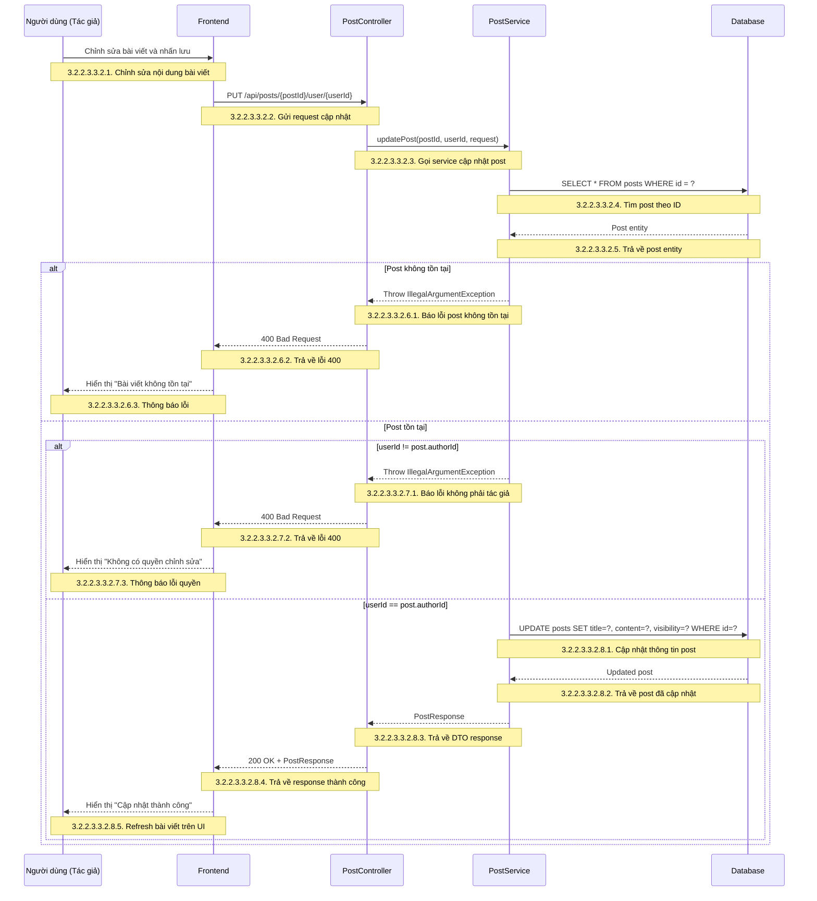
```mermaid
sequenceDiagram
    participant U as Người dùng (Tác giả)
    participant UI as Frontend
    participant C as PostController
    participant S as PostService
    participant DB as Database

    U->>UI: Chỉnh sửa bài viết và nhấn lưu
    Note over U,UI: 3.2.2.3.3.2.1. Chỉnh sửa nội dung bài viết
    UI->>C: PUT /api/posts/{postId}/user/{userId}
    Note over UI,C: 3.2.2.3.3.2.2. Gửi request cập nhật
    C->>S: updatePost(postId, userId, request)
    Note over C,S: 3.2.2.3.3.2.3. Gọi service cập nhật post
    S->>DB: SELECT * FROM posts WHERE id = ?
    Note over S,DB: 3.2.2.3.3.2.4. Tìm post theo ID
    DB-->>S: Post entity
    Note over DB,S: 3.2.2.3.3.2.5. Trả về post entity
    alt Post không tồn tại
        S-->>C: Throw IllegalArgumentException
        Note over S,C: 3.2.2.3.3.2.6.1. Báo lỗi post không tồn tại
        C-->>UI: 400 Bad Request
        Note over C,UI: 3.2.2.3.3.2.6.2. Trả về lỗi 400
        UI-->>U: Hiển thị "Bài viết không tồn tại"
        Note over UI,U: 3.2.2.3.3.2.6.3. Thông báo lỗi
    else Post tồn tại
        alt userId != post.authorId
            S-->>C: Throw IllegalArgumentException
            Note over S,C: 3.2.2.3.3.2.7.1. Báo lỗi không phải tác giả
            C-->>UI: 400 Bad Request
            Note over C,UI: 3.2.2.3.3.2.7.2. Trả về lỗi 400
            UI-->>U: Hiển thị "Không có quyền chỉnh sửa"
            Note over UI,U: 3.2.2.3.3.2.7.3. Thông báo lỗi quyền
        else userId == post.authorId
            S->>DB: UPDATE posts SET title=?, content=?, visibility=? WHERE id=?
            Note over S,DB: 3.2.2.3.3.2.8.1. Cập nhật thông tin post
            DB-->>S: Updated post
            Note over DB,S: 3.2.2.3.3.2.8.2. Trả về post đã cập nhật
            S-->>C: PostResponse
            Note over S,C: 3.2.2.3.3.2.8.3. Trả về DTO response
            C-->>UI: 200 OK + PostResponse
            Note over C,UI: 3.2.2.3.3.2.8.4. Trả về response thành công
            UI-->>U: Hiển thị "Cập nhật thành công"
            Note over UI,U: 3.2.2.3.3.2.8.5. Refresh bài viết trên UI
        end
    end
```

### 3.2.2.3.3.3 Xóa Bài Viết

**Mô tả:** Cho phép tác giả xóa bài viết (CASCADE xóa comments, likes, media).

**API:** `DELETE /api/posts/{postId}/user/{userId}`

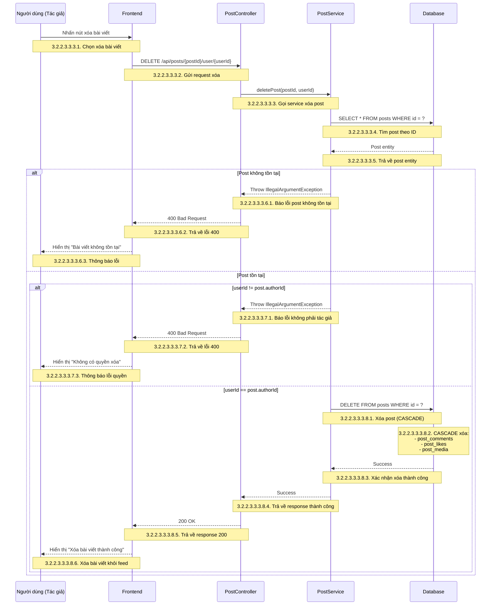
```mermaid
sequenceDiagram
    participant U as Người dùng (Tác giả)
    participant UI as Frontend
    participant C as PostController
    participant S as PostService
    participant DB as Database

    U->>UI: Nhấn nút xóa bài viết
    Note over U,UI: 3.2.2.3.3.3.1. Chọn xóa bài viết
    UI->>C: DELETE /api/posts/{postId}/user/{userId}
    Note over UI,C: 3.2.2.3.3.3.2. Gửi request xóa
    C->>S: deletePost(postId, userId)
    Note over C,S: 3.2.2.3.3.3.3. Gọi service xóa post
    S->>DB: SELECT * FROM posts WHERE id = ?
    Note over S,DB: 3.2.2.3.3.3.4. Tìm post theo ID
    DB-->>S: Post entity
    Note over DB,S: 3.2.2.3.3.3.5. Trả về post entity
    alt Post không tồn tại
        S-->>C: Throw IllegalArgumentException
        Note over S,C: 3.2.2.3.3.3.6.1. Báo lỗi post không tồn tại
        C-->>UI: 400 Bad Request
        Note over C,UI: 3.2.2.3.3.3.6.2. Trả về lỗi 400
        UI-->>U: Hiển thị "Bài viết không tồn tại"
        Note over UI,U: 3.2.2.3.3.3.6.3. Thông báo lỗi
    else Post tồn tại
        alt userId != post.authorId
            S-->>C: Throw IllegalArgumentException
            Note over S,C: 3.2.2.3.3.3.7.1. Báo lỗi không phải tác giả
            C-->>UI: 400 Bad Request
            Note over C,UI: 3.2.2.3.3.3.7.2. Trả về lỗi 400
            UI-->>U: Hiển thị "Không có quyền xóa"
            Note over UI,U: 3.2.2.3.3.3.7.3. Thông báo lỗi quyền
        else userId == post.authorId
            S->>DB: DELETE FROM posts WHERE id = ?
            Note over S,DB: 3.2.2.3.3.3.8.1. Xóa post (CASCADE)
            Note over DB: 3.2.2.3.3.3.8.2. CASCADE xóa:<br/>- post_comments<br/>- post_likes<br/>- post_media
            DB-->>S: Success
            Note over DB,S: 3.2.2.3.3.3.8.3. Xác nhận xóa thành công
            S-->>C: Success
            Note over S,C: 3.2.2.3.3.3.8.4. Trả về response thành công
            C-->>UI: 200 OK
            Note over C,UI: 3.2.2.3.3.3.8.5. Trả về response 200
            UI-->>U: Hiển thị "Xóa bài viết thành công"
            Note over UI,U: 3.2.2.3.3.3.8.6. Xóa bài viết khỏi feed
        end
    end
```

## 3.2.2.3.4 Tương Tác Với Bài Viết

### 3.2.2.3.4.1 Thích Bài Viết

**Mô tả:** Cho phép người dùng thích hoặc bỏ thích bài viết.

**API:** `POST /api/posts/{postId}/likes/user/{userId}`

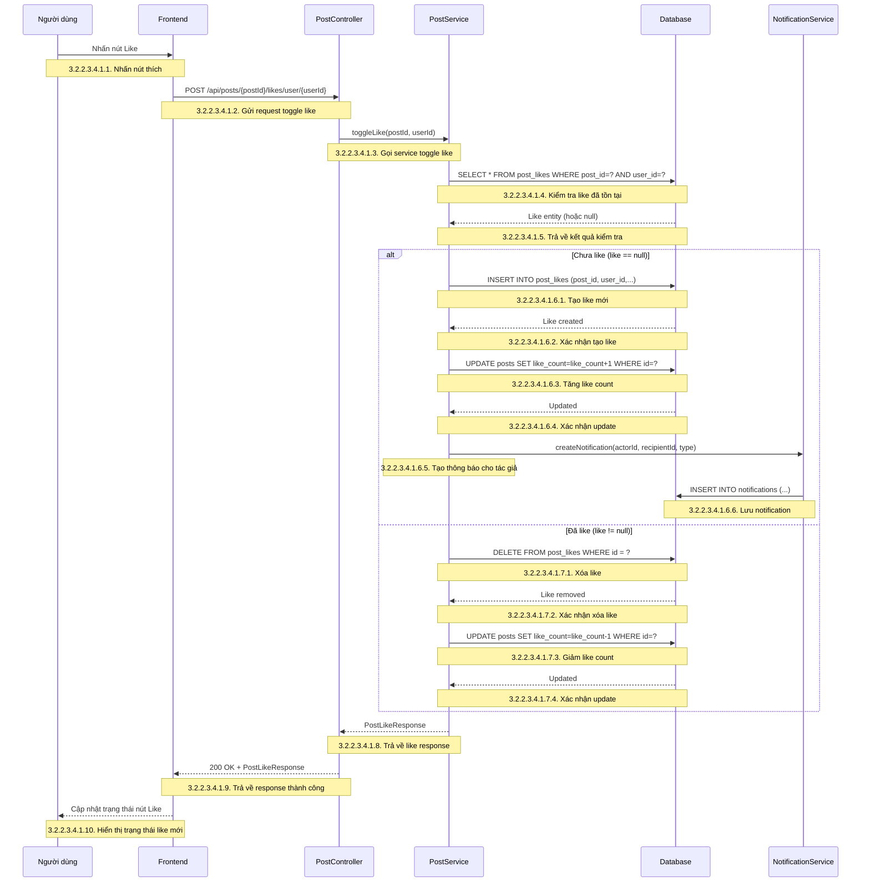
```mermaid
sequenceDiagram
    participant U as Người dùng
    participant UI as Frontend
    participant C as PostController
    participant S as PostService
    participant DB as Database

    U->>UI: Nhấn nút Like
    Note over U,UI: 3.2.2.3.4.1.1. Nhấn nút thích
    UI->>C: POST /api/posts/{postId}/likes/user/{userId}
    Note over UI,C: 3.2.2.3.4.1.2. Gửi request toggle like
    C->>S: toggleLike(postId, userId)
    Note over C,S: 3.2.2.3.4.1.3. Gọi service toggle like
    S->>DB: SELECT * FROM post_likes WHERE post_id=? AND user_id=?
    Note over S,DB: 3.2.2.3.4.1.4. Kiểm tra like đã tồn tại
    DB-->>S: Like entity (hoặc null)
    Note over DB,S: 3.2.2.3.4.1.5. Trả về kết quả kiểm tra
    alt Chưa like (like == null)
        S->>DB: INSERT INTO post_likes (post_id, user_id,...)
        Note over S,DB: 3.2.2.3.4.1.6.1. Tạo like mới
        DB-->>S: Like created
        Note over DB,S: 3.2.2.3.4.1.6.2. Xác nhận tạo like
        S->>DB: UPDATE posts SET like_count=like_count+1 WHERE id=?
        Note over S,DB: 3.2.2.3.4.1.6.3. Tăng like count
        DB-->>S: Updated
        Note over DB,S: 3.2.2.3.4.1.6.4. Xác nhận update
        S->>NotificationService: createNotification(actorId, recipientId, type)
        Note over S: 3.2.2.3.4.1.6.5. Tạo thông báo cho tác giả
        NotificationService->>DB: INSERT INTO notifications (...)
        Note over NotificationService,DB: 3.2.2.3.4.1.6.6. Lưu notification
    else Đã like (like != null)
        S->>DB: DELETE FROM post_likes WHERE id = ?
        Note over S,DB: 3.2.2.3.4.1.7.1. Xóa like
        DB-->>S: Like removed
        Note over DB,S: 3.2.2.3.4.1.7.2. Xác nhận xóa like
        S->>DB: UPDATE posts SET like_count=like_count-1 WHERE id=?
        Note over S,DB: 3.2.2.3.4.1.7.3. Giảm like count
        DB-->>S: Updated
        Note over DB,S: 3.2.2.3.4.1.7.4. Xác nhận update
    end
    S-->>C: PostLikeResponse
    Note over S,C: 3.2.2.3.4.1.8. Trả về like response
    C-->>UI: 200 OK + PostLikeResponse
    Note over C,UI: 3.2.2.3.4.1.9. Trả về response thành công
    UI-->>U: Cập nhật trạng thái nút Like
    Note over UI,U: 3.2.2.3.4.1.10. Hiển thị trạng thái like mới
```

### 3.2.2.3.4.2 Bình Luận Bài Viết

**Mô tả:** Cho phép người dùng thêm bình luận vào bài viết.

**API:** `POST /api/posts/{postId}/comments/user/{userId}`

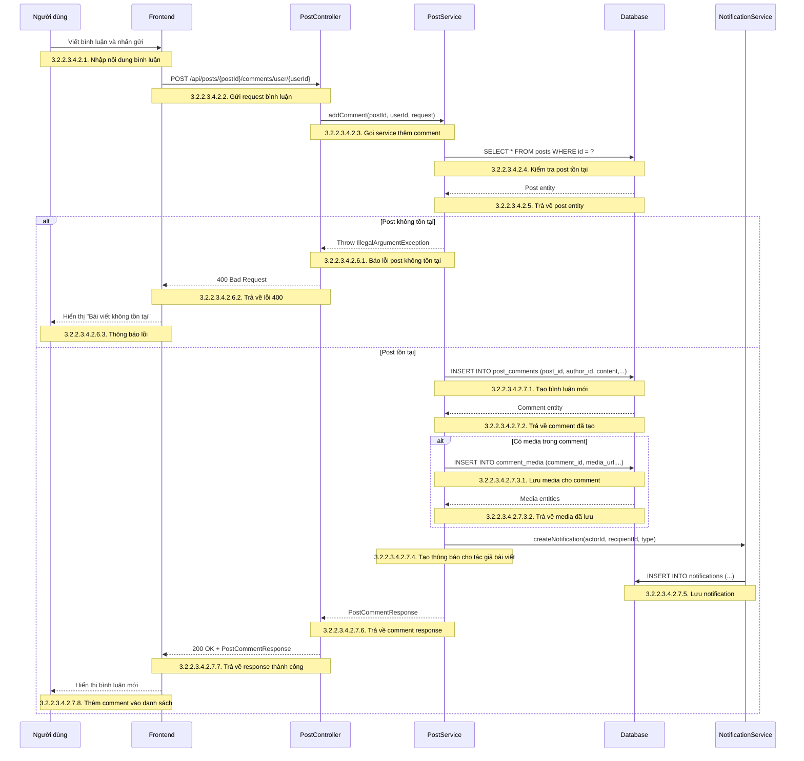
```mermaid
sequenceDiagram
    participant U as Người dùng
    participant UI as Frontend
    participant C as PostController
    participant S as PostService
    participant DB as Database

    U->>UI: Viết bình luận và nhấn gửi
    Note over U,UI: 3.2.2.3.4.2.1. Nhập nội dung bình luận
    UI->>C: POST /api/posts/{postId}/comments/user/{userId}
    Note over UI,C: 3.2.2.3.4.2.2. Gửi request bình luận
    C->>S: addComment(postId, userId, request)
    Note over C,S: 3.2.2.3.4.2.3. Gọi service thêm comment
    S->>DB: SELECT * FROM posts WHERE id = ?
    Note over S,DB: 3.2.2.3.4.2.4. Kiểm tra post tồn tại
    DB-->>S: Post entity
    Note over DB,S: 3.2.2.3.4.2.5. Trả về post entity
    alt Post không tồn tại
        S-->>C: Throw IllegalArgumentException
        Note over S,C: 3.2.2.3.4.2.6.1. Báo lỗi post không tồn tại
        C-->>UI: 400 Bad Request
        Note over C,UI: 3.2.2.3.4.2.6.2. Trả về lỗi 400
        UI-->>U: Hiển thị "Bài viết không tồn tại"
        Note over UI,U: 3.2.2.3.4.2.6.3. Thông báo lỗi
    else Post tồn tại
        S->>DB: INSERT INTO post_comments (post_id, author_id, content,...)
        Note over S,DB: 3.2.2.3.4.2.7.1. Tạo bình luận mới
        DB-->>S: Comment entity
        Note over DB,S: 3.2.2.3.4.2.7.2. Trả về comment đã tạo
        alt Có media trong comment
            S->>DB: INSERT INTO comment_media (comment_id, media_url,...)
            Note over S,DB: 3.2.2.3.4.2.7.3.1. Lưu media cho comment
            DB-->>S: Media entities
            Note over DB,S: 3.2.2.3.4.2.7.3.2. Trả về media đã lưu
        end
        S->>NotificationService: createNotification(actorId, recipientId, type)
        Note over S: 3.2.2.3.4.2.7.4. Tạo thông báo cho tác giả bài viết
        NotificationService->>DB: INSERT INTO notifications (...)
        Note over NotificationService,DB: 3.2.2.3.4.2.7.5. Lưu notification
        S-->>C: PostCommentResponse
        Note over S,C: 3.2.2.3.4.2.7.6. Trả về comment response
        C-->>UI: 200 OK + PostCommentResponse
        Note over C,UI: 3.2.2.3.4.2.7.7. Trả về response thành công
        UI-->>U: Hiển thị bình luận mới
        Note over UI,U: 3.2.2.3.4.2.7.8. Thêm comment vào danh sách
    end
```

### 3.2.2.3.4.3 Trả Lời Bình Luận

**Mô tả:** Cho phép người dùng trả lời một bình luận cụ thể (nested comments).

**API:** `POST /api/posts/{postId}/comments/{commentId}/reply/user/{userId}`

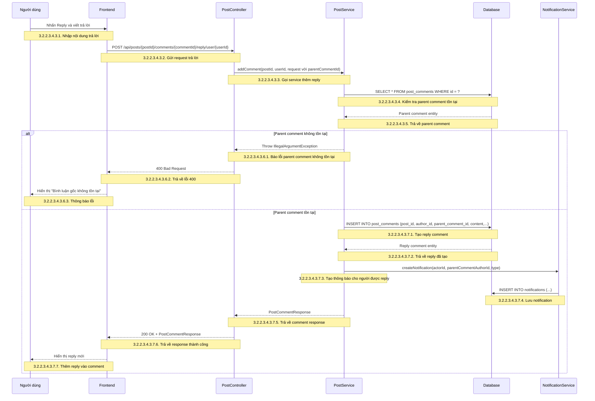
```mermaid
sequenceDiagram
    participant U as Người dùng
    participant UI as Frontend
    participant C as PostController
    participant S as PostService
    participant DB as Database

    U->>UI: Nhấn Reply và viết trả lời
    Note over U,UI: 3.2.2.3.4.3.1. Nhập nội dung trả lời
    UI->>C: POST /api/posts/{postId}/comments/{commentId}/reply/user/{userId}
    Note over UI,C: 3.2.2.3.4.3.2. Gửi request trả lời
    C->>S: addComment(postId, userId, request với parentCommentId)
    Note over C,S: 3.2.2.3.4.3.3. Gọi service thêm reply
    S->>DB: SELECT * FROM post_comments WHERE id = ?
    Note over S,DB: 3.2.2.3.4.3.4. Kiểm tra parent comment tồn tại
    DB-->>S: Parent comment entity
    Note over DB,S: 3.2.2.3.4.3.5. Trả về parent comment
    alt Parent comment không tồn tại
        S-->>C: Throw IllegalArgumentException
        Note over S,C: 3.2.2.3.4.3.6.1. Báo lỗi parent comment không tồn tại
        C-->>UI: 400 Bad Request
        Note over C,UI: 3.2.2.3.4.3.6.2. Trả về lỗi 400
        UI-->>U: Hiển thị "Bình luận gốc không tồn tại"
        Note over UI,U: 3.2.2.3.4.3.6.3. Thông báo lỗi
    else Parent comment tồn tại
        S->>DB: INSERT INTO post_comments (post_id, author_id, parent_comment_id, content,...)
        Note over S,DB: 3.2.2.3.4.3.7.1. Tạo reply comment
        DB-->>S: Reply comment entity
        Note over DB,S: 3.2.2.3.4.3.7.2. Trả về reply đã tạo
        S->>NotificationService: createNotification(actorId, parentCommentAuthorId, type)
        Note over S: 3.2.2.3.4.3.7.3. Tạo thông báo cho người được reply
        NotificationService->>DB: INSERT INTO notifications (...)
        Note over NotificationService,DB: 3.2.2.3.4.3.7.4. Lưu notification
        S-->>C: PostCommentResponse
        Note over S,C: 3.2.2.3.4.3.7.5. Trả về comment response
        C-->>UI: 200 OK + PostCommentResponse
        Note over C,UI: 3.2.2.3.4.3.7.6. Trả về response thành công
        UI-->>U: Hiển thị reply mới
        Note over UI,U: 3.2.2.3.4.3.7.7. Thêm reply vào comment
    end
```

### 3.2.2.3.4.4 Thích Bình Luận

**Mô tả:** Cho phép người dùng thích hoặc bỏ thích một bình luận.

**API:** `POST /api/posts/comments/{commentId}/likes/user/{userId}`

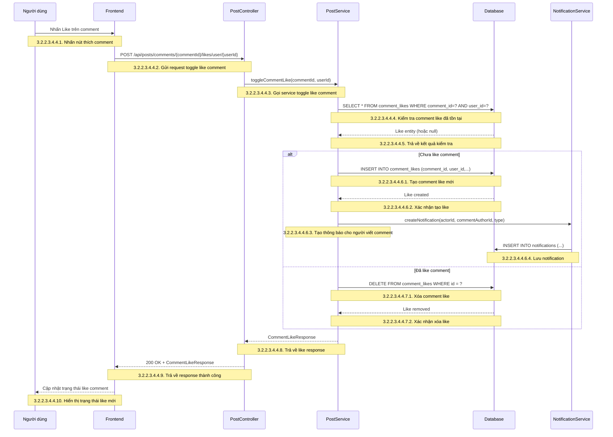
```mermaid
sequenceDiagram
    participant U as Người dùng
    participant UI as Frontend
    participant C as PostController
    participant S as PostService
    participant DB as Database

    U->>UI: Nhấn Like trên comment
    Note over U,UI: 3.2.2.3.4.4.1. Nhấn nút thích comment
    UI->>C: POST /api/posts/comments/{commentId}/likes/user/{userId}
    Note over UI,C: 3.2.2.3.4.4.2. Gửi request toggle like comment
    C->>S: toggleCommentLike(commentId, userId)
    Note over C,S: 3.2.2.3.4.4.3. Gọi service toggle like comment
    S->>DB: SELECT * FROM comment_likes WHERE comment_id=? AND user_id=?
    Note over S,DB: 3.2.2.3.4.4.4. Kiểm tra comment like đã tồn tại
    DB-->>S: Like entity (hoặc null)
    Note over DB,S: 3.2.2.3.4.4.5. Trả về kết quả kiểm tra
    alt Chưa like comment
        S->>DB: INSERT INTO comment_likes (comment_id, user_id,...)
        Note over S,DB: 3.2.2.3.4.4.6.1. Tạo comment like mới
        DB-->>S: Like created
        Note over DB,S: 3.2.2.3.4.4.6.2. Xác nhận tạo like
        S->>NotificationService: createNotification(actorId, commentAuthorId, type)
        Note over S: 3.2.2.3.4.4.6.3. Tạo thông báo cho người viết comment
        NotificationService->>DB: INSERT INTO notifications (...)
        Note over NotificationService,DB: 3.2.2.3.4.4.6.4. Lưu notification
    else Đã like comment
        S->>DB: DELETE FROM comment_likes WHERE id = ?
        Note over S,DB: 3.2.2.3.4.4.7.1. Xóa comment like
        DB-->>S: Like removed
        Note over DB,S: 3.2.2.3.4.4.7.2. Xác nhận xóa like
    end
    S-->>C: CommentLikeResponse
    Note over S,C: 3.2.2.3.4.4.8. Trả về like response
    C-->>UI: 200 OK + CommentLikeResponse
    Note over C,UI: 3.2.2.3.4.4.9. Trả về response thành công
    UI-->>U: Cập nhật trạng thái like comment
    Note over UI,U: 3.2.2.3.4.4.10. Hiển thị trạng thái like mới
```

## 3.2.2.3.5 Kết Nối Người Dùng

### 3.2.2.3.5.1 Gửi Yêu Cầu Kết Bạn

**Mô tả:** Cho phép người dùng gửi yêu cầu kết bạn đến người khác.

**API:** `POST /api/friendships/request`

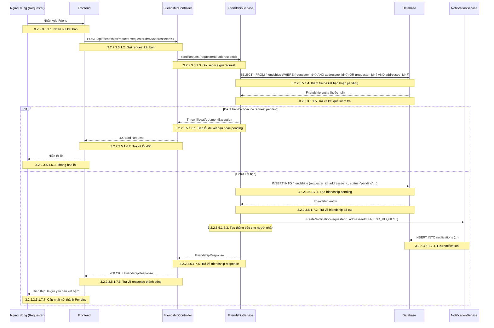
```mermaid
sequenceDiagram
    participant U1 as Người dùng (Requester)
    participant UI as Frontend
    participant C as FriendshipController
    participant S as FriendshipService
    participant DB as Database

    U1->>UI: Nhấn Add Friend
    Note over U1,UI: 3.2.2.3.5.1.1. Nhấn nút kết bạn
    UI->>C: POST /api/friendships/request?requesterId=X&addresseeId=Y
    Note over UI,C: 3.2.2.3.5.1.2. Gửi request kết bạn
    C->>S: sendRequest(requesterId, addresseeId)
    Note over C,S: 3.2.2.3.5.1.3. Gọi service gửi request
    S->>DB: SELECT * FROM friendships WHERE (requester_id=? AND addressee_id=?) OR (requester_id=? AND addressee_id=?)
    Note over S,DB: 3.2.2.3.5.1.4. Kiểm tra đã kết bạn hoặc pending
    DB-->>S: Friendship entity (hoặc null)
    Note over DB,S: 3.2.2.3.5.1.5. Trả về kết quả kiểm tra
    alt Đã là bạn bè hoặc có request pending
        S-->>C: Throw IllegalArgumentException
        Note over S,C: 3.2.2.3.5.1.6.1. Báo lỗi đã kết bạn hoặc pending
        C-->>UI: 400 Bad Request
        Note over C,UI: 3.2.2.3.5.1.6.2. Trả về lỗi 400
        UI-->>U1: Hiển thị lỗi
        Note over UI,U1: 3.2.2.3.5.1.6.3. Thông báo lỗi
    else Chưa kết bạn
        S->>DB: INSERT INTO friendships (requester_id, addressee_id, status='pending',...)
        Note over S,DB: 3.2.2.3.5.1.7.1. Tạo friendship pending
        DB-->>S: Friendship entity
        Note over DB,S: 3.2.2.3.5.1.7.2. Trả về friendship đã tạo
        S->>NotificationService: createNotification(requesterId, addresseeId, FRIEND_REQUEST)
        Note over S: 3.2.2.3.5.1.7.3. Tạo thông báo cho người nhận
        NotificationService->>DB: INSERT INTO notifications (...)
        Note over NotificationService,DB: 3.2.2.3.5.1.7.4. Lưu notification
        S-->>C: FriendshipResponse
        Note over S,C: 3.2.2.3.5.1.7.5. Trả về friendship response
        C-->>UI: 200 OK + FriendshipResponse
        Note over C,UI: 3.2.2.3.5.1.7.6. Trả về response thành công
        UI-->>U1: Hiển thị "Đã gửi yêu cầu kết bạn"
        Note over UI,U1: 3.2.2.3.5.1.7.7. Cập nhật nút thành Pending
    end
```

### 3.2.2.3.5.2 Chấp Nhận Yêu Cầu Kết Bạn

**Mô tả:** Cho phép người dùng chấp nhận yêu cầu kết bạn.

**API:** `POST /api/friendships/accept`

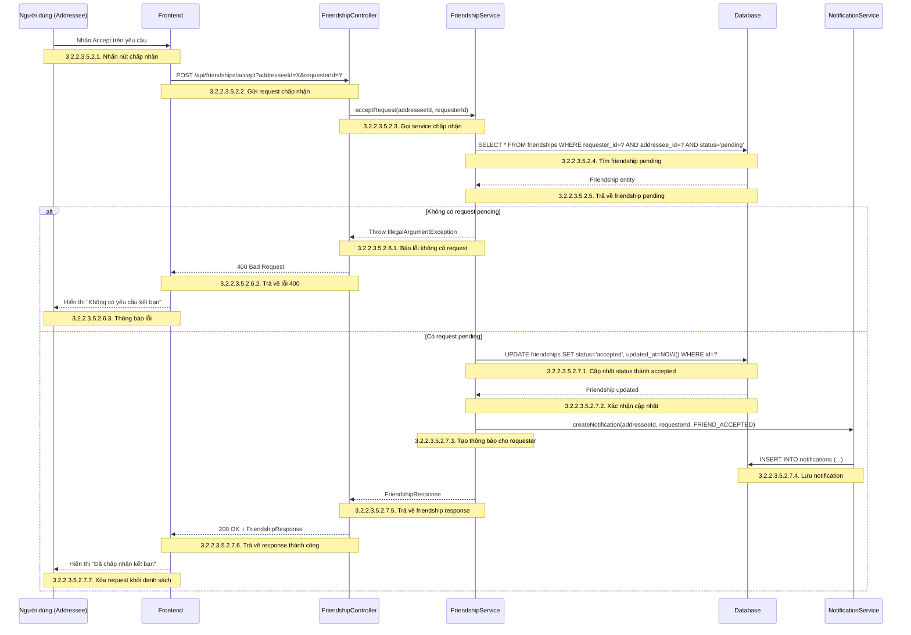
```mermaid
sequenceDiagram
    participant U2 as Người dùng (Addressee)
    participant UI as Frontend
    participant C as FriendshipController
    participant S as FriendshipService
    participant DB as Database

    U2->>UI: Nhấn Accept trên yêu cầu
    Note over U2,UI: 3.2.2.3.5.2.1. Nhấn nút chấp nhận
    UI->>C: POST /api/friendships/accept?addresseeId=X&requesterId=Y
    Note over UI,C: 3.2.2.3.5.2.2. Gửi request chấp nhận
    C->>S: acceptRequest(addresseeId, requesterId)
    Note over C,S: 3.2.2.3.5.2.3. Gọi service chấp nhận
    S->>DB: SELECT * FROM friendships WHERE requester_id=? AND addressee_id=? AND status='pending'
    Note over S,DB: 3.2.2.3.5.2.4. Tìm friendship pending
    DB-->>S: Friendship entity
    Note over DB,S: 3.2.2.3.5.2.5. Trả về friendship pending
    alt Không có request pending
        S-->>C: Throw IllegalArgumentException
        Note over S,C: 3.2.2.3.5.2.6.1. Báo lỗi không có request
        C-->>UI: 400 Bad Request
        Note over C,UI: 3.2.2.3.5.2.6.2. Trả về lỗi 400
        UI-->>U2: Hiển thị "Không có yêu cầu kết bạn"
        Note over UI,U2: 3.2.2.3.5.2.6.3. Thông báo lỗi
    else Có request pending
        S->>DB: UPDATE friendships SET status='accepted', updated_at=NOW() WHERE id=?
        Note over S,DB: 3.2.2.3.5.2.7.1. Cập nhật status thành accepted
        DB-->>S: Friendship updated
        Note over DB,S: 3.2.2.3.5.2.7.2. Xác nhận cập nhật
        S->>NotificationService: createNotification(addresseeId, requesterId, FRIEND_ACCEPTED)
        Note over S: 3.2.2.3.5.2.7.3. Tạo thông báo cho requester
        NotificationService->>DB: INSERT INTO notifications (...)
        Note over NotificationService,DB: 3.2.2.3.5.2.7.4. Lưu notification
        S-->>C: FriendshipResponse
        Note over S,C: 3.2.2.3.5.2.7.5. Trả về friendship response
        C-->>UI: 200 OK + FriendshipResponse
        Note over C,UI: 3.2.2.3.5.2.7.6. Trả về response thành công
        UI-->>U2: Hiển thị "Đã chấp nhận kết bạn"
        Note over UI,U2: 3.2.2.3.5.2.7.7. Xóa request khỏi danh sách
    end
```

### 3.2.2.3.5.3 Hủy Kết Bạn

**Mô tả:** Cho phép người dùng hủy kết bạn với bạn bè hiện tại.

**API:** `POST /api/friendships/unfriend`

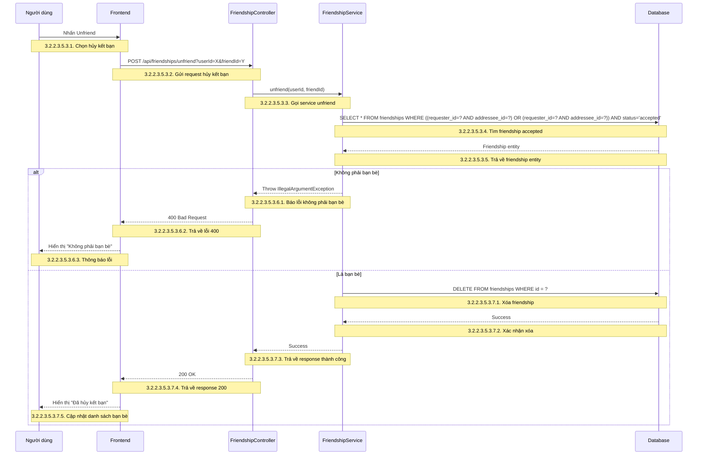
```mermaid
sequenceDiagram
    participant U as Người dùng
    participant UI as Frontend
    participant C as FriendshipController
    participant S as FriendshipService
    participant DB as Database

    U->>UI: Nhấn Unfriend
    Note over U,UI: 3.2.2.3.5.3.1. Chọn hủy kết bạn
    UI->>C: POST /api/friendships/unfriend?userId=X&friendId=Y
    Note over UI,C: 3.2.2.3.5.3.2. Gửi request hủy kết bạn
    C->>S: unfriend(userId, friendId)
    Note over C,S: 3.2.2.3.5.3.3. Gọi service unfriend
    S->>DB: SELECT * FROM friendships WHERE ((requester_id=? AND addressee_id=?) OR (requester_id=? AND addressee_id=?)) AND status='accepted'
    Note over S,DB: 3.2.2.3.5.3.4. Tìm friendship accepted
    DB-->>S: Friendship entity
    Note over DB,S: 3.2.2.3.5.3.5. Trả về friendship entity
    alt Không phải bạn bè
        S-->>C: Throw IllegalArgumentException
        Note over S,C: 3.2.2.3.5.3.6.1. Báo lỗi không phải bạn bè
        C-->>UI: 400 Bad Request
        Note over C,UI: 3.2.2.3.5.3.6.2. Trả về lỗi 400
        UI-->>U: Hiển thị "Không phải bạn bè"
        Note over UI,U: 3.2.2.3.5.3.6.3. Thông báo lỗi
    else Là bạn bè
        S->>DB: DELETE FROM friendships WHERE id = ?
        Note over S,DB: 3.2.2.3.5.3.7.1. Xóa friendship
        DB-->>S: Success
        Note over DB,S: 3.2.2.3.5.3.7.2. Xác nhận xóa
        S-->>C: Success
        Note over S,C: 3.2.2.3.5.3.7.3. Trả về response thành công
        C-->>UI: 200 OK
        Note over C,UI: 3.2.2.3.5.3.7.4. Trả về response 200
        UI-->>U: Hiển thị "Đã hủy kết bạn"
        Note over UI,U: 3.2.2.3.5.3.7.5. Cập nhật danh sách bạn bè
    end
```

### 3.2.2.3.5.4 Xem Danh Sách Bạn Bè

**Mô tả:** Cho phép người dùng xem danh sách bạn bè của mình.

**API:** `GET /api/friendships/friends`

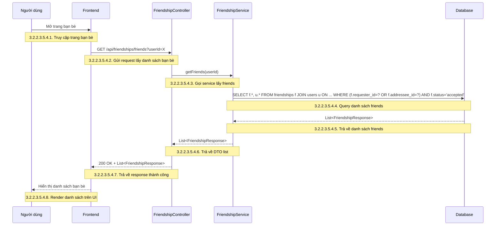
```mermaid
sequenceDiagram
    participant U as Người dùng
    participant UI as Frontend
    participant C as FriendshipController
    participant S as FriendshipService
    participant DB as Database

    U->>UI: Mở trang bạn bè
    Note over U,UI: 3.2.2.3.5.4.1. Truy cập trang bạn bè
    UI->>C: GET /api/friendships/friends?userId=X
    Note over UI,C: 3.2.2.3.5.4.2. Gửi request lấy danh sách bạn bè
    C->>S: getFriends(userId)
    Note over C,S: 3.2.2.3.5.4.3. Gọi service lấy friends
    S->>DB: SELECT f.*, u.* FROM friendships f JOIN users u ON ... WHERE (f.requester_id=? OR f.addressee_id=?) AND f.status='accepted'
    Note over S,DB: 3.2.2.3.5.4.4. Query danh sách friends
    DB-->>S: List<FriendshipResponse>
    Note over DB,S: 3.2.2.3.5.4.5. Trả về danh sách friends
    S-->>C: List<FriendshipResponse>
    Note over S,C: 3.2.2.3.5.4.6. Trả về DTO list
    C-->>UI: 200 OK + List<FriendshipResponse>
    Note over C,UI: 3.2.2.3.5.4.7. Trả về response thành công
    UI-->>U: Hiển thị danh sách bạn bè
    Note over UI,U: 3.2.2.3.5.4.8. Render danh sách trên UI
```

## 3.2.2.3.6 Quản Lý Tin Nhắn

### 3.2.2.3.6.1 Nhắn Tin Cá Nhân

**Mô tả:** Cho phép người dùng gửi tin nhắn văn bản hoặc media đến người khác (real-time qua WebSocket).

**API:** `POST /api/messages/send`

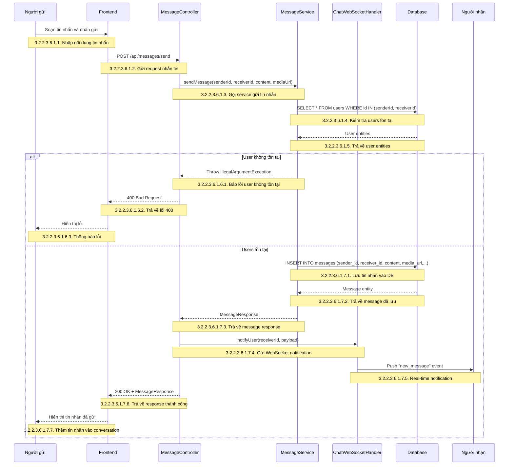
```mermaid
sequenceDiagram
    participant U1 as Người gửi
    participant UI as Frontend
    participant C as MessageController
    participant S as MessageService
    participant WS as ChatWebSocketHandler
    participant DB as Database
    participant U2 as Người nhận

    U1->>UI: Soạn tin nhắn và nhấn gửi
    Note over U1,UI: 3.2.2.3.6.1.1. Nhập nội dung tin nhắn
    UI->>C: POST /api/messages/send
    Note over UI,C: 3.2.2.3.6.1.2. Gửi request nhắn tin
    C->>S: sendMessage(senderId, receiverId, content, mediaUrl)
    Note over C,S: 3.2.2.3.6.1.3. Gọi service gửi tin nhắn
    S->>DB: SELECT * FROM users WHERE id IN (senderId, receiverId)
    Note over S,DB: 3.2.2.3.6.1.4. Kiểm tra users tồn tại
    DB-->>S: User entities
    Note over DB,S: 3.2.2.3.6.1.5. Trả về user entities
    alt User không tồn tại
        S-->>C: Throw IllegalArgumentException
        Note over S,C: 3.2.2.3.6.1.6.1. Báo lỗi user không tồn tại
        C-->>UI: 400 Bad Request
        Note over C,UI: 3.2.2.3.6.1.6.2. Trả về lỗi 400
        UI-->>U1: Hiển thị lỗi
        Note over UI,U1: 3.2.2.3.6.1.6.3. Thông báo lỗi
    else Users tồn tại
        S->>DB: INSERT INTO messages (sender_id, receiver_id, content, media_url,...)
        Note over S,DB: 3.2.2.3.6.1.7.1. Lưu tin nhắn vào DB
        DB-->>S: Message entity
        Note over DB,S: 3.2.2.3.6.1.7.2. Trả về message đã lưu
        S-->>C: MessageResponse
        Note over S,C: 3.2.2.3.6.1.7.3. Trả về message response
        C->>WS: notifyUser(receiverId, payload)
        Note over C,WS: 3.2.2.3.6.1.7.4. Gửi WebSocket notification
        WS->>U2: Push "new_message" event
        Note over WS,U2: 3.2.2.3.6.1.7.5. Real-time notification
        C-->>UI: 200 OK + MessageResponse
        Note over C,UI: 3.2.2.3.6.1.7.6. Trả về response thành công
        UI-->>U1: Hiển thị tin nhắn đã gửi
        Note over UI,U1: 3.2.2.3.6.1.7.7. Thêm tin nhắn vào conversation
    end
```

### 3.2.2.3.6.2 Thu Hồi Tin Nhắn

**Mô tả:** Cho phép người gửi thu hồi tin nhắn đã gửi.

**API:** `POST /api/messages/recall`

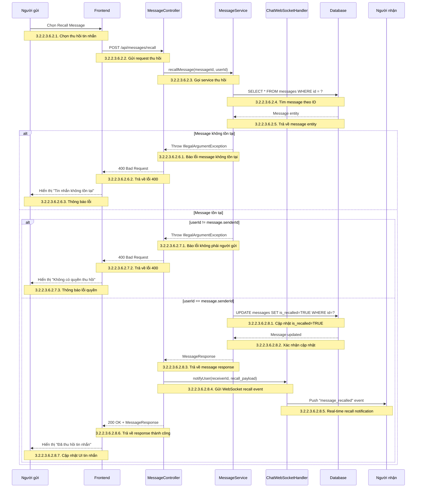
```mermaid
sequenceDiagram
    participant U1 as Người gửi
    participant UI as Frontend
    participant C as MessageController
    participant S as MessageService
    participant WS as ChatWebSocketHandler
    participant DB as Database
    participant U2 as Người nhận

    U1->>UI: Chọn Recall Message
    Note over U1,UI: 3.2.2.3.6.2.1. Chọn thu hồi tin nhắn
    UI->>C: POST /api/messages/recall
    Note over UI,C: 3.2.2.3.6.2.2. Gửi request thu hồi
    C->>S: recallMessage(messageId, userId)
    Note over C,S: 3.2.2.3.6.2.3. Gọi service thu hồi
    S->>DB: SELECT * FROM messages WHERE id = ?
    Note over S,DB: 3.2.2.3.6.2.4. Tìm message theo ID
    DB-->>S: Message entity
    Note over DB,S: 3.2.2.3.6.2.5. Trả về message entity
    alt Message không tồn tại
        S-->>C: Throw IllegalArgumentException
        Note over S,C: 3.2.2.3.6.2.6.1. Báo lỗi message không tồn tại
        C-->>UI: 400 Bad Request
        Note over C,UI: 3.2.2.3.6.2.6.2. Trả về lỗi 400
        UI-->>U1: Hiển thị "Tin nhắn không tồn tại"
        Note over UI,U1: 3.2.2.3.6.2.6.3. Thông báo lỗi
    else Message tồn tại
        alt userId != message.senderId
            S-->>C: Throw IllegalArgumentException
            Note over S,C: 3.2.2.3.6.2.7.1. Báo lỗi không phải người gửi
            C-->>UI: 400 Bad Request
            Note over C,UI: 3.2.2.3.6.2.7.2. Trả về lỗi 400
            UI-->>U1: Hiển thị "Không có quyền thu hồi"
            Note over UI,U1: 3.2.2.3.6.2.7.3. Thông báo lỗi quyền
        else userId == message.senderId
            S->>DB: UPDATE messages SET is_recalled=TRUE WHERE id=?
            Note over S,DB: 3.2.2.3.6.2.8.1. Cập nhật is_recalled=TRUE
            DB-->>S: Message updated
            Note over DB,S: 3.2.2.3.6.2.8.2. Xác nhận cập nhật
            S-->>C: MessageResponse
            Note over S,C: 3.2.2.3.6.2.8.3. Trả về message response
            C->>WS: notifyUser(receiverId, recall_payload)
            Note over C,WS: 3.2.2.3.6.2.8.4. Gửi WebSocket recall event
            WS->>U2: Push "message_recalled" event
            Note over WS,U2: 3.2.2.3.6.2.8.5. Real-time recall notification
            C-->>UI: 200 OK + MessageResponse
            Note over C,UI: 3.2.2.3.6.2.8.6. Trả về response thành công
            UI-->>U1: Hiển thị "Đã thu hồi tin nhắn"
            Note over UI,U1: 3.2.2.3.6.2.8.7. Cập nhật UI tin nhắn
        end
    end
```

## 3.2.2.3.7 Thông Báo

### 3.2.2.3.7.1 Nhận Thông Báo

**Mô tả:** Hệ thống tự động tạo thông báo khi có tương tác (friend request, like, comment, message).

**API:** `GET /api/notifications`

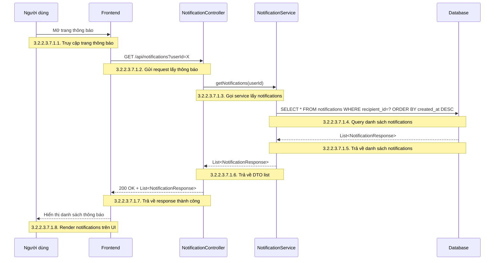
```mermaid
sequenceDiagram
    participant U as Người dùng
    participant UI as Frontend
    participant C as NotificationController
    participant S as NotificationService
    participant DB as Database

    U->>UI: Mở trang thông báo
    Note over U,UI: 3.2.2.3.7.1.1. Truy cập trang thông báo
    UI->>C: GET /api/notifications?userId=X
    Note over UI,C: 3.2.2.3.7.1.2. Gửi request lấy thông báo
    C->>S: getNotifications(userId)
    Note over C,S: 3.2.2.3.7.1.3. Gọi service lấy notifications
    S->>DB: SELECT * FROM notifications WHERE recipient_id=? ORDER BY created_at DESC
    Note over S,DB: 3.2.2.3.7.1.4. Query danh sách notifications
    DB-->>S: List<NotificationResponse>
    Note over DB,S: 3.2.2.3.7.1.5. Trả về danh sách notifications
    S-->>C: List<NotificationResponse>
    Note over S,C: 3.2.2.3.7.1.6. Trả về DTO list
    C-->>UI: 200 OK + List<NotificationResponse>
    Note over C,UI: 3.2.2.3.7.1.7. Trả về response thành công
    UI-->>U: Hiển thị danh sách thông báo
    Note over UI,U: 3.2.2.3.7.1.8. Render notifications trên UI
```

### 3.2.2.3.7.2 Đánh Dấu Đã Đọc Thông Báo

**Mô tả:** Cho phép người dùng đánh dấu một hoặc tất cả thông báo đã đọc.

**API:** `POST /api/notifications/{id}/read` hoặc `POST /api/notifications/read-all`

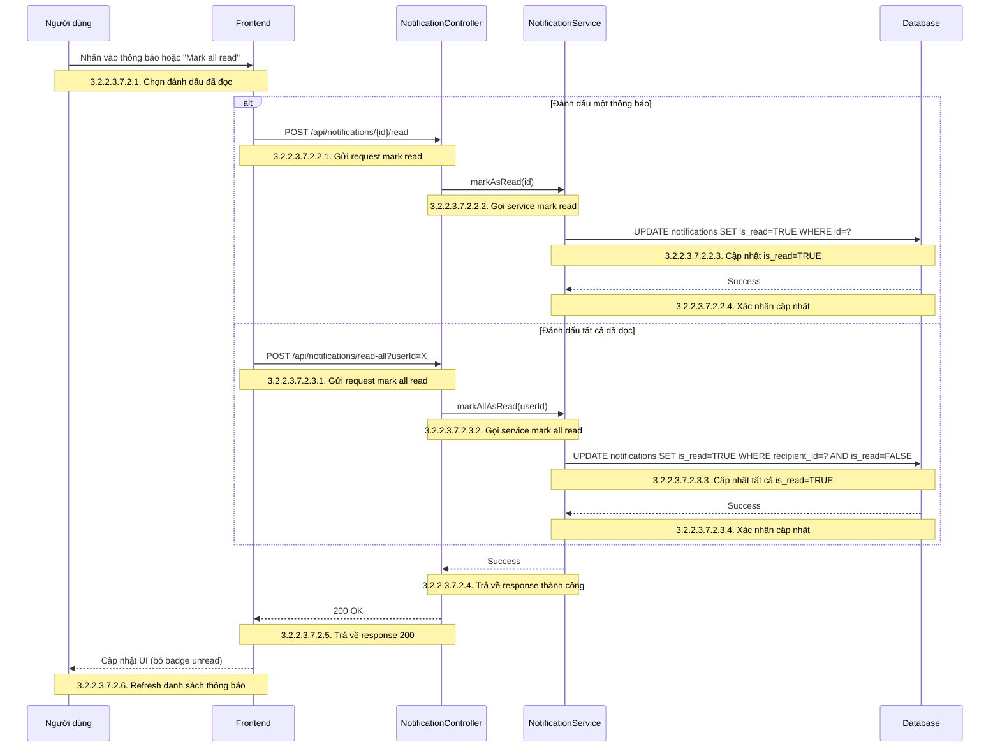
```mermaid
sequenceDiagram
    participant U as Người dùng
    participant UI as Frontend
    participant C as NotificationController
    participant S as NotificationService
    participant DB as Database

    U->>UI: Nhấn vào thông báo hoặc "Mark all read"
    Note over U,UI: 3.2.2.3.7.2.1. Chọn đánh dấu đã đọc
    alt Đánh dấu một thông báo
        UI->>C: POST /api/notifications/{id}/read
        Note over UI,C: 3.2.2.3.7.2.2.1. Gửi request mark read
        C->>S: markAsRead(id)
        Note over C,S: 3.2.2.3.7.2.2.2. Gọi service mark read
        S->>DB: UPDATE notifications SET is_read=TRUE WHERE id=?
        Note over S,DB: 3.2.2.3.7.2.2.3. Cập nhật is_read=TRUE
        DB-->>S: Success
        Note over DB,S: 3.2.2.3.7.2.2.4. Xác nhận cập nhật
    else Đánh dấu tất cả đã đọc
        UI->>C: POST /api/notifications/read-all?userId=X
        Note over UI,C: 3.2.2.3.7.2.3.1. Gửi request mark all read
        C->>S: markAllAsRead(userId)
        Note over C,S: 3.2.2.3.7.2.3.2. Gọi service mark all read
        S->>DB: UPDATE notifications SET is_read=TRUE WHERE recipient_id=? AND is_read=FALSE
        Note over S,DB: 3.2.2.3.7.2.3.3. Cập nhật tất cả is_read=TRUE
        DB-->>S: Success
        Note over DB,S: 3.2.2.3.7.2.3.4. Xác nhận cập nhật
    end
    S-->>C: Success
    Note over S,C: 3.2.2.3.7.2.4. Trả về response thành công
    C-->>UI: 200 OK
    Note over C,UI: 3.2.2.3.7.2.5. Trả về response 200
    UI-->>U: Cập nhật UI (bỏ badge unread)
    Note over UI,U: 3.2.2.3.7.2.6. Refresh danh sách thông báo
```

## 3.2.2.3.8 Tìm Kiếm Người Dùng

### 3.2.2.3.8.1 Tìm Kiếm Người Dùng

**Mô tả:** Cho phép người dùng tìm kiếm người dùng khác theo tên hoặc email.

**API:** `GET /api/users/search?q={query}`

```mermaid
sequenceDiagram
    participant U as Người dùng
    participant UI as Frontend
    participant C as UserController
    participant S as UserService
    participant DB as Database

    U->>UI: Nhập từ khóa tìm kiếm
    Note over U,UI: 3.2.2.3.8.1.1. Nhập search query
    UI->>C: GET /api/users/search?q={query}
    Note over UI,C: 3.2.2.3.8.1.2. Gửi request tìm kiếm
    C->>S: searchUsers(query)
    Note over C,S: 3.2.2.3.8.1.3. Gọi service search
    S->>DB: SELECT * FROM users WHERE full_name LIKE ? OR email LIKE ?
    Note over S,DB: 3.2.2.3.8.1.4. Query tìm users
    DB-->>S: List<UserResponse>
    Note over DB,S: 3.2.2.3.8.1.5. Trả về danh sách users
    S-->>C: List<UserResponse>
    Note over S,C: 3.2.2.3.8.1.6. Trả về DTO list
    C-->>UI: 200 OK + List<UserResponse>
    Note over C,UI: 3.2.2.3.8.1.7. Trả về response thành công
    UI-->>U: Hiển thị kết quả tìm kiếm
    Note over UI,U: 3.2.2.3.8.1.8. Render search results
```
