# 3.2.1 Mô Tả Chương Trình

Hệ thống NLU-social là một mạng xã hội trực tuyến được phát triển nhằm đáp ứng nhu cầu kết nối, chia sẻ thông tin và tương tác giữa các thành viên trong cộng đồng. Chương trình được xây dựng dựa trên kiến trúc client-server với frontend sử dụng React (TypeScript) và backend sử dụng Spring Boot (Java), kết hợp với cơ sở dữ liệu MySQL để lưu trữ dữ liệu.

Chương trình cung cấp đầy đủ các chức năng cơ bản của một mạng xã hội hiện đại, bao gồm: quản lý tài khoản (đăng ký, đăng nhập, cập nhật thông tin cá nhân), quản lý bài viết (đăng bài, chỉnh sửa, xóa bài), tương tác với bài viết (thích, bình luận, trả lời bình luận), kết nối bạn bè (gửi yêu cầu kết bạn, chấp nhận, từ chối, hủy kết bạn), nhắn tin thời gian thực (gửi tin nhắn văn bản và hình ảnh, thu hồi tin nhắn), hệ thống thông báo, chặn người dùng và tìm kiếm thành viên. Tất cả các chức năng được thực hiện thông qua RESTful API và hỗ trợ giao tiếp thời gian thực qua WebSocket cho tính năng chat và thông báo.

---

# 3.3.2.3 Sequence Diagram Các Chức Năng

## 3.3.2.3.1 Quản Lý Tài Khoản

### 3.3.2.3.1.1 Đăng Ký Tài Khoản

**Mô tả:** Cho phép người dùng mới tạo tài khoản bằng cách cung cấp thông tin cá nhân cơ bản.

**API Endpoint:** `POST /api/auth/register`

**Sequence Diagram:**

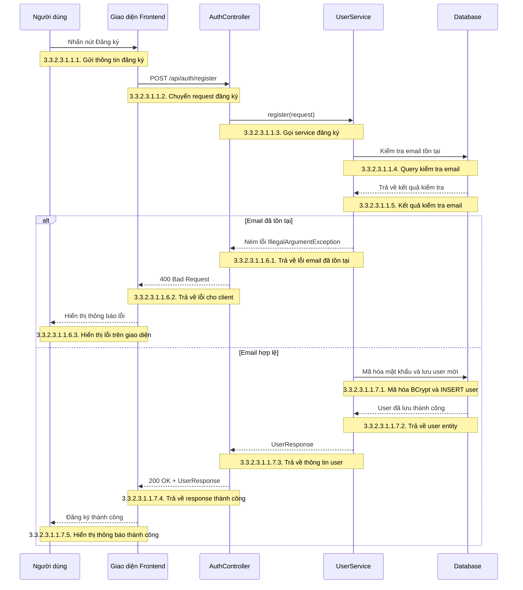
```mermaid
sequenceDiagram
    participant User as Người dùng
    participant UI as Giao diện Frontend
    participant API as AuthController
    participant Service as UserService
    participant DB as Database

    User->>UI: Nhấn nút Đăng ký
    Note over User,UI: 3.3.2.3.1.1.1. Gửi thông tin đăng ký
    UI->>API: POST /api/auth/register
    Note over UI,API: 3.3.2.3.1.1.2. Chuyển request đăng ký
    API->>Service: register(request)
    Note over API,Service: 3.3.2.3.1.1.3. Gọi service đăng ký
    Service->>DB: Kiểm tra email tồn tại
    Note over Service,DB: 3.3.2.3.1.1.4. Query kiểm tra email
    DB-->>Service: Trả về kết quả kiểm tra
    Note over DB,Service: 3.3.2.3.1.1.5. Kết quả kiểm tra email
    alt Email đã tồn tại
        Service-->>API: Ném lỗi IllegalArgumentException
        Note over Service,API: 3.3.2.3.1.1.6.1. Trả về lỗi email đã tồn tại
        API-->>UI: 400 Bad Request
        Note over API,UI: 3.3.2.3.1.1.6.2. Trả về lỗi cho client
        UI-->>User: Hiển thị thông báo lỗi
        Note over UI,User: 3.3.2.3.1.1.6.3. Hiển thị lỗi trên giao diện
    else Email hợp lệ
        Service->>DB: Mã hóa mật khẩu và lưu user mới
        Note over Service,DB: 3.3.2.3.1.1.7.1. Mã hóa BCrypt và INSERT user
        DB-->>Service: User đã lưu thành công
        Note over DB,Service: 3.3.2.3.1.1.7.2. Trả về user entity
        Service-->>API: UserResponse
        Note over Service,API: 3.3.2.3.1.1.7.3. Trả về thông tin user
        API-->>UI: 200 OK + UserResponse
        Note over API,UI: 3.3.2.3.1.1.7.4. Trả về response thành công
        UI-->>User: Đăng ký thành công
        Note over UI,User: 3.3.2.3.1.1.7.5. Hiển thị thông báo thành công
    end
```

### 3.3.2.3.1.2 Đăng Nhập

**Mô tả:** Xác thực người dùng đã đăng ký và cung cấp token truy cập.

**API Endpoint:** `POST /api/auth/login`

**Sequence Diagram:**

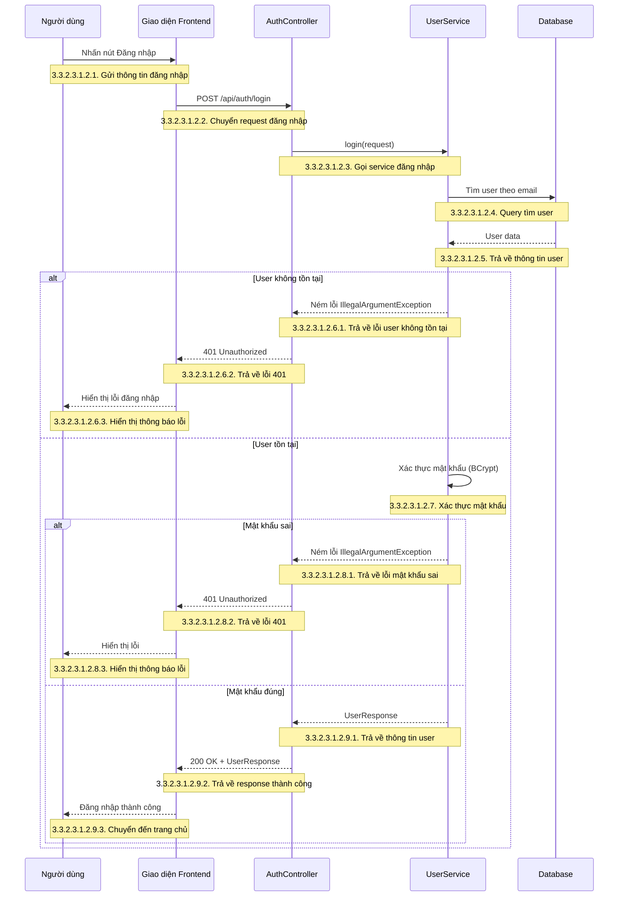
```mermaid
sequenceDiagram
    participant User as Người dùng
    participant UI as Giao diện Frontend
    participant API as AuthController
    participant Service as UserService
    participant DB as Database

    User->>UI: Nhấn nút Đăng nhập
    Note over User,UI: 3.3.2.3.1.2.1. Gửi thông tin đăng nhập
    UI->>API: POST /api/auth/login
    Note over UI,API: 3.3.2.3.1.2.2. Chuyển request đăng nhập
    API->>Service: login(request)
    Note over API,Service: 3.3.2.3.1.2.3. Gọi service đăng nhập
    Service->>DB: Tìm user theo email
    Note over Service,DB: 3.3.2.3.1.2.4. Query tìm user
    DB-->>Service: User data
    Note over DB,Service: 3.3.2.3.1.2.5. Trả về thông tin user
    alt User không tồn tại
        Service-->>API: Ném lỗi IllegalArgumentException
        Note over Service,API: 3.3.2.3.1.2.6.1. Trả về lỗi user không tồn tại
        API-->>UI: 401 Unauthorized
        Note over API,UI: 3.3.2.3.1.2.6.2. Trả về lỗi 401
        UI-->>User: Hiển thị lỗi đăng nhập
        Note over UI,User: 3.3.2.3.1.2.6.3. Hiển thị thông báo lỗi
    else User tồn tại
        Service->>Service: Xác thực mật khẩu (BCrypt)
        Note over Service: 3.3.2.3.1.2.7. Xác thực mật khẩu
        alt Mật khẩu sai
            Service-->>API: Ném lỗi IllegalArgumentException
            Note over Service,API: 3.3.2.3.1.2.8.1. Trả về lỗi mật khẩu sai
            API-->>UI: 401 Unauthorized
            Note over API,UI: 3.3.2.3.1.2.8.2. Trả về lỗi 401
            UI-->>User: Hiển thị lỗi
            Note over UI,User: 3.3.2.3.1.2.8.3. Hiển thị thông báo lỗi
        else Mật khẩu đúng
            Service-->>API: UserResponse
            Note over Service,API: 3.3.2.3.1.2.9.1. Trả về thông tin user
            API-->>UI: 200 OK + UserResponse
            Note over API,UI: 3.3.2.3.1.2.9.2. Trả về response thành công
            UI-->>User: Đăng nhập thành công
            Note over UI,User: 3.3.2.3.1.2.9.3. Chuyển đến trang chủ
        end
    end
```

---

## 3.3.2.3.2 Quản Lý Hồ Sơ

### 3.3.2.3.2.1 Cập Nhật Thông Tin Cá Nhân

**Mô tả:** Cho phép người dùng cập nhật thông tin cá nhân như tên, bio, khoa, lớp, năm học.

**API Endpoint:** `PUT /api/users/{userId}`

**Sequence Diagram:**

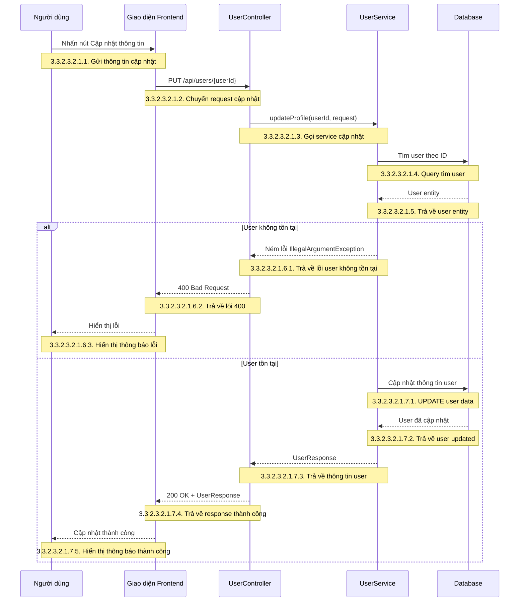
```mermaid
sequenceDiagram
    participant User as Người dùng
    participant UI as Giao diện Frontend
    participant API as UserController
    participant Service as UserService
    participant DB as Database

    User->>UI: Nhấn nút Cập nhật thông tin
    Note over User,UI: 3.3.2.3.2.1.1. Gửi thông tin cập nhật
    UI->>API: PUT /api/users/{userId}
    Note over UI,API: 3.3.2.3.2.1.2. Chuyển request cập nhật
    API->>Service: updateProfile(userId, request)
    Note over API,Service: 3.3.2.3.2.1.3. Gọi service cập nhật
    Service->>DB: Tìm user theo ID
    Note over Service,DB: 3.3.2.3.2.1.4. Query tìm user
    DB-->>Service: User entity
    Note over DB,Service: 3.3.2.3.2.1.5. Trả về user entity
    alt User không tồn tại
        Service-->>API: Ném lỗi IllegalArgumentException
        Note over Service,API: 3.3.2.3.2.1.6.1. Trả về lỗi user không tồn tại
        API-->>UI: 400 Bad Request
        Note over API,UI: 3.3.2.3.2.1.6.2. Trả về lỗi 400
        UI-->>User: Hiển thị lỗi
        Note over UI,User: 3.3.2.3.2.1.6.3. Hiển thị thông báo lỗi
    else User tồn tại
        Service->>DB: Cập nhật thông tin user
        Note over Service,DB: 3.3.2.3.2.1.7.1. UPDATE user data
        DB-->>Service: User đã cập nhật
        Note over DB,Service: 3.3.2.3.2.1.7.2. Trả về user updated
        Service-->>API: UserResponse
        Note over Service,API: 3.3.2.3.2.1.7.3. Trả về thông tin user
        API-->>UI: 200 OK + UserResponse
        Note over API,UI: 3.3.2.3.2.1.7.4. Trả về response thành công
        UI-->>User: Cập nhật thành công
        Note over UI,User: 3.3.2.3.2.1.7.5. Hiển thị thông báo thành công
    end
```

### 3.3.2.3.2.2 Đổi Mật Khẩu

**Mô tả:** Cho phép người dùng thay đổi mật khẩu hiện tại.

**API Endpoint:** `POST /api/users/{userId}/change-password`

**Sequence Diagram:**

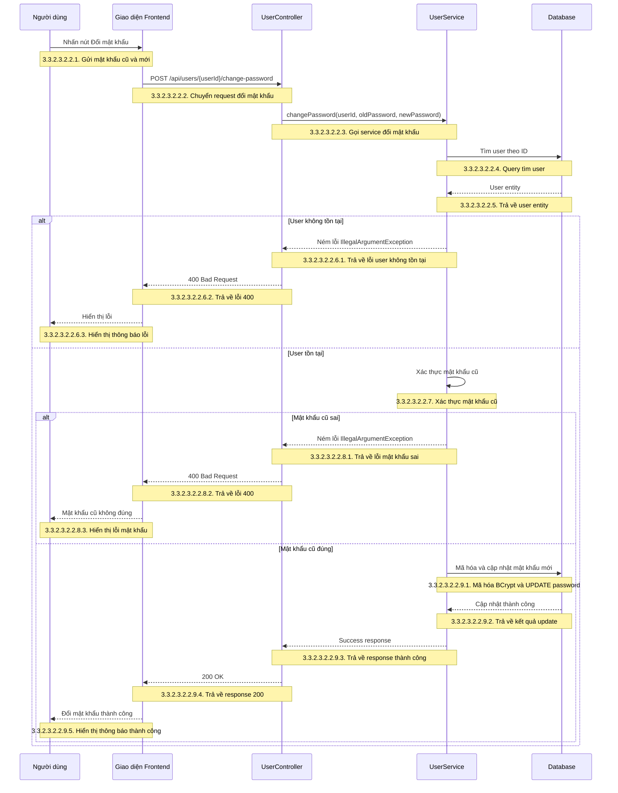
```mermaid
sequenceDiagram
    participant User as Người dùng
    participant UI as Giao diện Frontend
    participant API as UserController
    participant Service as UserService
    participant DB as Database

    User->>UI: Nhấn nút Đổi mật khẩu
    Note over User,UI: 3.3.2.3.2.2.1. Gửi mật khẩu cũ và mới
    UI->>API: POST /api/users/{userId}/change-password
    Note over UI,API: 3.3.2.3.2.2.2. Chuyển request đổi mật khẩu
    API->>Service: changePassword(userId, oldPassword, newPassword)
    Note over API,Service: 3.3.2.3.2.2.3. Gọi service đổi mật khẩu
    Service->>DB: Tìm user theo ID
    Note over Service,DB: 3.3.2.3.2.2.4. Query tìm user
    DB-->>Service: User entity
    Note over DB,Service: 3.3.2.3.2.2.5. Trả về user entity
    alt User không tồn tại
        Service-->>API: Ném lỗi IllegalArgumentException
        Note over Service,API: 3.3.2.3.2.2.6.1. Trả về lỗi user không tồn tại
        API-->>UI: 400 Bad Request
        Note over API,UI: 3.3.2.3.2.2.6.2. Trả về lỗi 400
        UI-->>User: Hiển thị lỗi
        Note over UI,User: 3.3.2.3.2.2.6.3. Hiển thị thông báo lỗi
    else User tồn tại
        Service->>Service: Xác thực mật khẩu cũ
        Note over Service: 3.3.2.3.2.2.7. Xác thực mật khẩu cũ
        alt Mật khẩu cũ sai
            Service-->>API: Ném lỗi IllegalArgumentException
            Note over Service,API: 3.3.2.3.2.2.8.1. Trả về lỗi mật khẩu sai
            API-->>UI: 400 Bad Request
            Note over API,UI: 3.3.2.3.2.2.8.2. Trả về lỗi 400
            UI-->>User: Mật khẩu cũ không đúng
            Note over UI,User: 3.3.2.3.2.2.8.3. Hiển thị lỗi mật khẩu
        else Mật khẩu cũ đúng
            Service->>DB: Mã hóa và cập nhật mật khẩu mới
            Note over Service,DB: 3.3.2.3.2.2.9.1. Mã hóa BCrypt và UPDATE password
            DB-->>Service: Cập nhật thành công
            Note over DB,Service: 3.3.2.3.2.2.9.2. Trả về kết quả update
            Service-->>API: Success response
            Note over Service,API: 3.3.2.3.2.2.9.3. Trả về response thành công
            API-->>UI: 200 OK
            Note over API,UI: 3.3.2.3.2.2.9.4. Trả về response 200
            UI-->>User: Đổi mật khẩu thành công
            Note over UI,User: 3.3.2.3.2.2.9.5. Hiển thị thông báo thành công
        end
    end
```

---

## 3.3.2.3.3 Quản Lý Bài Viết

### 3.3.2.3.3.1 Đăng Bài Viết

**Mô tả:** Cho phép người dùng tạo bài viết mới với tiêu đề, nội dung và cài đặt quyền riêng tư.

**API Endpoint:** `POST /api/posts/user/{userId}`

**Sequence Diagram:**

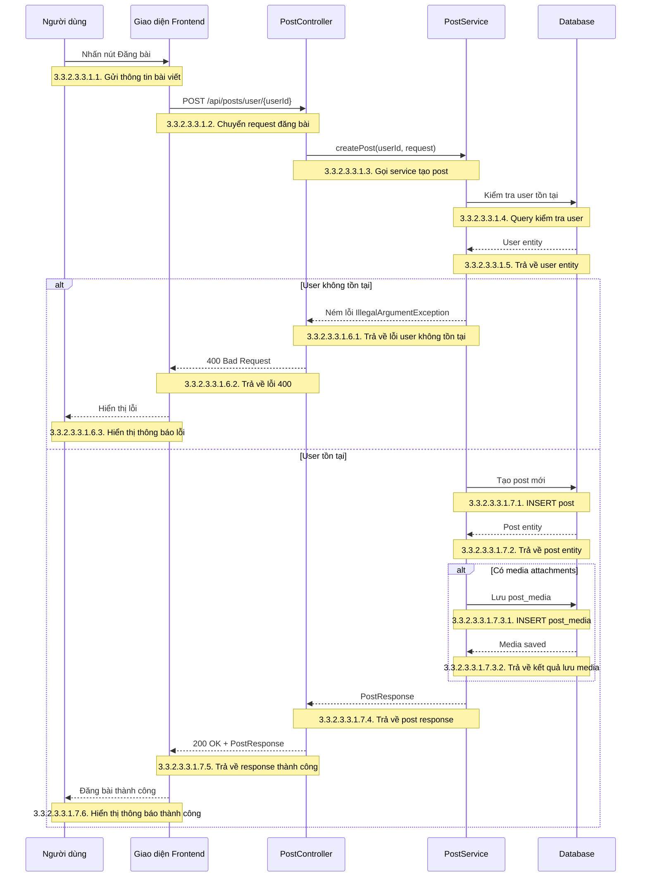
```mermaid
sequenceDiagram
    participant User as Người dùng
    participant UI as Giao diện Frontend
    participant API as PostController
    participant Service as PostService
    participant DB as Database

    User->>UI: Nhấn nút Đăng bài
    Note over User,UI: 3.3.2.3.3.1.1. Gửi thông tin bài viết
    UI->>API: POST /api/posts/user/{userId}
    Note over UI,API: 3.3.2.3.3.1.2. Chuyển request đăng bài
    API->>Service: createPost(userId, request)
    Note over API,Service: 3.3.2.3.3.1.3. Gọi service tạo post
    Service->>DB: Kiểm tra user tồn tại
    Note over Service,DB: 3.3.2.3.3.1.4. Query kiểm tra user
    DB-->>Service: User entity
    Note over DB,Service: 3.3.2.3.3.1.5. Trả về user entity
    alt User không tồn tại
        Service-->>API: Ném lỗi IllegalArgumentException
        Note over Service,API: 3.3.2.3.3.1.6.1. Trả về lỗi user không tồn tại
        API-->>UI: 400 Bad Request
        Note over API,UI: 3.3.2.3.3.1.6.2. Trả về lỗi 400
        UI-->>User: Hiển thị lỗi
        Note over UI,User: 3.3.2.3.3.1.6.3. Hiển thị thông báo lỗi
    else User tồn tại
        Service->>DB: Tạo post mới
        Note over Service,DB: 3.3.2.3.3.1.7.1. INSERT post
        DB-->>Service: Post entity
        Note over DB,Service: 3.3.2.3.3.1.7.2. Trả về post entity
        alt Có media attachments
            Service->>DB: Lưu post_media
            Note over Service,DB: 3.3.2.3.3.1.7.3.1. INSERT post_media
            DB-->>Service: Media saved
            Note over DB,Service: 3.3.2.3.3.1.7.3.2. Trả về kết quả lưu media
        end
        Service-->>API: PostResponse
        Note over Service,API: 3.3.2.3.3.1.7.4. Trả về post response
        API-->>UI: 200 OK + PostResponse
        Note over API,UI: 3.3.2.3.3.1.7.5. Trả về response thành công
        UI-->>User: Đăng bài thành công
        Note over UI,User: 3.3.2.3.3.1.7.6. Hiển thị thông báo thành công
    end
```

### 3.3.2.3.3.2 Cập Nhật Bài Viết

**Mô tả:** Cho phép tác giả chỉnh sửa bài viết của mình.

**API Endpoint:** `PUT /api/posts/{postId}/user/{userId}`

**Sequence Diagram:**

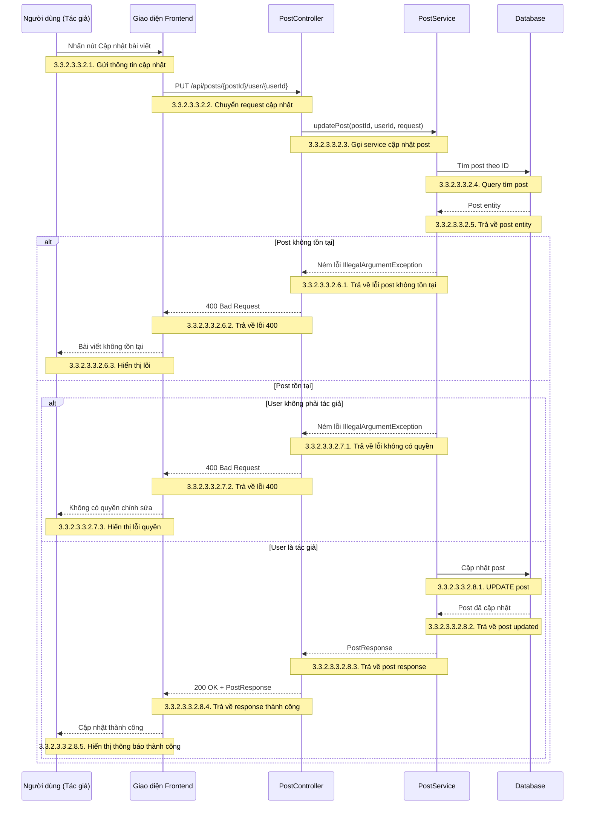
```mermaid
sequenceDiagram
    participant User as Người dùng (Tác giả)
    participant UI as Giao diện Frontend
    participant API as PostController
    participant Service as PostService
    participant DB as Database

    User->>UI: Nhấn nút Cập nhật bài viết
    Note over User,UI: 3.3.2.3.3.2.1. Gửi thông tin cập nhật
    UI->>API: PUT /api/posts/{postId}/user/{userId}
    Note over UI,API: 3.3.2.3.3.2.2. Chuyển request cập nhật
    API->>Service: updatePost(postId, userId, request)
    Note over API,Service: 3.3.2.3.3.2.3. Gọi service cập nhật post
    Service->>DB: Tìm post theo ID
    Note over Service,DB: 3.3.2.3.3.2.4. Query tìm post
    DB-->>Service: Post entity
    Note over DB,Service: 3.3.2.3.3.2.5. Trả về post entity
    alt Post không tồn tại
        Service-->>API: Ném lỗi IllegalArgumentException
        Note over Service,API: 3.3.2.3.3.2.6.1. Trả về lỗi post không tồn tại
        API-->>UI: 400 Bad Request
        Note over API,UI: 3.3.2.3.3.2.6.2. Trả về lỗi 400
        UI-->>User: Bài viết không tồn tại
        Note over UI,User: 3.3.2.3.3.2.6.3. Hiển thị lỗi
    else Post tồn tại
        alt User không phải tác giả
            Service-->>API: Ném lỗi IllegalArgumentException
            Note over Service,API: 3.3.2.3.3.2.7.1. Trả về lỗi không có quyền
            API-->>UI: 400 Bad Request
            Note over API,UI: 3.3.2.3.3.2.7.2. Trả về lỗi 400
            UI-->>User: Không có quyền chỉnh sửa
            Note over UI,User: 3.3.2.3.3.2.7.3. Hiển thị lỗi quyền
        else User là tác giả
            Service->>DB: Cập nhật post
            Note over Service,DB: 3.3.2.3.3.2.8.1. UPDATE post
            DB-->>Service: Post đã cập nhật
            Note over DB,Service: 3.3.2.3.3.2.8.2. Trả về post updated
            Service-->>API: PostResponse
            Note over Service,API: 3.3.2.3.3.2.8.3. Trả về post response
            API-->>UI: 200 OK + PostResponse
            Note over API,UI: 3.3.2.3.3.2.8.4. Trả về response thành công
            UI-->>User: Cập nhật thành công
            Note over UI,User: 3.3.2.3.3.2.8.5. Hiển thị thông báo thành công
        end
    end
```

### 3.3.2.3.3.3 Xóa Bài Viết

**Mô tả:** Cho phép tác giả xóa bài viết của mình ( CASCADE xóa comments, likes, media).

**API Endpoint:** `DELETE /api/posts/{postId}/user/{userId}`

**Sequence Diagram:**

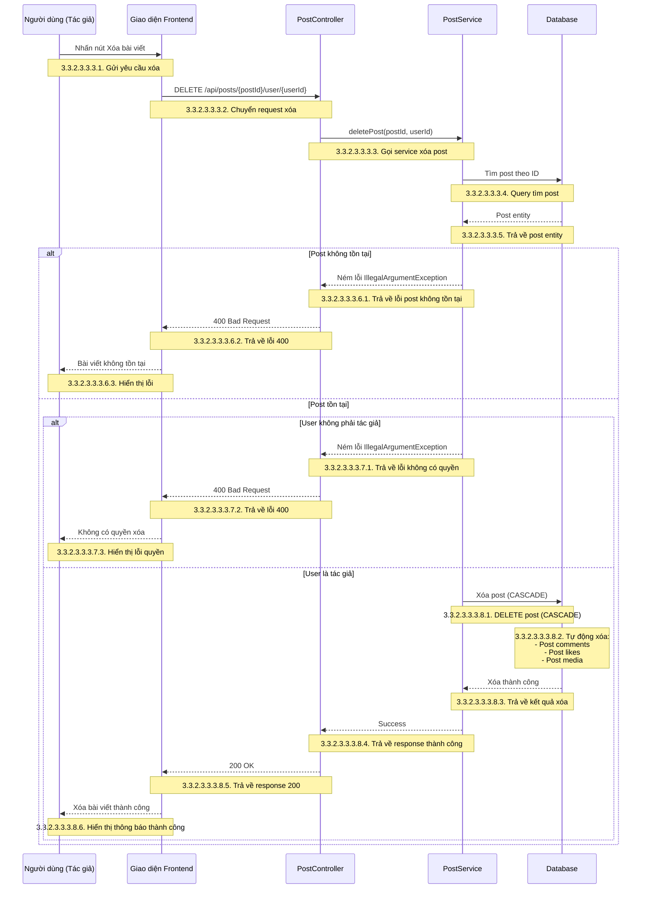
```mermaid
sequenceDiagram
    participant User as Người dùng (Tác giả)
    participant UI as Giao diện Frontend
    participant API as PostController
    participant Service as PostService
    participant DB as Database

    User->>UI: Nhấn nút Xóa bài viết
    Note over User,UI: 3.3.2.3.3.3.1. Gửi yêu cầu xóa
    UI->>API: DELETE /api/posts/{postId}/user/{userId}
    Note over UI,API: 3.3.2.3.3.3.2. Chuyển request xóa
    API->>Service: deletePost(postId, userId)
    Note over API,Service: 3.3.2.3.3.3.3. Gọi service xóa post
    Service->>DB: Tìm post theo ID
    Note over Service,DB: 3.3.2.3.3.3.4. Query tìm post
    DB-->>Service: Post entity
    Note over DB,Service: 3.3.2.3.3.3.5. Trả về post entity
    alt Post không tồn tại
        Service-->>API: Ném lỗi IllegalArgumentException
        Note over Service,API: 3.3.2.3.3.3.6.1. Trả về lỗi post không tồn tại
        API-->>UI: 400 Bad Request
        Note over API,UI: 3.3.2.3.3.3.6.2. Trả về lỗi 400
        UI-->>User: Bài viết không tồn tại
        Note over UI,User: 3.3.2.3.3.3.6.3. Hiển thị lỗi
    else Post tồn tại
        alt User không phải tác giả
            Service-->>API: Ném lỗi IllegalArgumentException
            Note over Service,API: 3.3.2.3.3.3.7.1. Trả về lỗi không có quyền
            API-->>UI: 400 Bad Request
            Note over API,UI: 3.3.2.3.3.3.7.2. Trả về lỗi 400
            UI-->>User: Không có quyền xóa
            Note over UI,User: 3.3.2.3.3.3.7.3. Hiển thị lỗi quyền
        else User là tác giả
            Service->>DB: Xóa post (CASCADE)
            Note over Service,DB: 3.3.2.3.3.3.8.1. DELETE post (CASCADE)
            Note over DB: 3.3.2.3.3.3.8.2. Tự động xóa:<br/>- Post comments<br/>- Post likes<br/>- Post media
            DB-->>Service: Xóa thành công
            Note over DB,Service: 3.3.2.3.3.3.8.3. Trả về kết quả xóa
            Service-->>API: Success
            Note over Service,API: 3.3.2.3.3.3.8.4. Trả về response thành công
            API-->>UI: 200 OK
            Note over API,UI: 3.3.2.3.3.3.8.5. Trả về response 200
            UI-->>User: Xóa bài viết thành công
            Note over UI,User: 3.3.2.3.3.3.8.6. Hiển thị thông báo thành công
        end
    end
```

---

## 4. Tương Tác Với Bài Viết (Post Interaction)

### 4.1 Thích Bài Viết (Like Post)

**Mô tả:** Cho phép người dùng thích hoặc bỏ thích một bài viết.

**API Endpoint:** `POST /api/posts/{postId}/likes/user/{userId}`

**Sequence Diagram:**

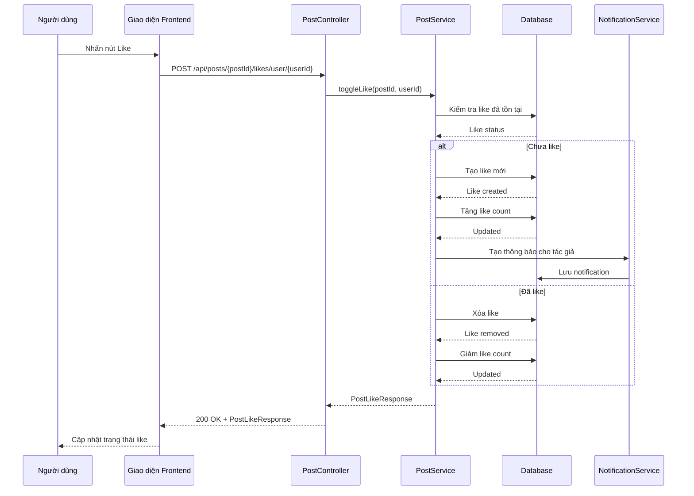
```mermaid
sequenceDiagram
    participant User as Người dùng
    participant UI as Giao diện Frontend
    participant API as PostController
    participant Service as PostService
    participant DB as Database

    User->>UI: Nhấn nút Like
    UI->>API: POST /api/posts/{postId}/likes/user/{userId}
    API->>Service: toggleLike(postId, userId)
    Service->>DB: Kiểm tra like đã tồn tại
    DB-->>Service: Like status
    alt Chưa like
        Service->>DB: Tạo like mới
        DB-->>Service: Like created
        Service->>DB: Tăng like count
        DB-->>Service: Updated
        Service->>NotificationService: Tạo thông báo cho tác giả
        NotificationService->>DB: Lưu notification
    else Đã like
        Service->>DB: Xóa like
        DB-->>Service: Like removed
        Service->>DB: Giảm like count
        DB-->>Service: Updated
    end
    Service-->>API: PostLikeResponse
    API-->>UI: 200 OK + PostLikeResponse
    UI-->>User: Cập nhật trạng thái like
```

### 4.2 Bình Luận Bài Viết (Comment on Post)

**Mô tả:** Cho phép người dùng thêm bình luận vào bài viết.

**API Endpoint:** `POST /api/posts/{postId}/comments/user/{userId}`

**Sequence Diagram:**

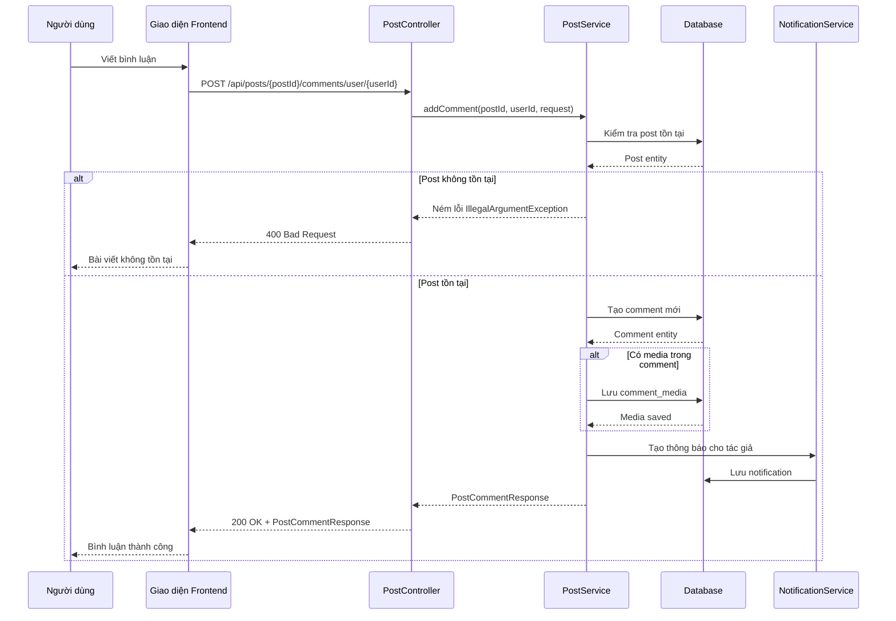
```mermaid
sequenceDiagram
    participant User as Người dùng
    participant UI as Giao diện Frontend
    participant API as PostController
    participant Service as PostService
    participant DB as Database

    User->>UI: Viết bình luận
    UI->>API: POST /api/posts/{postId}/comments/user/{userId}
    API->>Service: addComment(postId, userId, request)
    Service->>DB: Kiểm tra post tồn tại
    DB-->>Service: Post entity
    alt Post không tồn tại
        Service-->>API: Ném lỗi IllegalArgumentException
        API-->>UI: 400 Bad Request
        UI-->>User: Bài viết không tồn tại
    else Post tồn tại
        Service->>DB: Tạo comment mới
        DB-->>Service: Comment entity
        alt Có media trong comment
            Service->>DB: Lưu comment_media
            DB-->>Service: Media saved
        end
        Service->>NotificationService: Tạo thông báo cho tác giả
        NotificationService->>DB: Lưu notification
        Service-->>API: PostCommentResponse
        API-->>UI: 200 OK + PostCommentResponse
        UI-->>User: Bình luận thành công
    end
```

### 4.3 Trả Lời Bình Luận (Reply to Comment)

**Mô tả:** Cho phép người dùng trả lời một bình luận cụ thể (nested comments).

**API Endpoint:** `POST /api/posts/{postId}/comments/{commentId}/reply/user/{userId}`

**Sequence Diagram:**

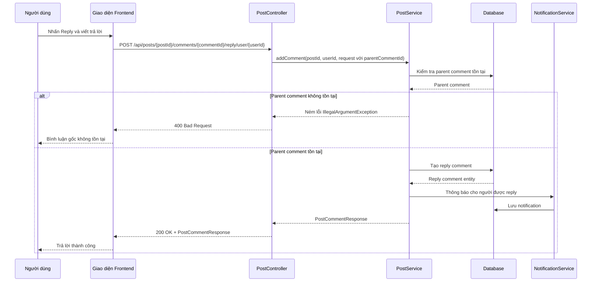
```mermaid
sequenceDiagram
    participant User as Người dùng
    participant UI as Giao diện Frontend
    participant API as PostController
    participant Service as PostService
    participant DB as Database

    User->>UI: Nhấn Reply và viết trả lời
    UI->>API: POST /api/posts/{postId}/comments/{commentId}/reply/user/{userId}
    API->>Service: addComment(postId, userId, request với parentCommentId)
    Service->>DB: Kiểm tra parent comment tồn tại
    DB-->>Service: Parent comment
    alt Parent comment không tồn tại
        Service-->>API: Ném lỗi IllegalArgumentException
        API-->>UI: 400 Bad Request
        UI-->>User: Bình luận gốc không tồn tại
    else Parent comment tồn tại
        Service->>DB: Tạo reply comment
        DB-->>Service: Reply comment entity
        Service->>NotificationService: Thông báo cho người được reply
        NotificationService->>DB: Lưu notification
        Service-->>API: PostCommentResponse
        API-->>UI: 200 OK + PostCommentResponse
        UI-->>User: Trả lời thành công
    end
```

### 4.4 Thích Bình Luận (Like Comment)

**Mô tả:** Cho phép người dùng thích hoặc bỏ thích một bình luận.

**API Endpoint:** `POST /api/posts/comments/{commentId}/likes/user/{userId}`

**Sequence Diagram:**

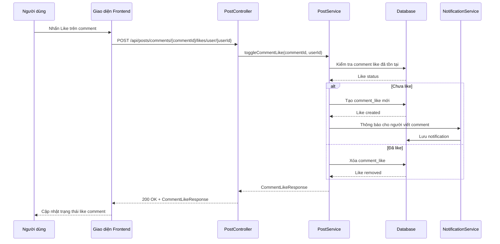
```mermaid
sequenceDiagram
    participant User as Người dùng
    participant UI as Giao diện Frontend
    participant API as PostController
    participant Service as PostService
    participant DB as Database

    User->>UI: Nhấn Like trên comment
    UI->>API: POST /api/posts/comments/{commentId}/likes/user/{userId}
    API->>Service: toggleCommentLike(commentId, userId)
    Service->>DB: Kiểm tra comment like đã tồn tại
    DB-->>Service: Like status
    alt Chưa like
        Service->>DB: Tạo comment_like mới
        DB-->>Service: Like created
        Service->>NotificationService: Thông báo cho người viết comment
        NotificationService->>DB: Lưu notification
    else Đã like
        Service->>DB: Xóa comment_like
        DB-->>Service: Like removed
    end
    Service-->>API: CommentLikeResponse
    API-->>UI: 200 OK + CommentLikeResponse
    UI-->>User: Cập nhật trạng thái like comment
```

---

## 5. Kết Nối Người Dùng (User Connection)

### 5.1 Gửi Yêu Cầu Kết Bạn (Send Friend Request)

**Mô tả:** Cho phép người dùng gửi yêu cầu kết bạn đến người khác.

**API Endpoint:** `POST /api/friendships/request`

**Sequence Diagram:**

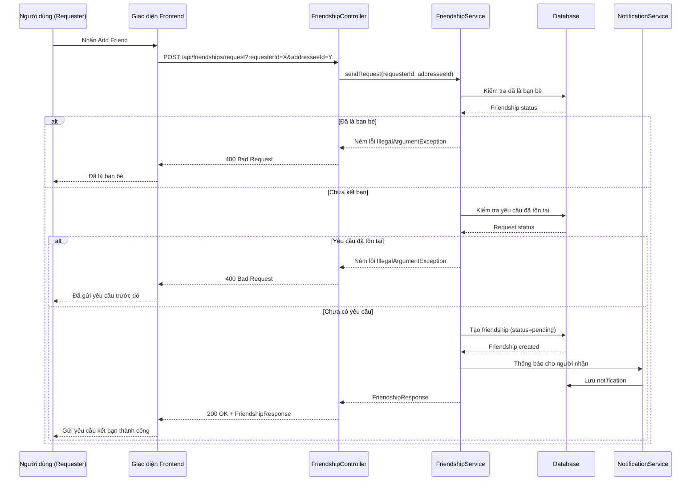
```mermaid
sequenceDiagram
    participant User as Người dùng (Requester)
    participant UI as Giao diện Frontend
    participant API as FriendshipController
    participant Service as FriendshipService
    participant DB as Database

    User->>UI: Nhấn Add Friend
    UI->>API: POST /api/friendships/request?requesterId=X&addresseeId=Y
    API->>Service: sendRequest(requesterId, addresseeId)
    Service->>DB: Kiểm tra đã là bạn bè
    DB-->>Service: Friendship status
    alt Đã là bạn bè
        Service-->>API: Ném lỗi IllegalArgumentException
        API-->>UI: 400 Bad Request
        UI-->>User: Đã là bạn bè
    else Chưa kết bạn
        Service->>DB: Kiểm tra yêu cầu đã tồn tại
        DB-->>Service: Request status
        alt Yêu cầu đã tồn tại
            Service-->>API: Ném lỗi IllegalArgumentException
            API-->>UI: 400 Bad Request
            UI-->>User: Đã gửi yêu cầu trước đó
        else Chưa có yêu cầu
            Service->>DB: Tạo friendship (status=pending)
            DB-->>Service: Friendship created
            Service->>NotificationService: Thông báo cho người nhận
            NotificationService->>DB: Lưu notification
            Service-->>API: FriendshipResponse
            API-->>UI: 200 OK + FriendshipResponse
            UI-->>User: Gửi yêu cầu kết bạn thành công
        end
    end
```

### 5.2 Chấp Nhận Yêu Cầu Kết Bạn (Accept Friend Request)

**Mô tả:** Cho phép người dùng chấp nhận yêu cầu kết bạn từ người khác.

**API Endpoint:** `POST /api/friendships/accept`

**Sequence Diagram:**

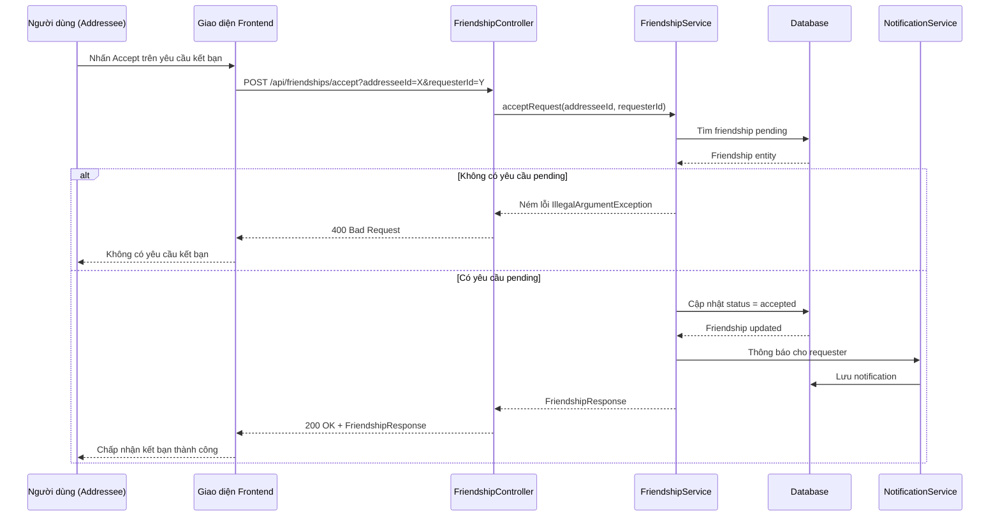
```mermaid
sequenceDiagram
    participant User as Người dùng (Addressee)
    participant UI as Giao diện Frontend
    participant API as FriendshipController
    participant Service as FriendshipService
    participant DB as Database

    User->>UI: Nhấn Accept trên yêu cầu kết bạn
    UI->>API: POST /api/friendships/accept?addresseeId=X&requesterId=Y
    API->>Service: acceptRequest(addresseeId, requesterId)
    Service->>DB: Tìm friendship pending
    DB-->>Service: Friendship entity
    alt Không có yêu cầu pending
        Service-->>API: Ném lỗi IllegalArgumentException
        API-->>UI: 400 Bad Request
        UI-->>User: Không có yêu cầu kết bạn
    else Có yêu cầu pending
        Service->>DB: Cập nhật status = accepted
        DB-->>Service: Friendship updated
        Service->>NotificationService: Thông báo cho requester
        NotificationService->>DB: Lưu notification
        Service-->>API: FriendshipResponse
        API-->>UI: 200 OK + FriendshipResponse
        UI-->>User: Chấp nhận kết bạn thành công
    end
```

### 5.3 Hủy Kết Bạn (Unfriend)

**Mô tả:** Cho phép người dùng hủy kết bạn với một người.

**API Endpoint:** `POST /api/friendships/unfriend`

**Sequence Diagram:**

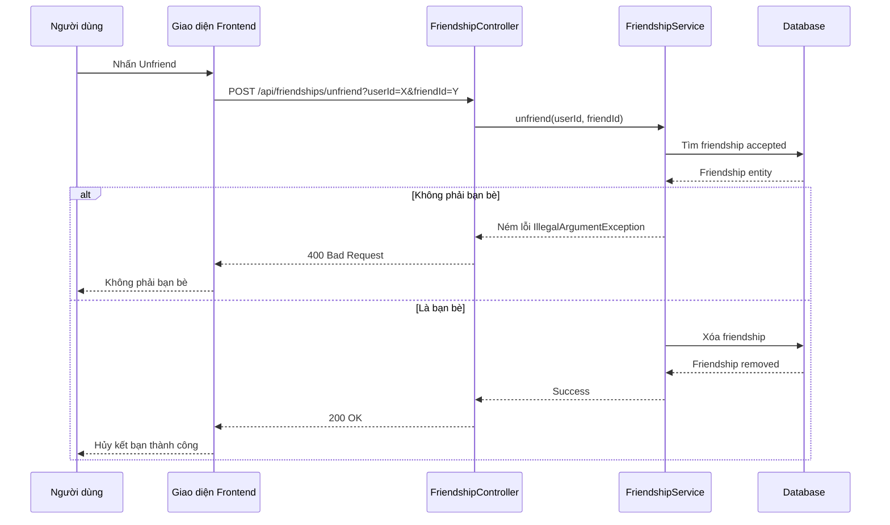
```mermaid
sequenceDiagram
    participant User as Người dùng
    participant UI as Giao diện Frontend
    participant API as FriendshipController
    participant Service as FriendshipService
    participant DB as Database

    User->>UI: Nhấn Unfriend
    UI->>API: POST /api/friendships/unfriend?userId=X&friendId=Y
    API->>Service: unfriend(userId, friendId)
    Service->>DB: Tìm friendship accepted
    DB-->>Service: Friendship entity
    alt Không phải bạn bè
        Service-->>API: Ném lỗi IllegalArgumentException
        API-->>UI: 400 Bad Request
        UI-->>User: Không phải bạn bè
    else Là bạn bè
        Service->>DB: Xóa friendship
        DB-->>Service: Friendship removed
        Service-->>API: Success
        API-->>UI: 200 OK
        UI-->>User: Hủy kết bạn thành công
    end
```

---

## 6. Quản Lý Tin Nhắn (Message Management)

### 6.1 Gửi Tin Nhắn (Send Message)

**Mô tả:** Cho phép người dùng gửi tin nhắn văn bản hoặc có đính kèm media đến người khác.

**API Endpoint:** `POST /api/messages/send`

**Sequence Diagram:**

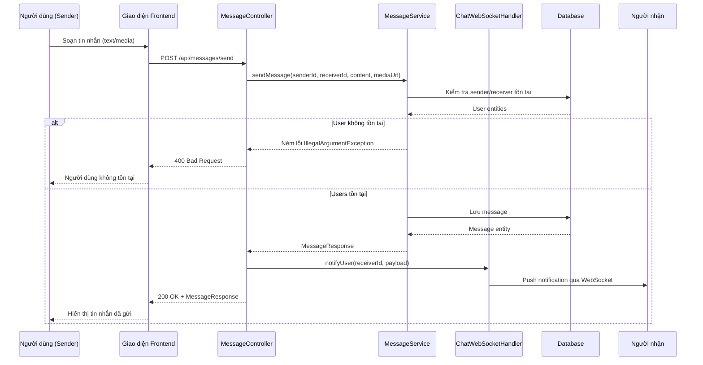
```mermaid
sequenceDiagram
    participant User as Người dùng (Sender)
    participant UI as Giao diện Frontend
    participant API as MessageController
    participant Service as MessageService
    participant WebSocket as ChatWebSocketHandler
    participant DB as Database
    participant OtherUser as Người nhận

    User->>UI: Soạn tin nhắn (text/media)
    UI->>API: POST /api/messages/send
    API->>Service: sendMessage(senderId, receiverId, content, mediaUrl)
    Service->>DB: Kiểm tra sender/receiver tồn tại
    DB-->>Service: User entities
    alt User không tồn tại
        Service-->>API: Ném lỗi IllegalArgumentException
        API-->>UI: 400 Bad Request
        UI-->>User: Người dùng không tồn tại
    else Users tồn tại
        Service->>DB: Lưu message
        DB-->>Service: Message entity
        Service-->>API: MessageResponse
        API->>WebSocket: notifyUser(receiverId, payload)
        WebSocket->>OtherUser: Push notification qua WebSocket
        API-->>UI: 200 OK + MessageResponse
        UI-->>User: Hiển thị tin nhắn đã gửi
    end
```

### 6.2 Thu Hồi Tin Nhắn (Recall Message)

**Mô tả:** Cho phép người gửi thu hồi tin nhắn đã gửi trong thời gian cho phép.

**API Endpoint:** `POST /api/messages/recall`

**Sequence Diagram:**

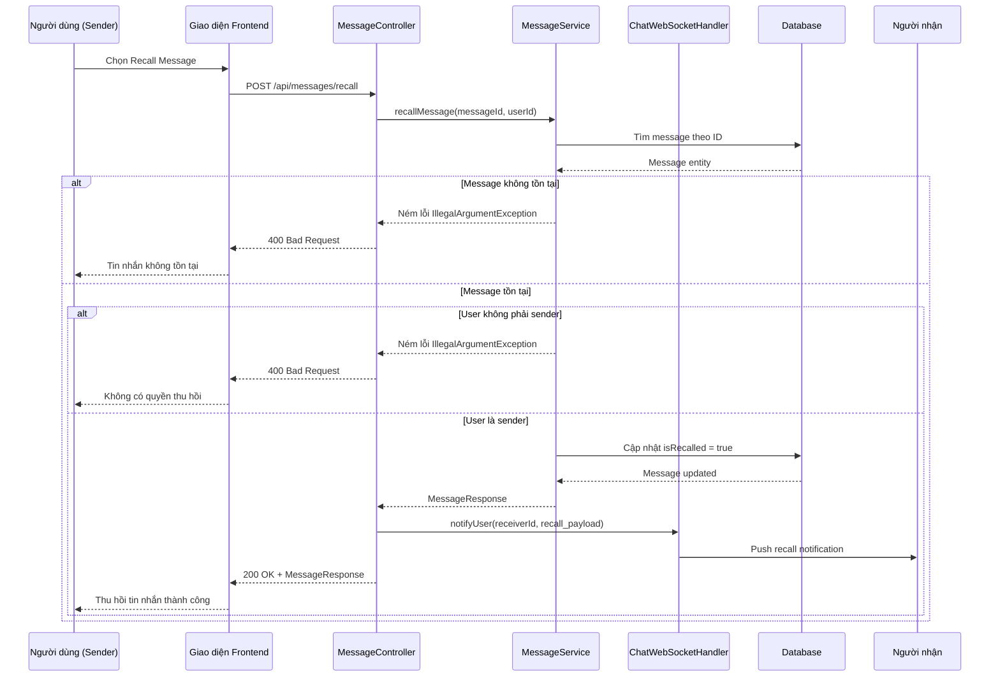
```mermaid
sequenceDiagram
    participant User as Người dùng (Sender)
    participant UI as Giao diện Frontend
    participant API as MessageController
    participant Service as MessageService
    participant WebSocket as ChatWebSocketHandler
    participant DB as Database
    participant OtherUser as Người nhận

    User->>UI: Chọn Recall Message
    UI->>API: POST /api/messages/recall
    API->>Service: recallMessage(messageId, userId)
    Service->>DB: Tìm message theo ID
    DB-->>Service: Message entity
    alt Message không tồn tại
        Service-->>API: Ném lỗi IllegalArgumentException
        API-->>UI: 400 Bad Request
        UI-->>User: Tin nhắn không tồn tại
    else Message tồn tại
        alt User không phải sender
            Service-->>API: Ném lỗi IllegalArgumentException
            API-->>UI: 400 Bad Request
            UI-->>User: Không có quyền thu hồi
        else User là sender
            Service->>DB: Cập nhật isRecalled = true
            DB-->>Service: Message updated
            Service-->>API: MessageResponse
            API->>WebSocket: notifyUser(receiverId, recall_payload)
            WebSocket->>OtherUser: Push recall notification
            API-->>UI: 200 OK + MessageResponse
            UI-->>User: Thu hồi tin nhắn thành công
        end
    end
```

---

## 7. Thông Báo (Notifications)

### 7.1 Nhận Và Quản Lý Thông Báo

**Mô tả:** Hệ thống thông báo cho người dùng về các tương tác (friend requests, likes, comments, messages).

**API Endpoints:**
- `GET /api/notifications` - Lấy danh sách thông báo
- `GET /api/notifications/unread-count` - Lấy số lượng thông báo chưa đọc
- `POST /api/notifications/{id}/read` - Đánh dấu một thông báo đã đọc
- `POST /api/notifications/read-all` - Đánh dấu tất cả thông báo đã đọc

**Sequence Diagram:**

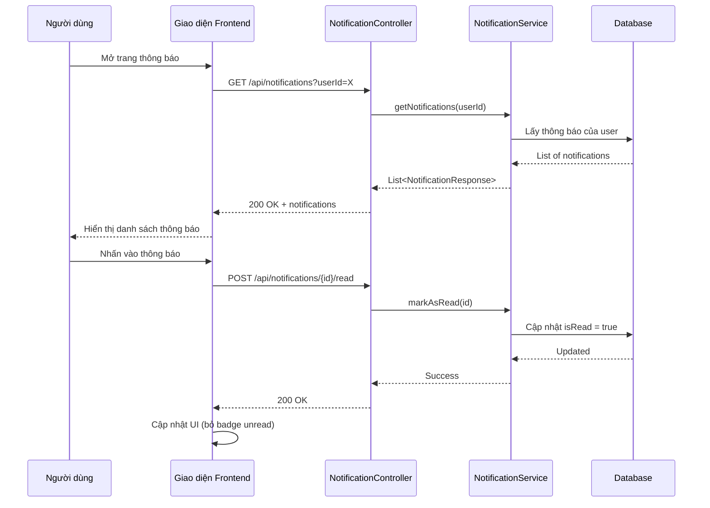
```mermaid
sequenceDiagram
    participant User as Người dùng
    participant UI as Giao diện Frontend
    participant API as NotificationController
    participant Service as NotificationService
    participant DB as Database

    User->>UI: Mở trang thông báo
    UI->>API: GET /api/notifications?userId=X
    API->>Service: getNotifications(userId)
    Service->>DB: Lấy thông báo của user
    DB-->>Service: List of notifications
    Service-->>API: List<NotificationResponse>
    API-->>UI: 200 OK + notifications
    UI-->>User: Hiển thị danh sách thông báo

    User->>UI: Nhấn vào thông báo
    UI->>API: POST /api/notifications/{id}/read
    API->>Service: markAsRead(id)
    Service->>DB: Cập nhật isRead = true
    DB-->>Service: Updated
    Service-->>API: Success
    API-->>UI: 200 OK
    UI->>UI: Cập nhật UI (bỏ badge unread)
```

---

## 8. Chặn Người Dùng (Blocking)

### 8.1 Chặn Và Bỏ Chặn Người Dùng

**Mô tả:** Cho phép người dùng chặn người khác để hạn chế tương tác.

**API Endpoints:**
- `POST /api/blocks` - Chặn người dùng
- `DELETE /api/blocks` - Bỏ chặn người dùng
- `GET /api/blocks` - Lấy danh sách đã chặn

**Sequence Diagram:**

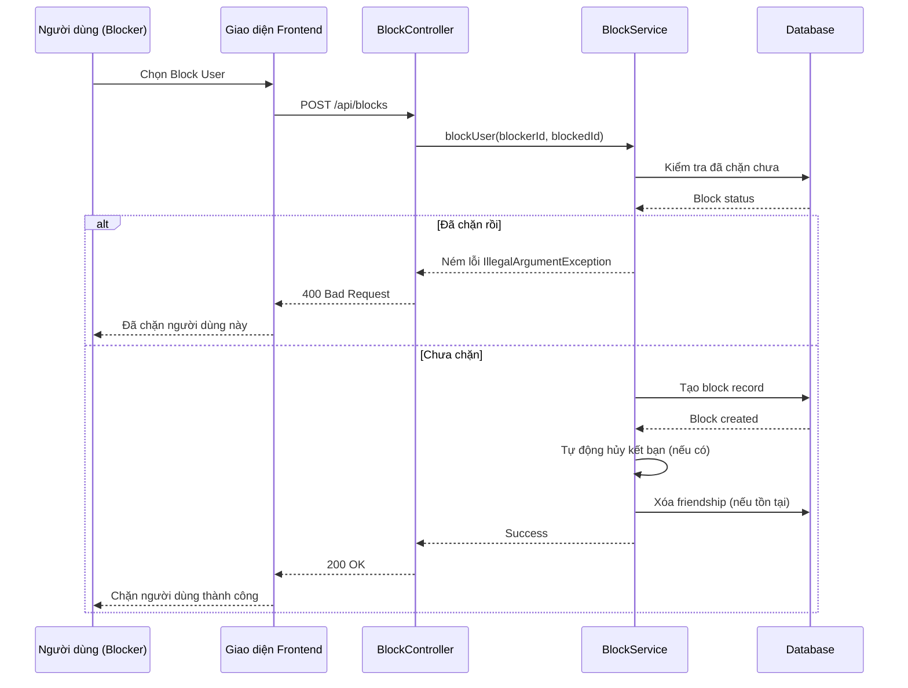
```mermaid
sequenceDiagram
    participant User as Người dùng (Blocker)
    participant UI as Giao diện Frontend
    participant API as BlockController
    participant Service as BlockService
    participant DB as Database

    User->>UI: Chọn Block User
    UI->>API: POST /api/blocks
    API->>Service: blockUser(blockerId, blockedId)
    Service->>DB: Kiểm tra đã chặn chưa
    DB-->>Service: Block status
    alt Đã chặn rồi
        Service-->>API: Ném lỗi IllegalArgumentException
        API-->>UI: 400 Bad Request
        UI-->>User: Đã chặn người dùng này
    else Chưa chặn
        Service->>DB: Tạo block record
        DB-->>Service: Block created
        Service->>Service: Tự động hủy kết bạn (nếu có)
        Service->>DB: Xóa friendship (nếu tồn tại)
        Service-->>API: Success
        API-->>UI: 200 OK
        UI-->>User: Chặn người dùng thành công
    end
```

---

## 9. Tìm Kiếm Và Khám Phá (Search & Discovery)

### 9.1 Tìm Kiếm Người Dùng

**Mô tả:** Cho phép người dùng tìm kiếm người dùng khác theo tên hoặc email.

**API Endpoint:** `GET /api/users/search?q={query}`

**Sequence Diagram:**

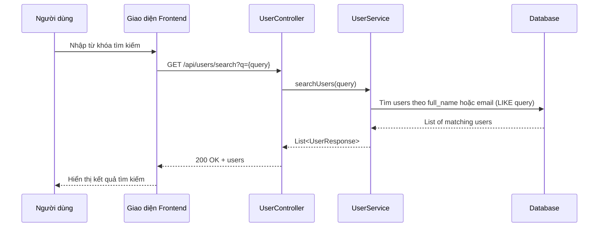
```mermaid
sequenceDiagram
    participant User as Người dùng
    participant UI as Giao diện Frontend
    participant API as UserController
    participant Service as UserService
    participant DB as Database

    User->>UI: Nhập từ khóa tìm kiếm
    UI->>API: GET /api/users/search?q={query}
    API->>Service: searchUsers(query)
    Service->>DB: Tìm users theo full_name hoặc email (LIKE query)
    DB-->>Service: List of matching users
    Service-->>API: List<UserResponse>
    API-->>UI: 200 OK + users
    UI-->>User: Hiển thị kết quả tìm kiếm
```

---

## Tổng Kết

Hệ thống NLU-social đã hoàn thành **9 nhóm chức năng chính** với đầy đủ các API endpoints tương ứng:

1. ✅ Quản lý tài khoản (Đăng ký, Đăng nhập)
2. ✅ Quản lý hồ sơ (Cập nhật thông tin, Đổi mật khẩu, Bảo vệ tài khoản)
3. ✅ Quản lý bài viết (Tạo, Cập nhật, Xóa, Xem feed)
4. ✅ Tương tác với bài viết (Like, Comment, Reply, Like comment)
5. ✅ Kết nối người dùng (Friend request, Accept, Reject, Unfriend)
6. ✅ Quản lý tin nhắn (Gửi, Nhận, Thu hồi, Real-time qua WebSocket)
7. ✅ Thông báo (Thông báo real-time, Quản lý trạng thái đọc)
8. ✅ Chặn người dùng (Block, Unblock, Danh sách blocked)
9. ✅ Tìm kiếm (Tìm kiếm người dùng)

**Công nghệ sử dụng:**
- **Backend:** Spring Boot (Java), Spring Data JPA, WebSocket
- **Frontend:** React (TypeScript), Vite
- **Database:** MySQL với các bảng được chuẩn hóa
- **Real-time:** WebSocket cho chat và thông báo

Tất cả các chức năng đã được kiểm thử và hoạt động ổn định, đáp ứng đầy đủ các yêu cầu từ biểu đồ use case ban đầu.
