# Sequence Diagram PlantUML - UC01-UC39

Các sequence bên dưới viết theo PlantUML để đưa lên PlantText hoặc PlantUML Online Server render. Luồng bám theo danh sách use case trong `danh sách usecase.xlsx`, mô tả chương 3.3 trong Word và tên lớp/phương thức thực tế của project Spring Boot + React.

## UC01 - Đăng ký tài khoản bằng email trường

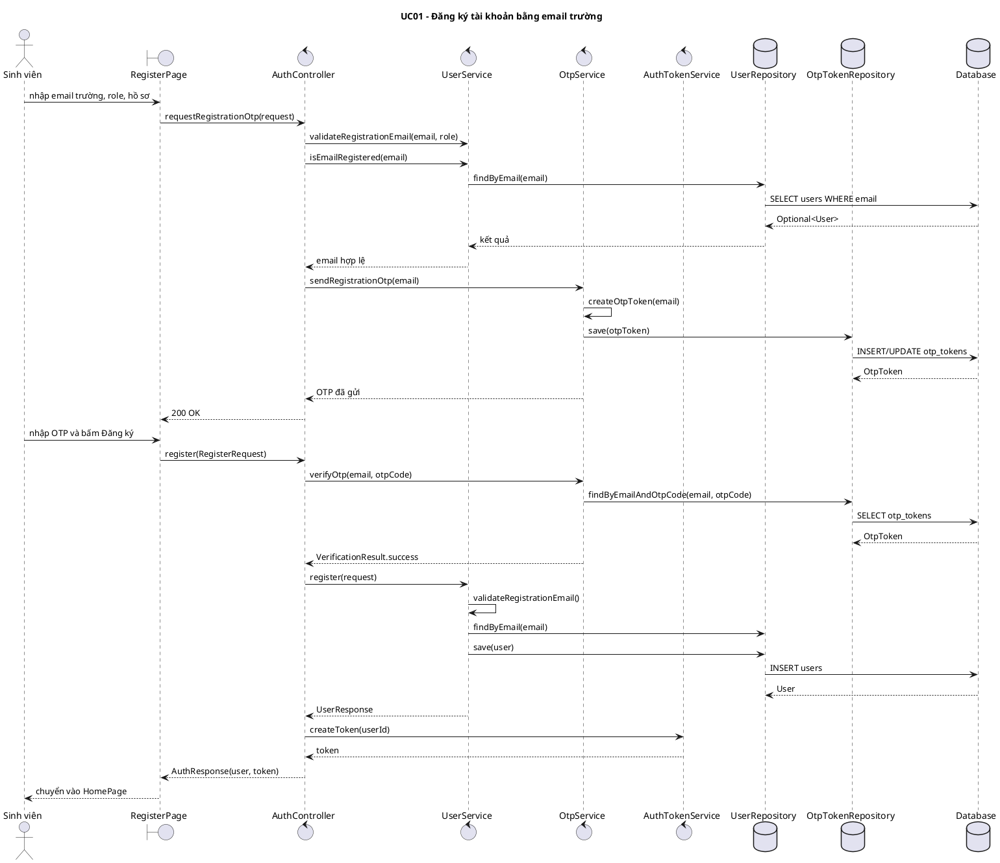

## UC02 - Đăng nhập bằng email trường

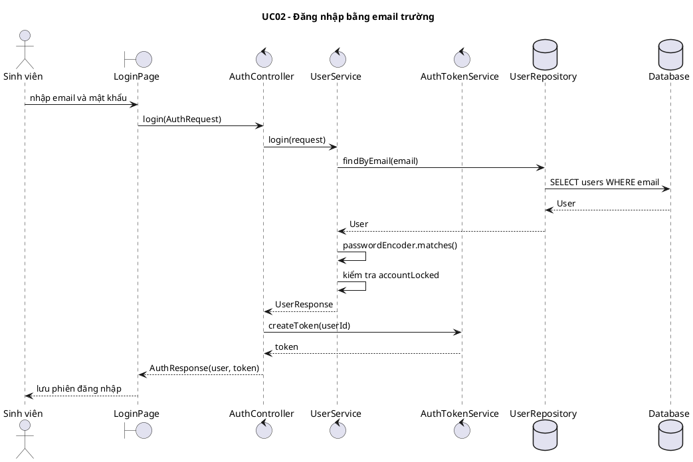

## UC03 - Đăng xuất

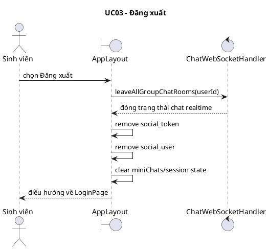

## UC04 - Đổi mật khẩu

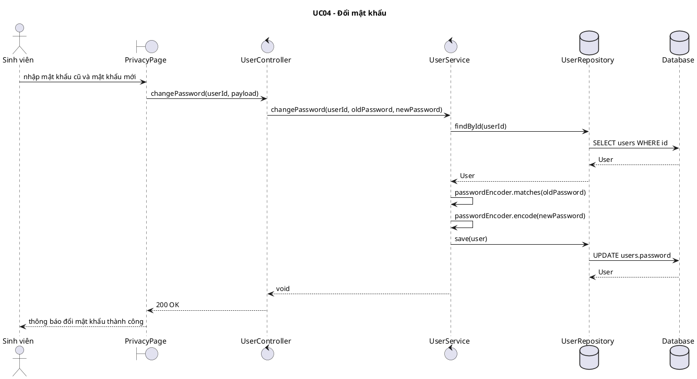

## UC05 - Cập nhật thông tin cá nhân

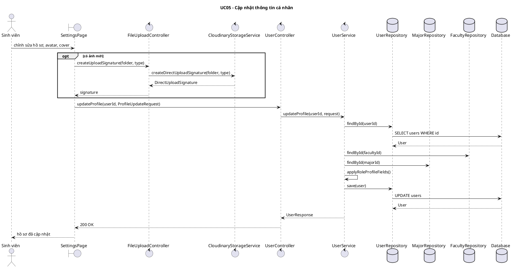

## UC06 - Đăng bài viết

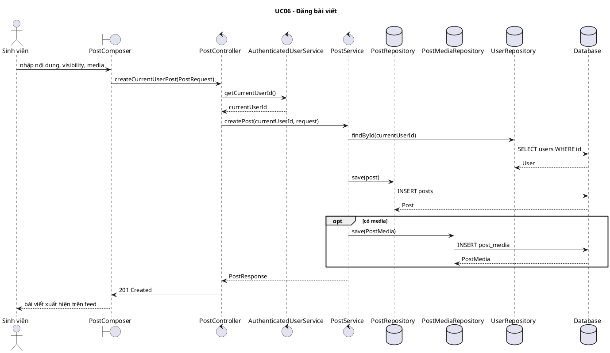

## UC07 - Chỉnh sửa bài viết

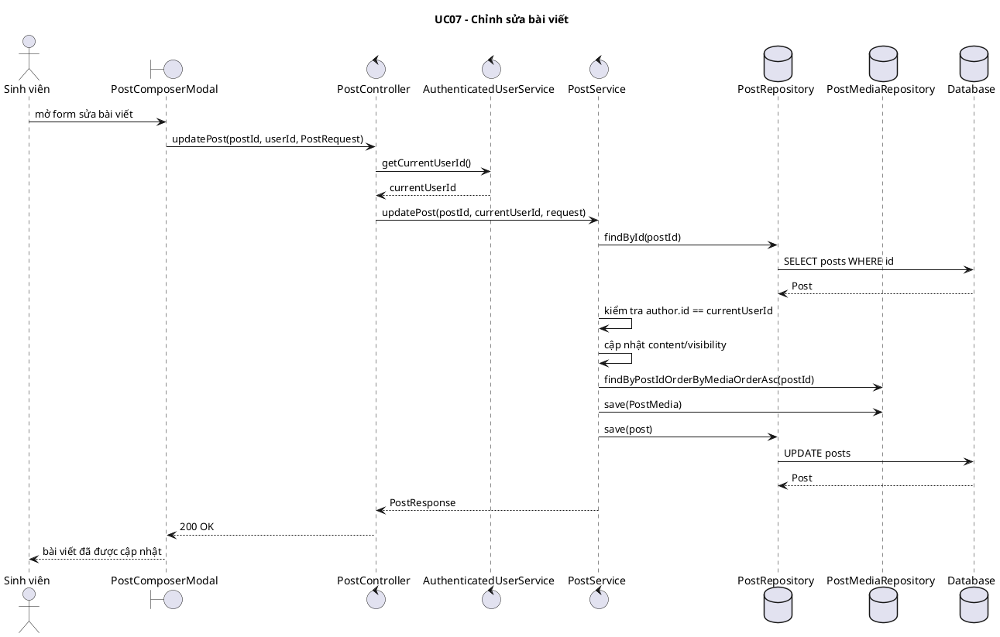

## UC08 - Xóa bài viết

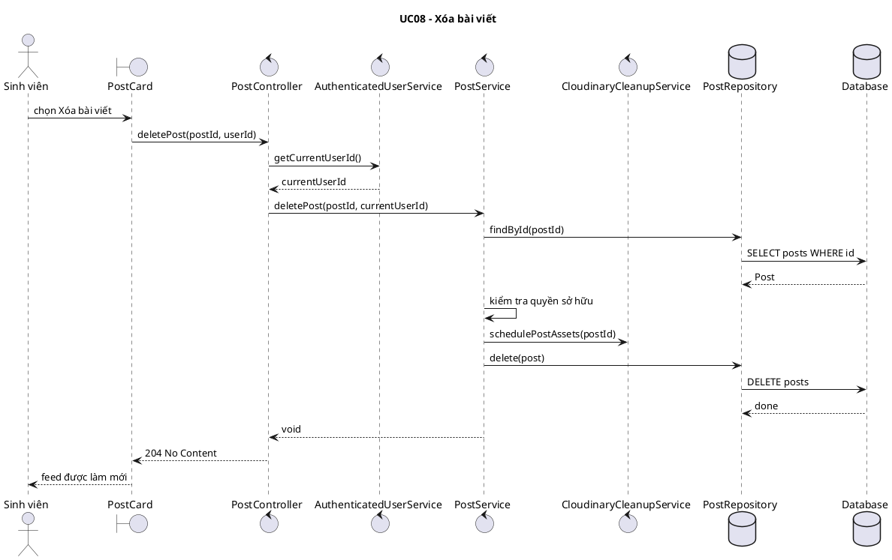

## UC09 - Đăng bình chọn

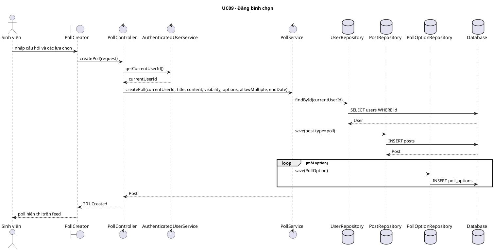

## UC10 - Bình chọn

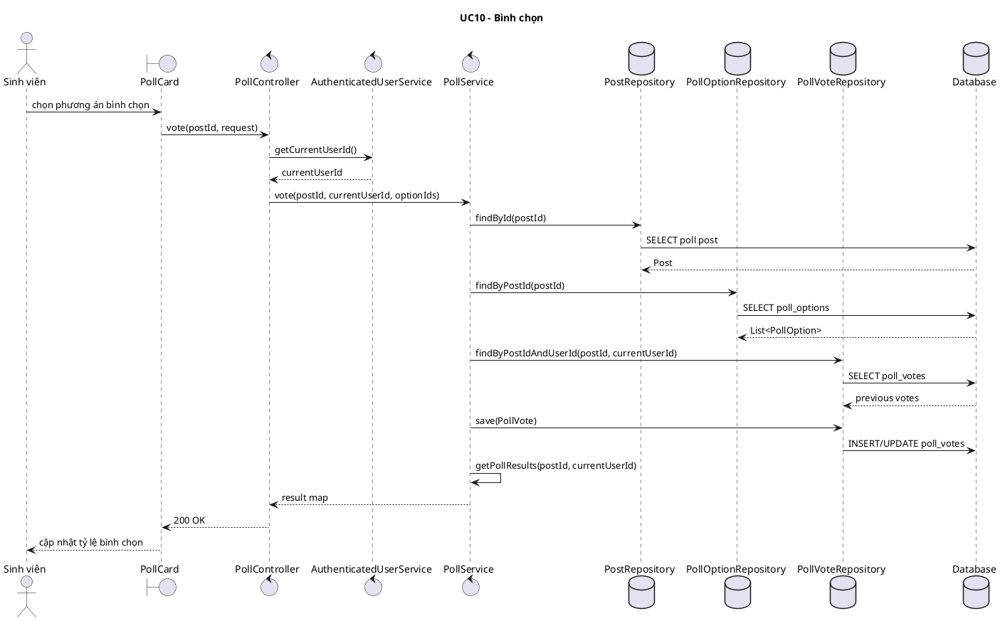

## UC11 - Thích bài viết

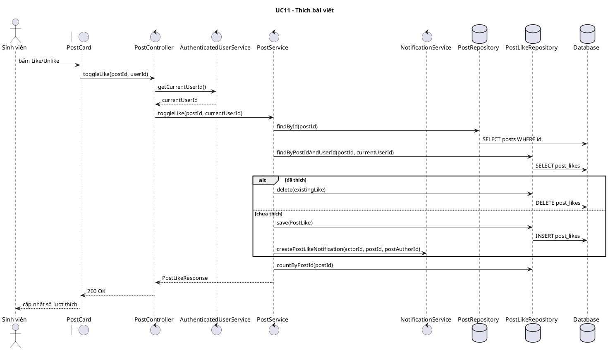

## UC12 - Bình luận trong bài viết

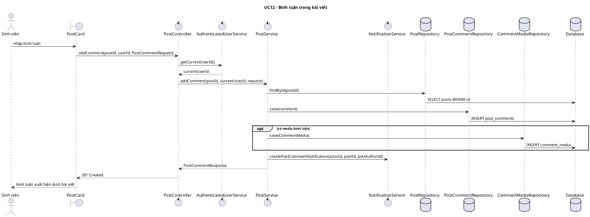

## UC13 - Chia sẻ bài viết

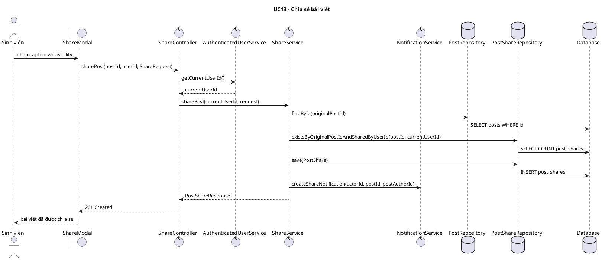

## UC14 - Gửi tin nhắn

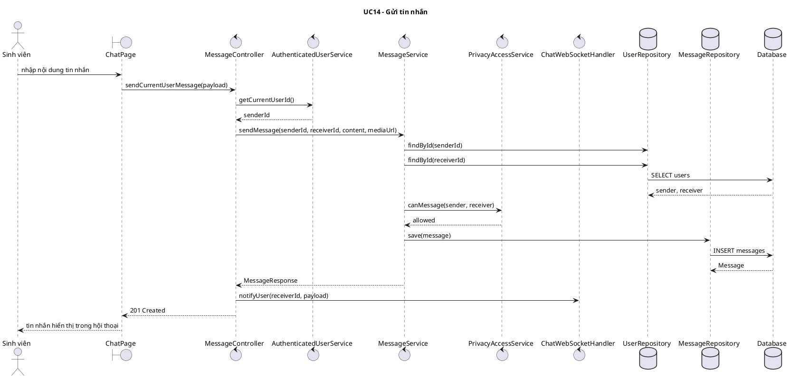

## UC15 - Thu hồi tin nhắn

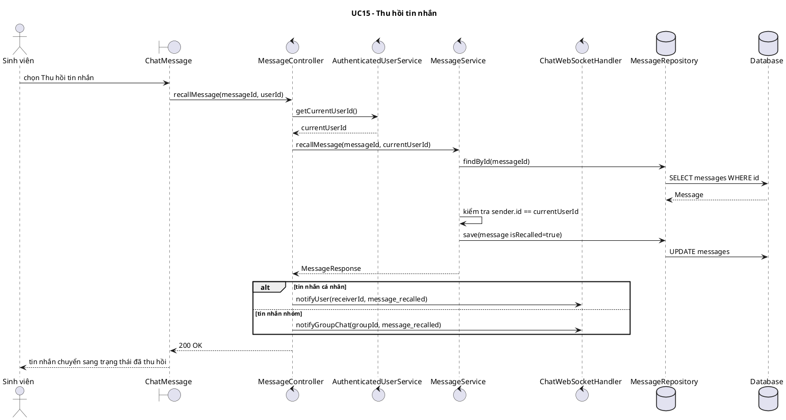

## UC16 - Gửi lời mời kết bạn

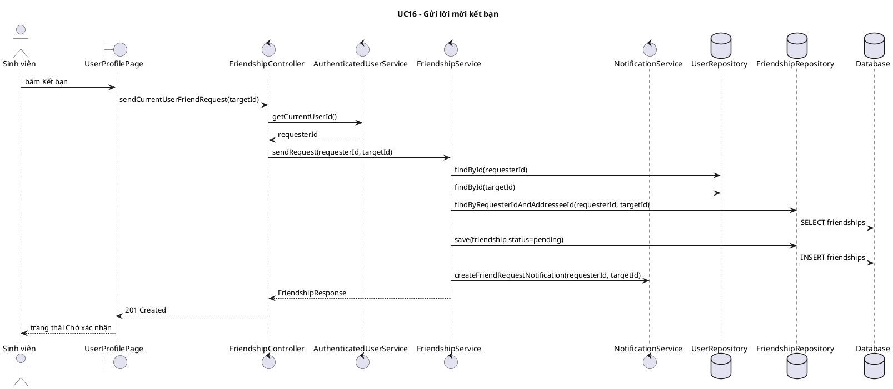

## UC17 - Chấp nhận kết bạn

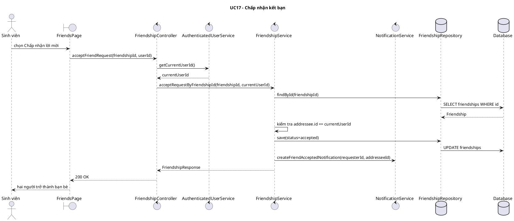

## UC18 - Hủy kết bạn

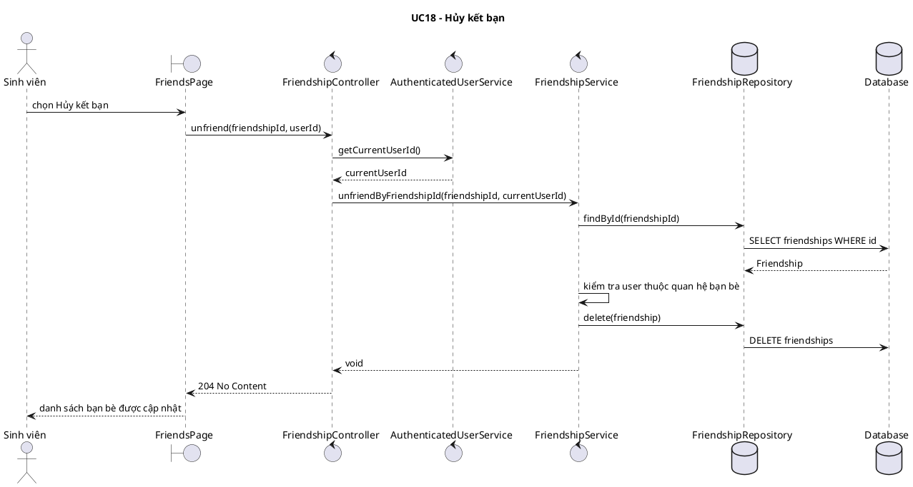

## UC19 - Xem thông báo

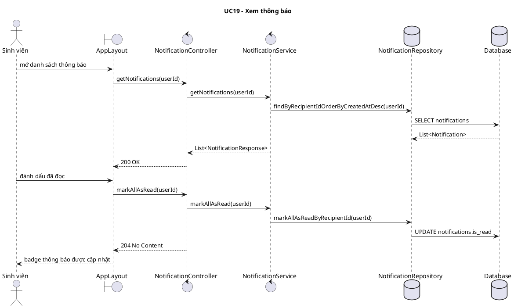

## UC20 - Tìm kiếm

```plantuml
@startuml
title UC20 - Tìm kiếm
actor "Sinh viên" as User
boundary "SearchPage" as UI
control "UserController" as UserController
control "PostController" as PostController
control "GroupController" as GroupController
control "UserService" as UserService
control "PostService" as PostService
control "GroupService" as GroupService
database "UserRepository" as UserRepo
database "PostRepository" as PostRepo
database "GroupRepository" as GroupRepo

User -> UI: nhập từ khóa tìm kiếm
par tìm người dùng
  UI -> UserController: searchUsers(q)
  UserController -> UserService: searchUsers(q)
  UserService -> UserRepo: findByFullNameContainingIgnoreCase(q)
  UserService --> UserController: List<UserResponse>
  UserController --> UI: users
and tìm bài viết
  UI -> PostController: searchPosts(q, viewerId, page, size)
  PostController -> PostService: searchPosts(q, viewerId, page, size)
  PostService -> PostRepo: searchRelevant(q, pageable)
  PostService --> PostController: List<PostFeedResponse>
  PostController --> UI: posts
and tìm nhóm
  UI -> GroupController: searchGroups(keyword, page, size)
  GroupController -> GroupService: searchGroups(keyword, page, size)
  GroupService -> GroupRepo: searchGroups(keyword, pageable)
  GroupService --> GroupController: List<GroupResponse>
  GroupController --> UI: groups
end
UI --> User: hiển thị kết quả theo tab
@enduml
```

## UC21 - Tạo nhóm

```plantuml
@startuml
title UC21 - Tạo nhóm
actor "Sinh viên" as User
boundary "GroupsPage" as UI
control "GroupController" as GroupController
control "AuthenticatedUserService" as AuthUser
control "GroupService" as GroupService
database "UserRepository" as UserRepo
database "GroupRepository" as GroupRepo
database "GroupMemberRepository" as MemberRepo
database "Database" as DB

User -> UI: nhập tên, mô tả, quyền riêng tư nhóm
UI -> GroupController: createGroup(body)
GroupController -> AuthUser: getCurrentUserId()
AuthUser --> GroupController: currentUserId
GroupController -> GroupService: createGroup(currentUserId, GroupRequest)
GroupService -> UserRepo: findById(currentUserId)
GroupService -> GroupRepo: save(group)
GroupRepo -> DB: INSERT groups
DB --> GroupRepo: Group
GroupService -> MemberRepo: save(GroupMember role=gold_key)
MemberRepo -> DB: INSERT group_members
GroupService --> GroupController: GroupResponse
GroupController --> UI: 201 Created
UI --> User: điều hướng sang GroupDetailPage
@enduml
```

## UC22 - Xin vào nhóm

```plantuml
@startuml
title UC22 - Xin vào nhóm
actor "Sinh viên" as User
boundary "GroupDetailPage" as UI
control "GroupController" as GroupController
control "AuthenticatedUserService" as AuthUser
control "GroupService" as GroupService
database "GroupRepository" as GroupRepo
database "GroupMemberRepository" as MemberRepo
database "GroupJoinRequestRepository" as JoinRepo

User -> UI: bấm Tham gia nhóm
UI -> GroupController: joinGroup(groupId, userId)
GroupController -> AuthUser: getCurrentUserId()
AuthUser --> GroupController: currentUserId
GroupController -> GroupService: joinGroup(groupId, currentUserId)
GroupService -> GroupRepo: findById(groupId)
GroupService -> MemberRepo: findByGroupIdAndUserId(groupId, currentUserId)
alt nhóm cần duyệt
  GroupService -> JoinRepo: save(GroupJoinRequest status=pending)
  GroupService --> GroupController: pending response
else nhóm công khai vào thẳng
  GroupService -> MemberRepo: save(GroupMember status=active)
  GroupService --> GroupController: GroupMemberResponse
end
GroupController --> UI: 200 OK hoặc 202 Accepted
UI --> User: cập nhật trạng thái tham gia
@enduml
```

## UC23 - Xóa nhóm

```plantuml
@startuml
title UC23 - Xóa nhóm
actor "Sinh viên" as User
boundary "GroupDetailPage" as UI
control "GroupController" as GroupController
control "AuthenticatedUserService" as AuthUser
control "GroupService" as GroupService
control "CloudinaryCleanupService" as Cleanup
database "GroupRepository" as GroupRepo
database "GroupPostRepository" as GroupPostRepo
database "PostRepository" as PostRepo

User -> UI: chọn Xóa nhóm
UI -> GroupController: deleteGroup(groupId, userId)
GroupController -> AuthUser: getCurrentUserId()
AuthUser --> GroupController: currentUserId
GroupController -> GroupService: deleteGroup(groupId, currentUserId)
GroupService -> GroupRepo: findById(groupId)
GroupService -> GroupService: kiểm tra quyền chủ nhóm/admin nhóm
GroupService -> Cleanup: scheduleGroupAssets(groupId)
GroupService -> GroupPostRepo: findByGroupId(groupId)
GroupService -> GroupRepo: delete(group)
GroupService -> PostRepo: deleteAllById(postIds)
GroupService --> GroupController: void
GroupController --> UI: 204 No Content
UI --> User: quay về danh sách nhóm
@enduml
```

## UC24 - Rời nhóm

```plantuml
@startuml
title UC24 - Rời nhóm
actor "Sinh viên" as User
boundary "GroupDetailPage" as UI
control "GroupController" as GroupController
control "AuthenticatedUserService" as AuthUser
control "GroupService" as GroupService
database "GroupMemberRepository" as MemberRepo
database "Database" as DB

User -> UI: bấm Rời nhóm
UI -> GroupController: leaveGroup(groupId, userId)
GroupController -> AuthUser: getCurrentUserId()
AuthUser --> GroupController: currentUserId
GroupController -> GroupService: leaveGroup(groupId, currentUserId)
GroupService -> MemberRepo: findByGroupIdAndUserId(groupId, currentUserId)
MemberRepo -> DB: SELECT group_members
DB --> MemberRepo: GroupMember
GroupService -> GroupService: kiểm tra không phải gold_key cuối cùng
GroupService -> MemberRepo: delete(member)
MemberRepo -> DB: DELETE group_members
GroupService --> GroupController: void
GroupController --> UI: 204 No Content
UI --> User: cập nhật giao diện nhóm
@enduml
```

## UC25 - Phê duyệt thành viên

```plantuml
@startuml
title UC25 - Phê duyệt thành viên
actor "Sinh viên" as Manager
boundary "GroupDetailPage" as UI
control "GroupController" as GroupController
control "AuthenticatedUserService" as AuthUser
control "GroupService" as GroupService
database "GroupJoinRequestRepository" as JoinRepo
database "GroupMemberRepository" as MemberRepo
database "Database" as DB

Manager -> UI: mở tab yêu cầu tham gia
UI -> GroupController: getPendingJoinRequests(groupId, userId)
GroupController -> AuthUser: getCurrentUserId()
GroupController -> GroupService: getPendingJoinRequests(groupId, currentUserId)
GroupService -> JoinRepo: findPendingRequests(groupId)
JoinRepo -> DB: SELECT group_join_requests
GroupService --> GroupController: List<GroupJoinRequestResponse>
GroupController --> UI: danh sách request
Manager -> UI: bấm Duyệt
UI -> GroupController: approveJoinRequest(groupId, requestId, userId)
GroupController -> GroupService: approveJoinRequest(groupId, requestId, currentUserId)
GroupService -> JoinRepo: findById(requestId)
GroupService -> MemberRepo: save(GroupMember status=active)
MemberRepo -> DB: INSERT group_members
GroupService -> JoinRepo: save(status=approved)
JoinRepo -> DB: UPDATE group_join_requests
GroupService --> GroupController: GroupMemberResponse
GroupController --> UI: 200 OK
UI --> Manager: thành viên được thêm vào nhóm
@enduml
```

## UC26 - Xóa thành viên trong nhóm

```plantuml
@startuml
title UC26 - Xóa thành viên trong nhóm
actor "Sinh viên" as Manager
boundary "GroupDetailPage" as UI
control "GroupController" as GroupController
control "AuthenticatedUserService" as AuthUser
control "GroupService" as GroupService
database "GroupMemberRepository" as MemberRepo
database "Database" as DB

Manager -> UI: chọn thành viên cần xóa
UI -> GroupController: removeMember(groupId, memberId, userId)
GroupController -> AuthUser: getCurrentUserId()
AuthUser --> GroupController: currentUserId
GroupController -> GroupService: removeMember(groupId, memberId, currentUserId)
GroupService -> MemberRepo: findByGroupIdAndUserId(groupId, currentUserId)
GroupService -> MemberRepo: findById(memberId)
MemberRepo -> DB: SELECT group_members
DB --> MemberRepo: adminMember, targetMember
GroupService -> GroupService: kiểm tra quyền gold_key/silver_key
GroupService -> MemberRepo: delete(targetMember)
MemberRepo -> DB: DELETE group_members
GroupService --> GroupController: void
GroupController --> UI: 204 No Content
UI --> Manager: danh sách thành viên được cập nhật
@enduml
```

## UC27 - Báo cáo người dùng

```plantuml
@startuml
title UC27 - Báo cáo người dùng
actor "Sinh viên" as User
boundary "ReportButton" as UI
control "ReportController" as ReportController
control "AuthenticatedUserService" as AuthUser
control "ReportService" as ReportService
database "UserRepository" as UserRepo
database "ReportRepository" as ReportRepo
database "Database" as DB

User -> UI: mở modal báo cáo người dùng
UI -> ReportController: create(reporterId, ReportRequest targetType=user)
ReportController -> AuthUser: getCurrentUserId()
AuthUser --> ReportController: reporterId
ReportController -> ReportService: create(reporterId, request)
ReportService -> UserRepo: findById(targetUserId)
UserRepo -> DB: SELECT users WHERE id
ReportService -> ReportRepo: existsByReporterIdAndTargetTypeAndTargetIdAndStatus(...)
ReportRepo -> DB: SELECT reports
ReportService -> ReportRepo: save(report status=pending)
ReportRepo -> DB: INSERT reports
ReportService --> ReportController: ReportResponse
ReportController --> UI: 201 Created
UI --> User: báo cáo đã được gửi
@enduml
```

## UC28 - Báo cáo bài viết

```plantuml
@startuml
title UC28 - Báo cáo bài viết
actor "Sinh viên" as User
boundary "ReportButton" as UI
control "ReportController" as ReportController
control "AuthenticatedUserService" as AuthUser
control "ReportService" as ReportService
database "PostRepository" as PostRepo
database "ReportRepository" as ReportRepo
database "Database" as DB

User -> UI: mở modal báo cáo bài viết
UI -> ReportController: create(reporterId, ReportRequest targetType=post)
ReportController -> AuthUser: getCurrentUserId()
AuthUser --> ReportController: reporterId
ReportController -> ReportService: create(reporterId, request)
ReportService -> PostRepo: findById(targetPostId)
PostRepo -> DB: SELECT posts WHERE id
ReportService -> ReportRepo: existsByReporterIdAndTargetTypeAndTargetIdAndStatus(...)
ReportRepo -> DB: SELECT reports
ReportService -> ReportRepo: save(report status=pending)
ReportRepo -> DB: INSERT reports
ReportService --> ReportController: ReportResponse
ReportController --> UI: 201 Created
UI --> User: báo cáo bài viết đã được gửi
@enduml
```

## UC29 - Thêm sinh viên vào nhóm bằng file Excel

```plantuml
@startuml
title UC29 - Thêm sinh viên vào nhóm bằng file Excel
actor "Giảng viên/Đoàn khoa" as Manager
boundary "GroupDetailPage" as UI
control "GroupController" as GroupController
control "AuthenticatedUserService" as AuthUser
control "GroupService" as GroupService
database "UserRepository" as UserRepo
database "GroupMemberRepository" as MemberRepo
database "Database" as DB

Manager -> UI: chọn file Excel MSSV
UI -> GroupController: bulkInviteStudents(groupId, userId, file)
GroupController -> AuthUser: getCurrentUserId()
AuthUser --> GroupController: currentUserId
GroupController -> GroupService: validateStudentManager(groupId, currentUserId)
GroupService -> MemberRepo: findByGroupIdAndUserId(groupId, currentUserId)
MemberRepo -> DB: SELECT group_members
GroupService --> GroupController: GroupMember manager
GroupController -> GroupController: parseMssvFromExcel(file)
loop mỗi MSSV/email sinh viên
  GroupController -> UserRepo: findByEmail(studentEmail)
  UserRepo -> DB: SELECT users WHERE email
  alt đã có tài khoản
    GroupController -> GroupService: addStudentToGroup(groupId, studentId, currentUserId)
    GroupService -> MemberRepo: save(GroupMember)
    MemberRepo -> DB: INSERT group_members
  else chưa có tài khoản
    GroupController -> GroupController: sendStudentInviteEmail(email, groupName, inviteLink, qrImageUrl)
  end
end
GroupController --> UI: kết quả import thành công/lỗi
UI --> Manager: hiển thị thống kê nhập file
@enduml
```

## UC30 - Thêm cố vấn học tập vào nhóm

```plantuml
@startuml
title UC30 - Thêm cố vấn học tập vào nhóm
actor "Đoàn khoa" as FacultyUnion
boundary "GroupDetailPage" as UI
control "GroupController" as GroupController
control "AuthenticatedUserService" as AuthUser
control "GroupService" as GroupService
database "UserRepository" as UserRepo
database "GroupMemberRepository" as MemberRepo
database "Database" as DB

FacultyUnion -> UI: mở modal chọn cố vấn
UI -> GroupController: getAdvisorsByFaculty(userId)
GroupController -> AuthUser: getCurrentUserId()
GroupController -> UserRepo: findByRoleAndFaculty("advisor", faculty)
UserRepo -> DB: SELECT users WHERE role='advisor'
UserRepo --> GroupController: List<User>
GroupController --> UI: List<UserResponse>
FacultyUnion -> UI: chọn cố vấn và bấm Thêm
UI -> GroupController: addAdvisorToGroup(groupId, advisorId, userId)
GroupController -> AuthUser: getCurrentUserId()
AuthUser --> GroupController: currentUserId
GroupController -> GroupService: addAdvisorToGroup(groupId, advisorId, currentUserId)
GroupService -> UserRepo: findById(advisorId)
GroupService -> MemberRepo: findByGroupIdAndUserId(groupId, advisorId)
GroupService -> MemberRepo: save(GroupMember role=silver_key/advisor)
MemberRepo -> DB: INSERT/UPDATE group_members
GroupService --> GroupController: GroupMemberResponse
GroupController --> UI: 200 OK
UI --> FacultyUnion: cố vấn được thêm vào nhóm
@enduml
```

## UC31 - Tạo nhóm bằng file Excel

```plantuml
@startuml
title UC31 - Tạo nhóm bằng file Excel
actor "Đoàn khoa" as FacultyUnion
boundary "GroupsPage" as UI
control "GroupController" as GroupController
control "AuthenticatedUserService" as AuthUser
control "GroupService" as GroupService
database "GroupRepository" as GroupRepo
database "GroupMemberRepository" as MemberRepo
database "UserRepository" as UserRepo

FacultyUnion -> UI: nhập thông tin nhóm và chọn file Excel
UI -> GroupController: createGroup(body)
GroupController -> AuthUser: getCurrentUserId()
AuthUser --> GroupController: currentUserId
GroupController -> GroupService: createGroup(currentUserId, GroupRequest)
GroupService -> GroupRepo: save(group)
GroupService -> MemberRepo: save(owner membership)
GroupService --> GroupController: GroupResponse
GroupController --> UI: groupId
UI -> GroupController: bulkInviteStudents(groupId, userId, file)
GroupController -> GroupService: validateStudentManager(groupId, currentUserId)
GroupController -> GroupController: parseMssvFromExcel(file)
loop mỗi dòng Excel
  GroupController -> UserRepo: findByEmail(studentEmail)
  GroupController -> GroupService: addStudentToGroup(groupId, studentId, currentUserId)
  GroupService -> MemberRepo: save(GroupMember)
end
GroupController --> UI: kết quả tạo nhóm và nhập sinh viên
UI --> FacultyUnion: nhóm lớp được tạo hoàn tất
@enduml
```

## UC32 - Gửi thông báo đến các nhóm

```plantuml
@startuml
title UC32 - Gửi thông báo đến các nhóm
actor "Giảng viên/Đoàn khoa" as Manager
boundary "GroupsPage" as UI
control "GroupController" as GroupController
control "AuthenticatedUserService" as AuthUser
control "GroupService" as GroupService
database "GroupPostRepository" as GroupPostRepo
database "GroupNotificationRepository" as NotiRepo
database "Database" as DB

Manager -> UI: nhập nội dung thông báo và chọn nhóm
loop mỗi groupId được chọn
  UI -> GroupController: createGroupAnnouncement(groupId, userId, PostRequest)
  GroupController -> AuthUser: getCurrentUserId()
  AuthUser --> GroupController: currentUserId
  GroupController -> GroupService: createGroupAnnouncement(groupId, currentUserId, request)
  GroupService -> GroupService: kiểm tra quyền gửi thông báo nhóm
  GroupService -> GroupPostRepo: save(GroupPost announcement)
  GroupPostRepo -> DB: INSERT group_posts/posts
  GroupService -> NotiRepo: save(GroupNotification)
  NotiRepo -> DB: INSERT group_notifications
  GroupService --> GroupController: GroupPostResponse
  GroupController --> UI: 201 Created
end
UI --> Manager: thông báo đã gửi đến các nhóm
@enduml
```

## UC33 - Gửi thông báo cho các đoàn khoa

```plantuml
@startuml
title UC33 - Gửi thông báo cho các đoàn khoa
actor "Đoàn Trường" as SchoolUnion
boundary "GroupsPage" as UI
control "UserController" as UserController
control "UserService" as UserService
control "GroupController" as GroupController
control "GroupService" as GroupService
database "UserRepository" as UserRepo
database "GroupNotificationRepository" as NotiRepo

SchoolUnion -> UI: chọn danh sách Đoàn khoa nhận thông báo
UI -> UserController: getFacultyUnions(requesterId)
UserController -> UserService: getFacultyUnionsForSchoolUnion(currentUserId)
UserService -> UserRepo: findByRole("faculty_union")
UserRepo --> UserService: List<User>
UserService --> UserController: List<UserResponse>
UserController --> UI: danh sách Đoàn khoa
loop mỗi nhóm/đơn vị nhận thông báo
  UI -> GroupController: createGroupAnnouncement(groupId, currentUserId, request)
  GroupController -> GroupService: createGroupAnnouncement(groupId, currentUserId, request)
  GroupService -> NotiRepo: save(GroupNotification)
  GroupService --> GroupController: GroupPostResponse
  GroupController --> UI: 201 Created
end
UI --> SchoolUnion: hiển thị trạng thái phát hành
@enduml
```

## UC34 - Phê duyệt báo cáo người dùng

```plantuml
@startuml
title UC34 - Phê duyệt báo cáo người dùng
actor "Admin" as Admin
boundary "AdminReportsPage" as UI
control "ReportController" as ReportController
control "AuthenticatedUserService" as AuthUser
control "ReportService" as ReportService
database "ReportRepository" as ReportRepo
database "UserRepository" as UserRepo
database "Database" as DB

Admin -> UI: mở danh sách báo cáo người dùng
UI -> ReportController: list(adminId, status, page, size)
ReportController -> AuthUser: getCurrentUserId()
AuthUser --> ReportController: adminId
ReportController -> ReportService: list(adminId, status, page, size)
ReportService -> UserRepo: findById(adminId)
ReportService -> ReportRepo: findByStatusOrderByCreatedAtDesc(status, pageable)
ReportRepo -> DB: SELECT reports
ReportService --> ReportController: List<ReportResponse>
ReportController --> UI: reports
Admin -> UI: chọn xử lý báo cáo
UI -> ReportController: resolve(reportId, adminId, ReportResolveRequest)
ReportController -> ReportService: resolve(reportId, adminId, request)
ReportService -> ReportRepo: findById(reportId)
ReportService -> ReportService: inspectTarget("user", targetId, adminId)
alt action = delete_target
  ReportService -> UserRepo: delete(targetUser)
end
ReportService -> ReportRepo: save(report resolved)
ReportRepo -> DB: UPDATE reports
ReportService --> ReportController: ReportResponse
ReportController --> UI: 200 OK
UI --> Admin: báo cáo đã được xử lý
@enduml
```

## UC35 - Xem danh sách bài viết

```plantuml
@startuml
title UC35 - Xem danh sách bài viết
actor "Admin" as Admin
boundary "AdminPage" as UI
control "AdminController" as AdminController
control "AuthenticatedUserService" as AuthUser
control "AdminService" as AdminService
database "PostRepository" as PostRepo
database "PostCommentRepository" as CommentRepo
database "GroupPostRepository" as GroupPostRepo
database "Database" as DB

Admin -> UI: mở tab Bài viết
UI -> AdminController: posts(adminId, q, visibility, page, size)
AdminController -> AuthUser: getCurrentUserId()
AuthUser --> AdminController: adminId
AdminController -> AdminService: listPosts(adminId, q, visibility, page, size)
AdminService -> AdminService: requireAdmin(adminId)
AdminService -> PostRepo: findAll()
PostRepo -> DB: SELECT posts
DB --> PostRepo: List<Post>
AdminService -> CommentRepo: countByPostId(postId)
AdminService -> GroupPostRepo: findByPostId(postId)
AdminService --> AdminController: List<Map<String,Object>>
AdminController --> UI: 200 OK
UI --> Admin: hiển thị danh sách bài viết
@enduml
```

## UC36 - Xóa bài viết (Kiểm duyệt)

```plantuml
@startuml
title UC36 - Xóa bài viết (Kiểm duyệt)
actor "Admin" as Admin
boundary "AdminPage" as UI
control "AdminController" as AdminController
control "AuthenticatedUserService" as AuthUser
control "AdminService" as AdminService
control "CloudinaryCleanupService" as Cleanup
database "PostRepository" as PostRepo
database "Database" as DB

Admin -> UI: chọn bài viết cần xóa
UI -> AdminController: deletePost(adminId, id)
AdminController -> AuthUser: getCurrentUserId()
AuthUser --> AdminController: adminId
AdminController -> AdminService: deletePost(adminId, id)
AdminService -> AdminService: requireAdmin(adminId)
AdminService -> Cleanup: schedulePostAssets(id)
AdminService -> PostRepo: findById(id)
PostRepo -> DB: SELECT posts WHERE id
DB --> PostRepo: Post
AdminService -> PostRepo: delete(post)
PostRepo -> DB: DELETE posts
AdminService --> AdminController: void
AdminController --> UI: 204 No Content
UI --> Admin: danh sách bài viết được làm mới
@enduml
```

## UC37 - Xem danh sách người dùng

```plantuml
@startuml
title UC37 - Xem danh sách người dùng
actor "Admin" as Admin
boundary "AdminPage" as UI
control "AdminController" as AdminController
control "AuthenticatedUserService" as AuthUser
control "AdminService" as AdminService
database "UserRepository" as UserRepo
database "Database" as DB

Admin -> UI: mở tab Người dùng
UI -> AdminController: users(adminId, q, role, status, page, size)
AdminController -> AuthUser: getCurrentUserId()
AuthUser --> AdminController: adminId
AdminController -> AdminService: listUsers(adminId, q, role, status, page, size)
AdminService -> AdminService: requireAdmin(adminId)
AdminService -> UserRepo: findAll()
UserRepo -> DB: SELECT users
DB --> UserRepo: List<User>
AdminService -> AdminService: lọc theo q, role, status
AdminService --> AdminController: List<Map<String,Object>>
AdminController --> UI: 200 OK
UI --> Admin: hiển thị bảng người dùng
@enduml
```

## UC38 - Xóa người dùng

```plantuml
@startuml
title UC38 - Xóa người dùng
actor "Admin" as Admin
boundary "AdminPage" as UI
control "AdminController" as AdminController
control "AuthenticatedUserService" as AuthUser
control "AdminService" as AdminService
control "CloudinaryCleanupService" as Cleanup
database "UserRepository" as UserRepo
database "GroupRepository" as GroupRepo
database "MessageRepository" as MessageRepo
database "ReportRepository" as ReportRepo
database "OtpTokenRepository" as OtpRepo
database "Database" as DB

Admin -> UI: chọn tài khoản và bấm Xóa
UI -> AdminController: deleteUser(adminId, id)
AdminController -> AuthUser: getCurrentUserId()
AuthUser --> AdminController: adminId
AdminController -> AdminService: deleteUser(adminId, id)
AdminService -> AdminService: requireAdmin(adminId)
AdminService -> UserRepo: findById(id)
UserRepo -> DB: SELECT users WHERE id
DB --> UserRepo: targetUser
AdminService -> Cleanup: scheduleUserAssets(id)
AdminService -> GroupRepo: findByCreatorId(id)
AdminService -> MessageRepo: deleteBySenderIdOrReceiverId(id, id)
AdminService -> ReportRepo: deleteByTargetOwnerId(id)
AdminService -> OtpRepo: deleteByEmail(target.email)
AdminService -> UserRepo: delete(targetUser)
UserRepo -> DB: DELETE users
AdminService --> AdminController: void
AdminController --> UI: 204 No Content
UI --> Admin: tài khoản bị xóa khỏi danh sách
@enduml
```

## UC39 - Khóa người dùng

```plantuml
@startuml
title UC39 - Khóa người dùng
actor "Admin" as Admin
boundary "AdminPage" as UI
control "AdminController" as AdminController
control "AuthenticatedUserService" as AuthUser
control "AdminService" as AdminService
database "UserRepository" as UserRepo
database "Database" as DB

Admin -> UI: bật/tắt khóa tài khoản
UI -> AdminController: lock(adminId, id, locked)
AdminController -> AuthUser: getCurrentUserId()
AuthUser --> AdminController: adminId
AdminController -> AdminService: setUserLocked(adminId, id, locked)
AdminService -> AdminService: requireAdmin(adminId)
AdminService -> UserRepo: findById(id)
UserRepo -> DB: SELECT users WHERE id
DB --> UserRepo: targetUser
AdminService -> AdminService: kiểm tra không khóa admin/chính mình
AdminService -> UserRepo: save(targetUser accountLocked=locked)
UserRepo -> DB: UPDATE users.account_locked
DB --> UserRepo: User
AdminService --> AdminController: userMap(targetUser)
AdminController --> UI: 200 OK
UI --> Admin: trạng thái tài khoản được cập nhật
@enduml
```
