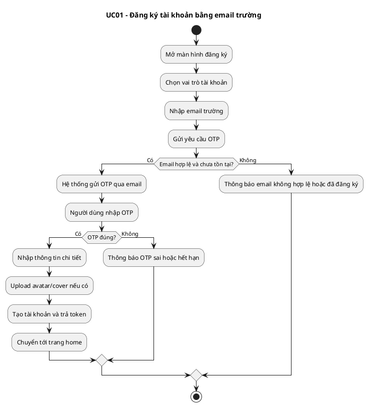
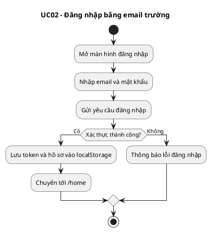
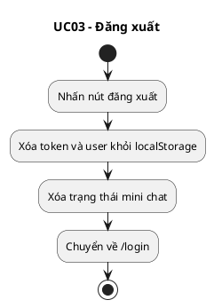
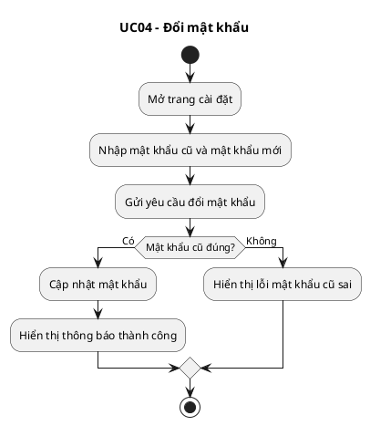
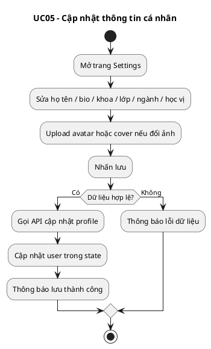
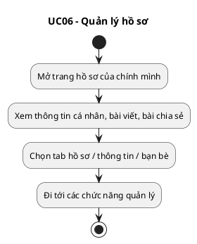
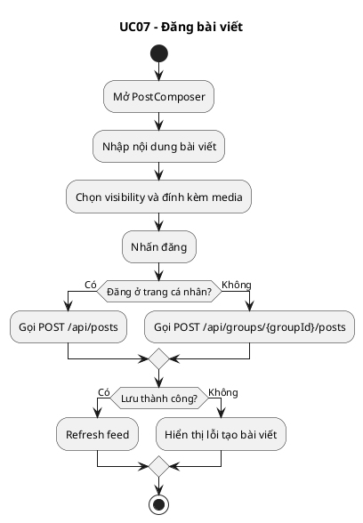
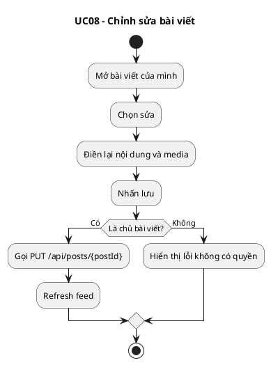
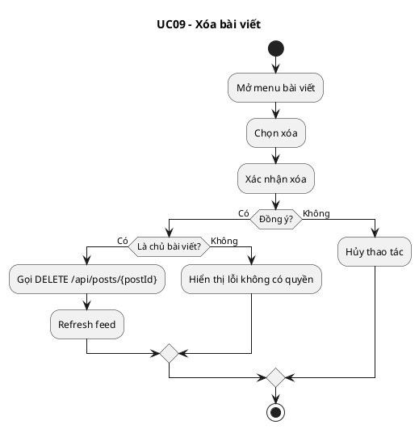
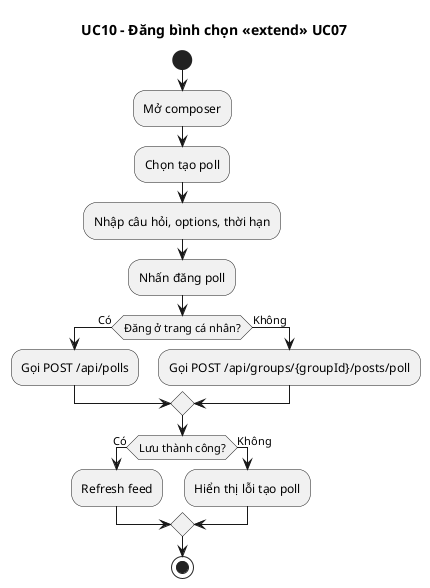

# Activity Diagrams - Use Case 01-10

## UC01 - Đăng ký tài khoản bằng email trường

## UC02 - Đăng nhập bằng email trường

## UC03 - Đăng xuất

## UC04 - Đổi mật khẩu

## UC05 - Cập nhật thông tin cá nhân

## UC06 - Quản lý hồ sơ

## UC07 - Đăng bài viết

## UC08 - Chỉnh sửa bài viết

## UC09 - Xóa bài viết

## UC10 - Đăng bình chọn <<extend>> UC07

