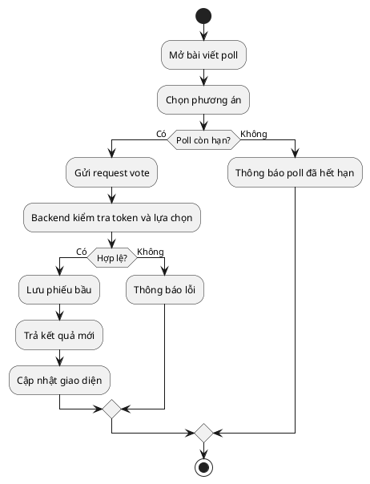
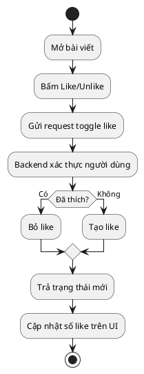
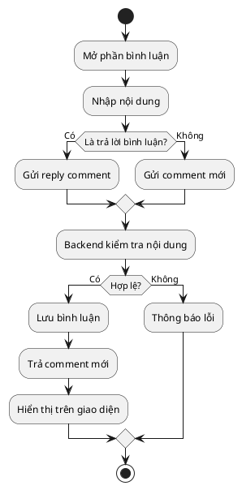
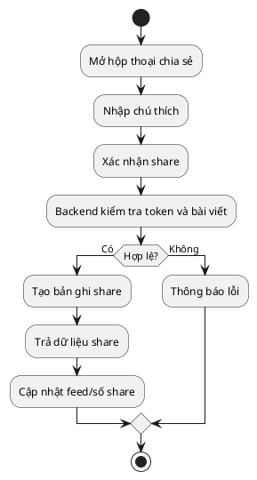
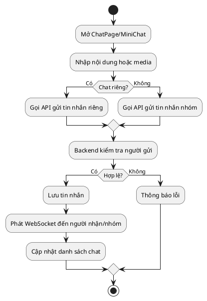
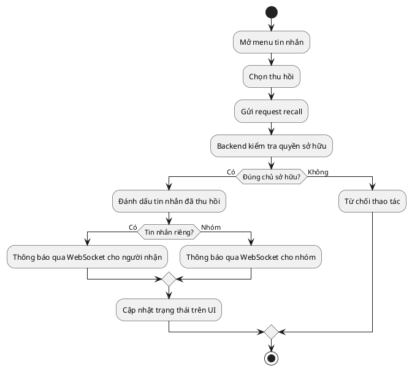
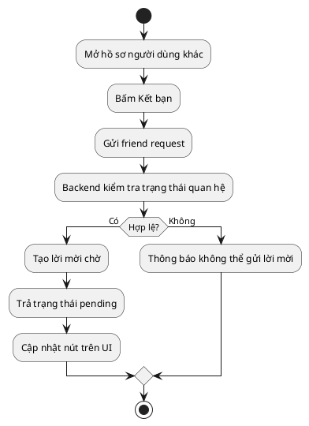
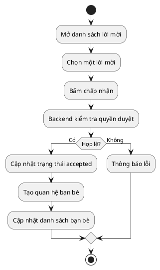
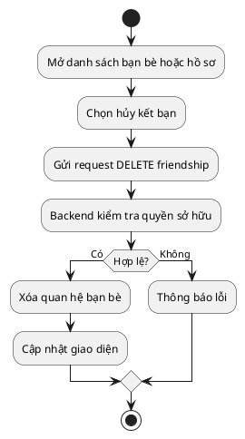
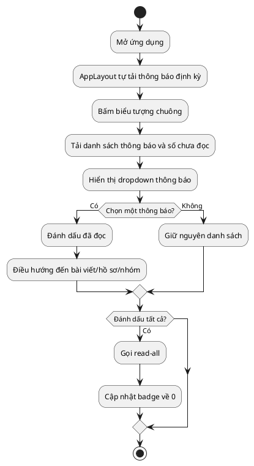

# Activity Diagram - Use Case 11-20

## UC11 - Bình chọn trong bài khảo sát

## UC12 - Thích bài viết

## UC13 - Bình luận bài viết

## UC14 - Chia sẻ bài viết

## UC15 - Gửi tin nhắn

## UC16 - Thu hồi tin nhắn

## UC17 - Gửi lời mời kết bạn

## UC18 - Chấp nhận kết bạn

## UC19 - Hủy kết bạn

## UC20 - Xem thông báo

