# Activity Diagram - Use Case 20-39

Các sơ đồ dưới đây mô tả luồng giao tiếp giữa người dùng và hệ thống (ứng dụng web). Chỉ giữ đúng các use case 20-39 trong danh sách.

## UC20 - Xem thông báo
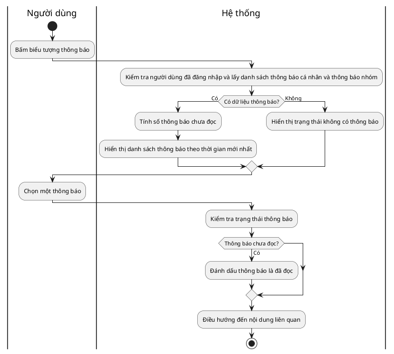
```plantuml
@startuml
|Người dùng|
start
:Bấm biểu tượng thông báo;
|Hệ thống|
:Kiểm tra người dùng đã đăng nhập và lấy danh sách thông báo cá nhân và thông báo nhóm;
if (Có dữ liệu thông báo?) then (Có)
  :Tính số thông báo chưa đọc;
  :Hiển thị danh sách thông báo theo thời gian mới nhất;
else (Không)
  :Hiển thị trạng thái không có thông báo;
endif
|Người dùng|
:Chọn một thông báo;
|Hệ thống|
:Kiểm tra trạng thái thông báo;
if (Thông báo chưa đọc?) then (Có)
  :Đánh dấu thông báo là đã đọc;
endif
:Điều hướng đến nội dung liên quan;
stop
@enduml
```

## UC21 - Tìm kiếm
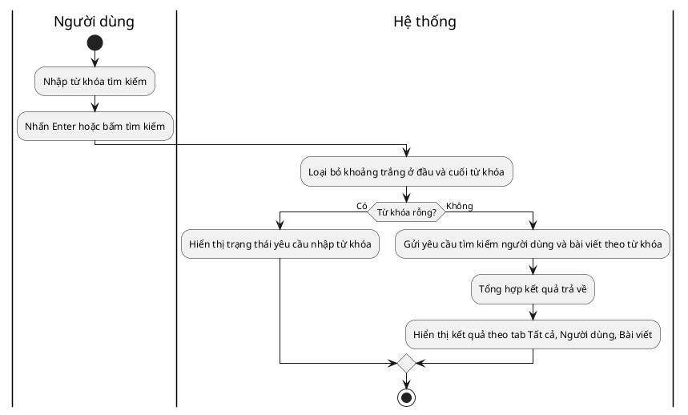
```plantuml
@startuml
|Người dùng|
start
:Nhập từ khóa tìm kiếm;
:Nhấn Enter hoặc bấm tìm kiếm;
|Hệ thống|
:Loại bỏ khoảng trắng ở đầu và cuối từ khóa;
if (Từ khóa rỗng?) then (Có)
  :Hiển thị trạng thái yêu cầu nhập từ khóa;
else (Không)
  :Gửi yêu cầu tìm kiếm người dùng và bài viết theo từ khóa;
  :Tổng hợp kết quả trả về;
  :Hiển thị kết quả theo tab Tất cả, Người dùng, Bài viết;
endif
stop
@enduml
```

## UC22 - Tạo nhóm
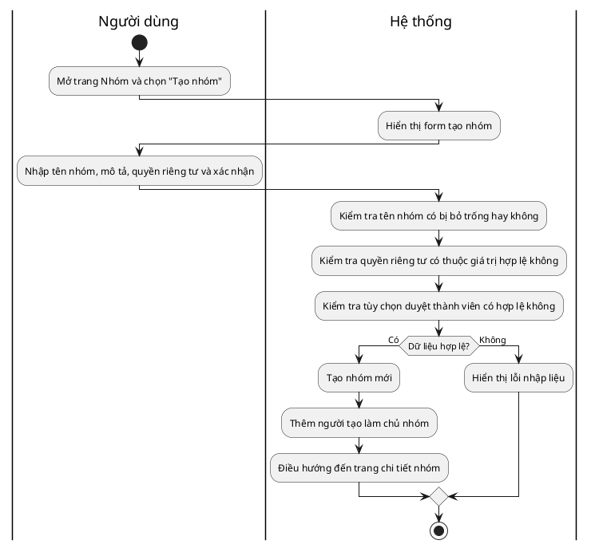
```plantuml
@startuml
|Người dùng|
start
:Mở trang Nhóm và chọn "Tạo nhóm";
|Hệ thống|
:Hiển thị form tạo nhóm;
|Người dùng|
:Nhập tên nhóm, mô tả, quyền riêng tư và xác nhận;
|Hệ thống|
:Kiểm tra tên nhóm có bị bỏ trống hay không;
:Kiểm tra quyền riêng tư có thuộc giá trị hợp lệ không;
:Kiểm tra tùy chọn duyệt thành viên có hợp lệ không;
if (Dữ liệu hợp lệ?) then (Có)
  :Tạo nhóm mới;
  :Thêm người tạo làm chủ nhóm;
  :Điều hướng đến trang chi tiết nhóm;
else (Không)
  :Hiển thị lỗi nhập liệu;
endif
stop
@enduml
```

## UC23 - Xin vào nhóm
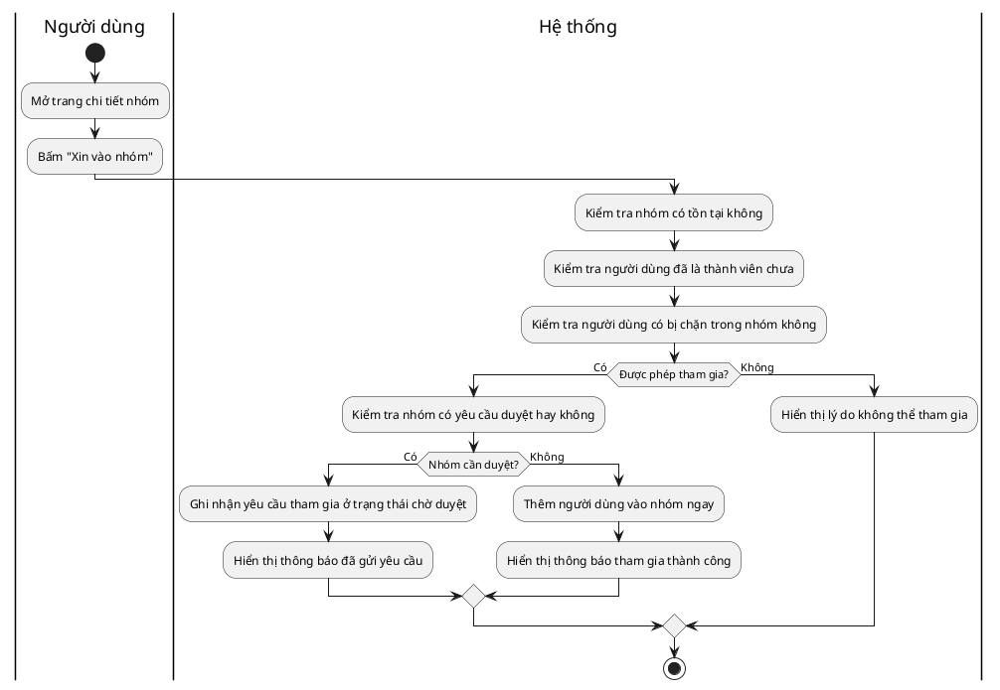
```plantuml
@startuml
|Người dùng|
start
:Mở trang chi tiết nhóm;
:Bấm "Xin vào nhóm";
|Hệ thống|
:Kiểm tra nhóm có tồn tại không;
:Kiểm tra người dùng đã là thành viên chưa;
:Kiểm tra người dùng có bị chặn trong nhóm không;
if (Được phép tham gia?) then (Có)
  :Kiểm tra nhóm có yêu cầu duyệt hay không;
  if (Nhóm cần duyệt?) then (Có)
    :Ghi nhận yêu cầu tham gia ở trạng thái chờ duyệt;
    :Hiển thị thông báo đã gửi yêu cầu;
  else (Không)
    :Thêm người dùng vào nhóm ngay;
    :Hiển thị thông báo tham gia thành công;
  endif
else (Không)
  :Hiển thị lý do không thể tham gia;
endif
stop
@enduml
```

## UC24 - Xóa nhóm
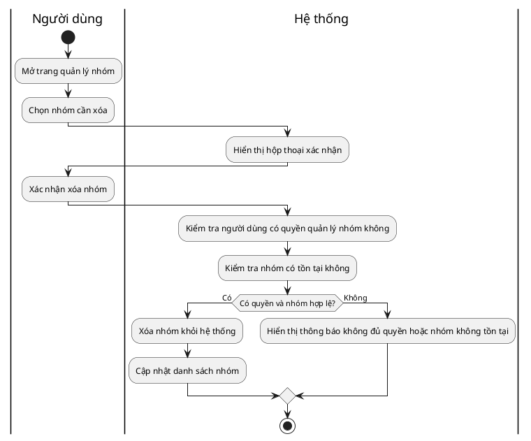
```plantuml
@startuml
|Người dùng|
start
:Mở trang quản lý nhóm;
:Chọn nhóm cần xóa;
|Hệ thống|
:Hiển thị hộp thoại xác nhận;
|Người dùng|
:Xác nhận xóa nhóm;
|Hệ thống|
:Kiểm tra người dùng có quyền quản lý nhóm không;
:Kiểm tra nhóm có tồn tại không;
if (Có quyền và nhóm hợp lệ?) then (Có)
  :Xóa nhóm khỏi hệ thống;
  :Cập nhật danh sách nhóm;
else (Không)
  :Hiển thị thông báo không đủ quyền hoặc nhóm không tồn tại;
endif
stop
@enduml
```

## UC25 - Rời nhóm
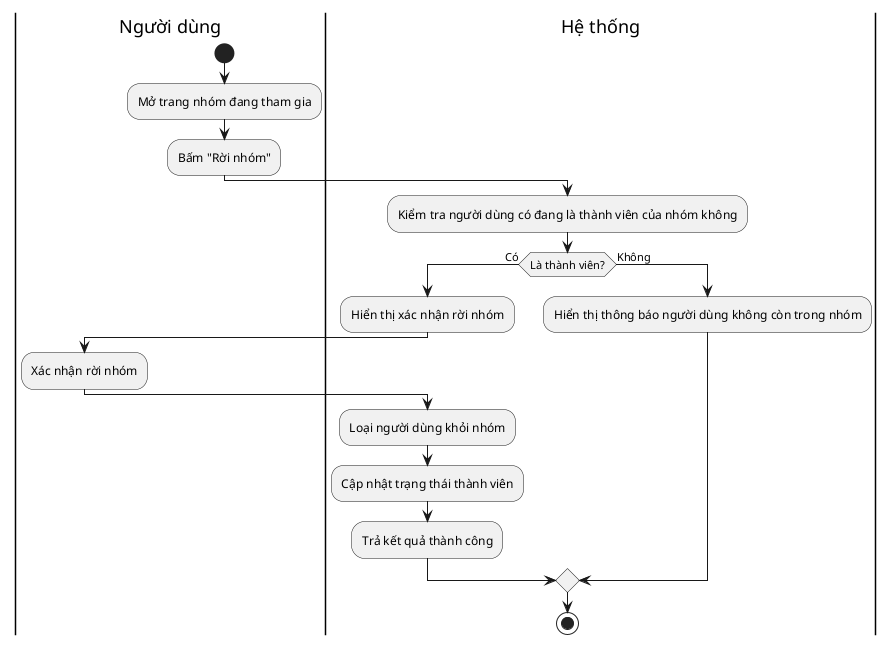
```plantuml
@startuml
|Người dùng|
start
:Mở trang nhóm đang tham gia;
:Bấm "Rời nhóm";
|Hệ thống|
:Kiểm tra người dùng có đang là thành viên của nhóm không;
if (Là thành viên?) then (Có)
  :Hiển thị xác nhận rời nhóm;
  |Người dùng|
  :Xác nhận rời nhóm;
  |Hệ thống|
  :Loại người dùng khỏi nhóm;
  :Cập nhật trạng thái thành viên;
  :Trả kết quả thành công;
else (Không)
  :Hiển thị thông báo người dùng không còn trong nhóm;
endif
stop
@enduml
```

## UC26 - Phê duyệt thành viên
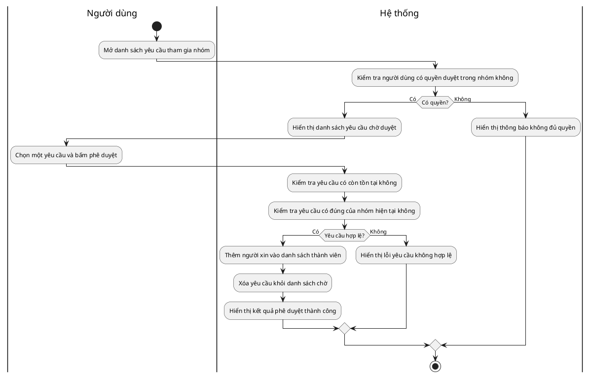
```plantuml
@startuml
|Người dùng|
start
:Mở danh sách yêu cầu tham gia nhóm;
|Hệ thống|
:Kiểm tra người dùng có quyền duyệt trong nhóm không;
if (Có quyền?) then (Có)
  :Hiển thị danh sách yêu cầu chờ duyệt;
  |Người dùng|
  :Chọn một yêu cầu và bấm phê duyệt;
  |Hệ thống|
  :Kiểm tra yêu cầu có còn tồn tại không;
  :Kiểm tra yêu cầu có đúng của nhóm hiện tại không;
  if (Yêu cầu hợp lệ?) then (Có)
    :Thêm người xin vào danh sách thành viên;
    :Xóa yêu cầu khỏi danh sách chờ;
    :Hiển thị kết quả phê duyệt thành công;
  else (Không)
    :Hiển thị lỗi yêu cầu không hợp lệ;
  endif
else (Không)
  :Hiển thị thông báo không đủ quyền;
endif
stop
@enduml
```

## UC27 - Xóa thành viên trong nhóm
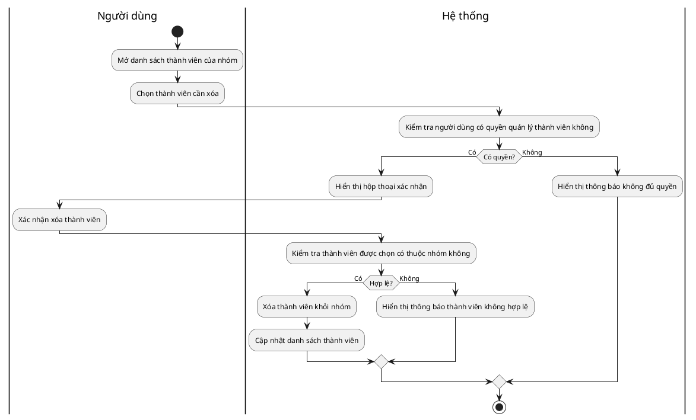
```plantuml
@startuml
|Người dùng|
start
:Mở danh sách thành viên của nhóm;
:Chọn thành viên cần xóa;
|Hệ thống|
:Kiểm tra người dùng có quyền quản lý thành viên không;
if (Có quyền?) then (Có)
  :Hiển thị hộp thoại xác nhận;
  |Người dùng|
  :Xác nhận xóa thành viên;
  |Hệ thống|
  :Kiểm tra thành viên được chọn có thuộc nhóm không;
  if (Hợp lệ?) then (Có)
    :Xóa thành viên khỏi nhóm;
    :Cập nhật danh sách thành viên;
  else (Không)
    :Hiển thị thông báo thành viên không hợp lệ;
  endif
else (Không)
  :Hiển thị thông báo không đủ quyền;
endif
stop
@enduml
```

## UC28 - Báo cáo người dùng
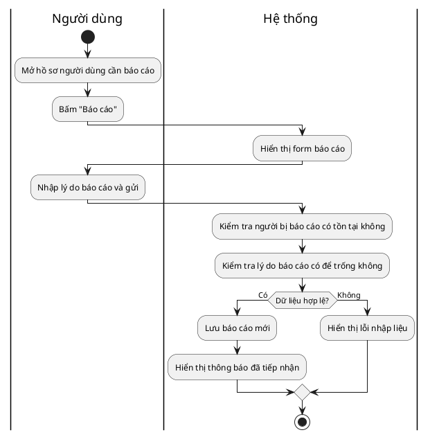
```plantuml
@startuml
|Người dùng|
start
:Mở hồ sơ người dùng cần báo cáo;
:Bấm "Báo cáo";
|Hệ thống|
:Hiển thị form báo cáo;
|Người dùng|
:Nhập lý do báo cáo và gửi;
|Hệ thống|
:Kiểm tra người bị báo cáo có tồn tại không;
:Kiểm tra lý do báo cáo có để trống không;
if (Dữ liệu hợp lệ?) then (Có)
  :Lưu báo cáo mới;
  :Hiển thị thông báo đã tiếp nhận;
else (Không)
  :Hiển thị lỗi nhập liệu;
endif
stop
@enduml
```

## UC29 - Báo cáo bài viết
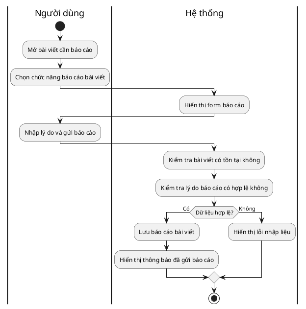
```plantuml
@startuml
|Người dùng|
start
:Mở bài viết cần báo cáo;
:Chọn chức năng báo cáo bài viết;
|Hệ thống|
:Hiển thị form báo cáo;
|Người dùng|
:Nhập lý do và gửi báo cáo;
|Hệ thống|
:Kiểm tra bài viết có tồn tại không;
:Kiểm tra lý do báo cáo có hợp lệ không;
if (Dữ liệu hợp lệ?) then (Có)
  :Lưu báo cáo bài viết;
  :Hiển thị thông báo đã gửi báo cáo;
else (Không)
  :Hiển thị lỗi nhập liệu;
endif
stop
@enduml
```

## UC30 - Thêm sinh viên vào nhóm bằng file Excel
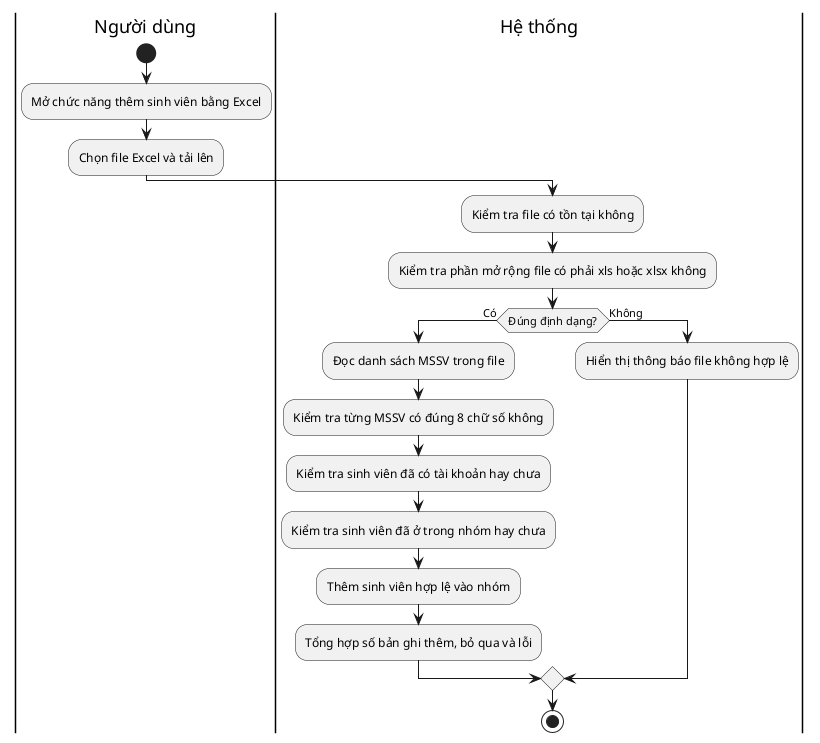
```plantuml
@startuml
|Người dùng|
start
:Mở chức năng thêm sinh viên bằng Excel;
:Chọn file Excel và tải lên;
|Hệ thống|
:Kiểm tra file có tồn tại không;
:Kiểm tra phần mở rộng file có phải xls hoặc xlsx không;
if (Đúng định dạng?) then (Có)
  :Đọc danh sách MSSV trong file;
  :Kiểm tra từng MSSV có đúng 8 chữ số không;
  :Kiểm tra sinh viên đã có tài khoản hay chưa;
  :Kiểm tra sinh viên đã ở trong nhóm hay chưa;
  :Thêm sinh viên hợp lệ vào nhóm;
  :Tổng hợp số bản ghi thêm, bỏ qua và lỗi;
else (Không)
  :Hiển thị thông báo file không hợp lệ;
endif
stop
@enduml
```

## UC31 - Thêm cố vấn học tập vào nhóm
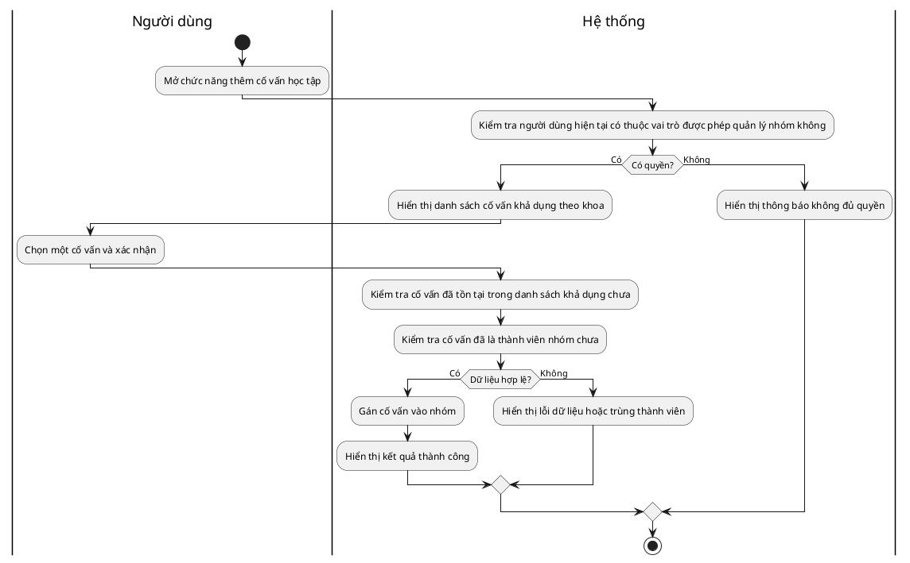
```plantuml
@startuml
|Người dùng|
start
:Mở chức năng thêm cố vấn học tập;
|Hệ thống|
:Kiểm tra người dùng hiện tại có thuộc vai trò được phép quản lý nhóm không;
if (Có quyền?) then (Có)
  :Hiển thị danh sách cố vấn khả dụng theo khoa;
  |Người dùng|
  :Chọn một cố vấn và xác nhận;
  |Hệ thống|
  :Kiểm tra cố vấn đã tồn tại trong danh sách khả dụng chưa;
  :Kiểm tra cố vấn đã là thành viên nhóm chưa;
  if (Dữ liệu hợp lệ?) then (Có)
    :Gán cố vấn vào nhóm;
    :Hiển thị kết quả thành công;
  else (Không)
    :Hiển thị lỗi dữ liệu hoặc trùng thành viên;
  endif
else (Không)
  :Hiển thị thông báo không đủ quyền;
endif
stop
@enduml
```

## UC32 - Tạo nhóm bằng file Excel
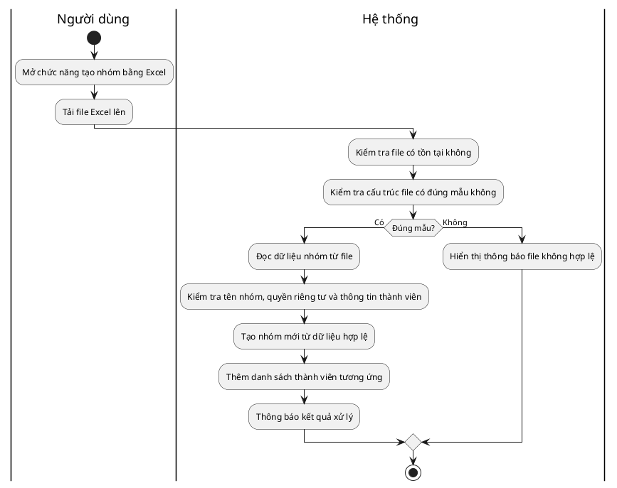
```plantuml
@startuml
|Người dùng|
start
:Mở chức năng tạo nhóm bằng Excel;
:Tải file Excel lên;
|Hệ thống|
:Kiểm tra file có tồn tại không;
:Kiểm tra cấu trúc file có đúng mẫu không;
if (Đúng mẫu?) then (Có)
  :Đọc dữ liệu nhóm từ file;
  :Kiểm tra tên nhóm, quyền riêng tư và thông tin thành viên;
  :Tạo nhóm mới từ dữ liệu hợp lệ;
  :Thêm danh sách thành viên tương ứng;
  :Thông báo kết quả xử lý;
else (Không)
  :Hiển thị thông báo file không hợp lệ;
endif
stop
@enduml
```

## UC33 - Gửi thông báo đến các nhóm
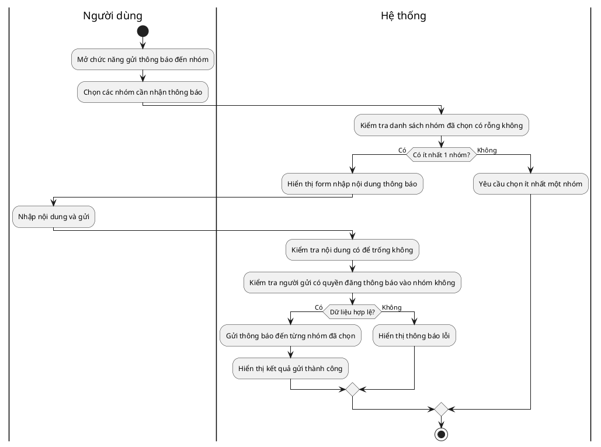
```plantuml
@startuml
|Người dùng|
start
:Mở chức năng gửi thông báo đến nhóm;
:Chọn các nhóm cần nhận thông báo;
|Hệ thống|
:Kiểm tra danh sách nhóm đã chọn có rỗng không;
if (Có ít nhất 1 nhóm?) then (Có)
  :Hiển thị form nhập nội dung thông báo;
  |Người dùng|
  :Nhập nội dung và gửi;
  |Hệ thống|
  :Kiểm tra nội dung có để trống không;
  :Kiểm tra người gửi có quyền đăng thông báo vào nhóm không;
  if (Dữ liệu hợp lệ?) then (Có)
    :Gửi thông báo đến từng nhóm đã chọn;
    :Hiển thị kết quả gửi thành công;
  else (Không)
    :Hiển thị thông báo lỗi;
  endif
else (Không)
  :Yêu cầu chọn ít nhất một nhóm;
endif
stop
@enduml
```

## UC34 - Gửi thông báo cho các đoàn khoa
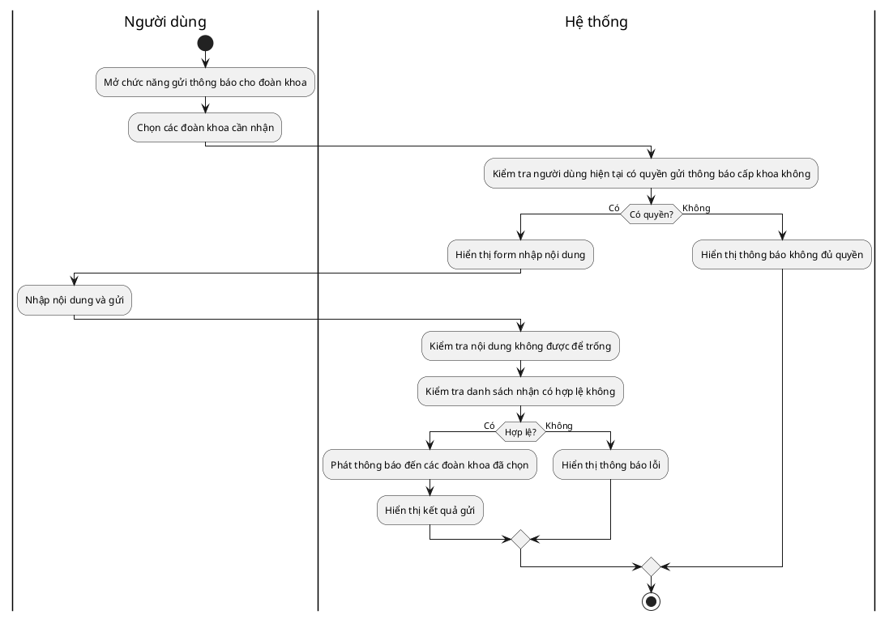
```plantuml
@startuml
|Người dùng|
start
:Mở chức năng gửi thông báo cho đoàn khoa;
:Chọn các đoàn khoa cần nhận;
|Hệ thống|
:Kiểm tra người dùng hiện tại có quyền gửi thông báo cấp khoa không;
if (Có quyền?) then (Có)
  :Hiển thị form nhập nội dung;
  |Người dùng|
  :Nhập nội dung và gửi;
  |Hệ thống|
  :Kiểm tra nội dung không được để trống;
  :Kiểm tra danh sách nhận có hợp lệ không;
  if (Hợp lệ?) then (Có)
    :Phát thông báo đến các đoàn khoa đã chọn;
    :Hiển thị kết quả gửi;
  else (Không)
    :Hiển thị thông báo lỗi;
  endif
else (Không)
  :Hiển thị thông báo không đủ quyền;
endif
stop
@enduml
```

## UC35 - Phê duyệt báo cáo người dùng
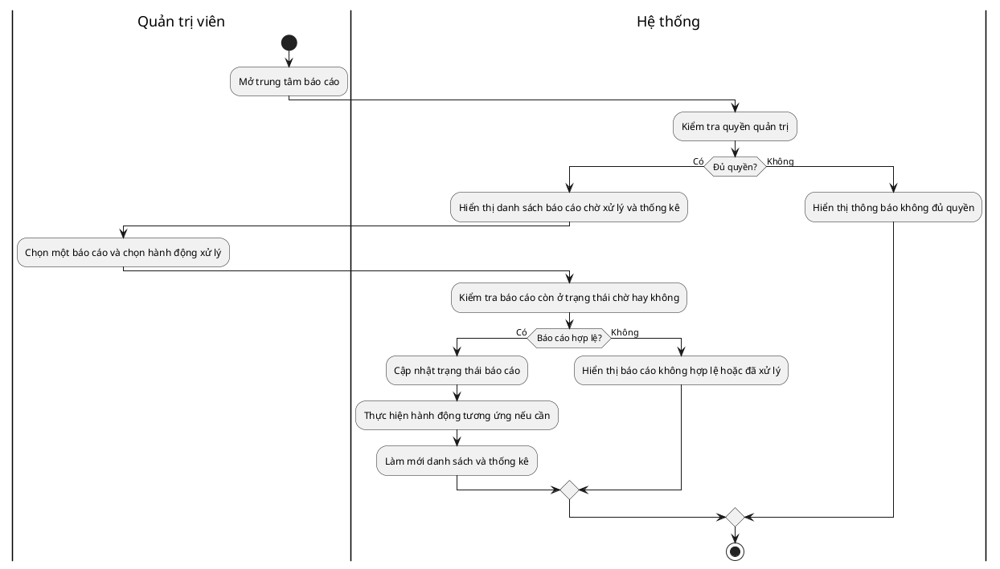
```plantuml
@startuml
|Quản trị viên|
start
:Mở trung tâm báo cáo;
|Hệ thống|
:Kiểm tra quyền quản trị;
if (Đủ quyền?) then (Có)
  :Hiển thị danh sách báo cáo chờ xử lý và thống kê;
  |Quản trị viên|
  :Chọn một báo cáo và chọn hành động xử lý;
  |Hệ thống|
  :Kiểm tra báo cáo còn ở trạng thái chờ hay không;
  if (Báo cáo hợp lệ?) then (Có)
    :Cập nhật trạng thái báo cáo;
    :Thực hiện hành động tương ứng nếu cần;
    :Làm mới danh sách và thống kê;
  else (Không)
    :Hiển thị báo cáo không hợp lệ hoặc đã xử lý;
  endif
else (Không)
  :Hiển thị thông báo không đủ quyền;
endif
stop
@enduml
```

## UC36 - Xem danh sách bài viết
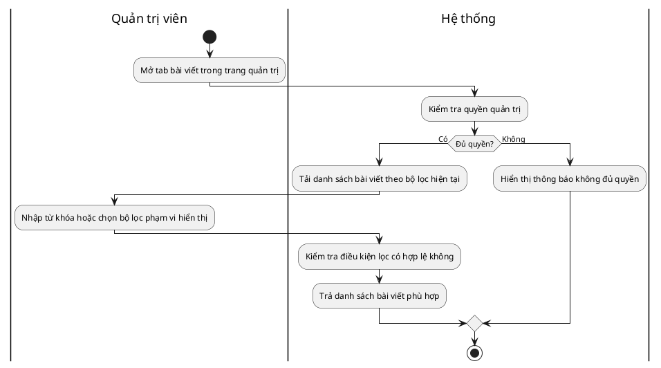
```plantuml
@startuml
|Quản trị viên|
start
:Mở tab bài viết trong trang quản trị;
|Hệ thống|
:Kiểm tra quyền quản trị;
if (Đủ quyền?) then (Có)
  :Tải danh sách bài viết theo bộ lọc hiện tại;
  |Quản trị viên|
  :Nhập từ khóa hoặc chọn bộ lọc phạm vi hiển thị;
  |Hệ thống|
  :Kiểm tra điều kiện lọc có hợp lệ không;
  :Trả danh sách bài viết phù hợp;
else (Không)
  :Hiển thị thông báo không đủ quyền;
endif
stop
@enduml
```

## UC37 - Xóa bài viết
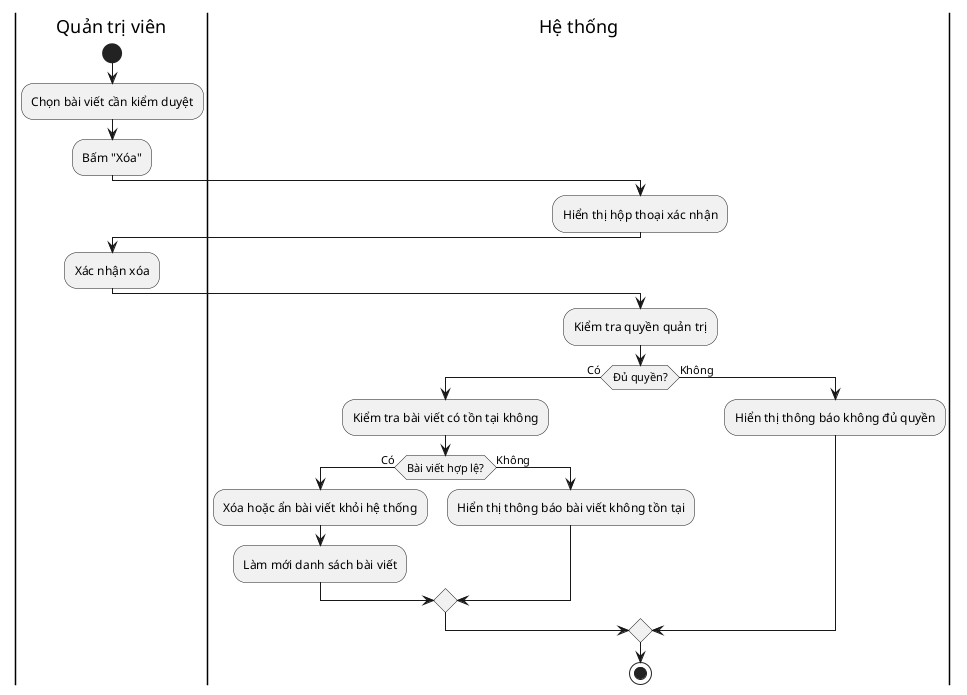
```plantuml
@startuml
|Quản trị viên|
start
:Chọn bài viết cần kiểm duyệt;
:Bấm "Xóa";
|Hệ thống|
:Hiển thị hộp thoại xác nhận;
|Quản trị viên|
:Xác nhận xóa;
|Hệ thống|
:Kiểm tra quyền quản trị;
if (Đủ quyền?) then (Có)
  :Kiểm tra bài viết có tồn tại không;
  if (Bài viết hợp lệ?) then (Có)
    :Xóa hoặc ẩn bài viết khỏi hệ thống;
    :Làm mới danh sách bài viết;
  else (Không)
    :Hiển thị thông báo bài viết không tồn tại;
  endif
else (Không)
  :Hiển thị thông báo không đủ quyền;
endif
stop
@enduml
```

## UC38 - Xem danh sách người dùng
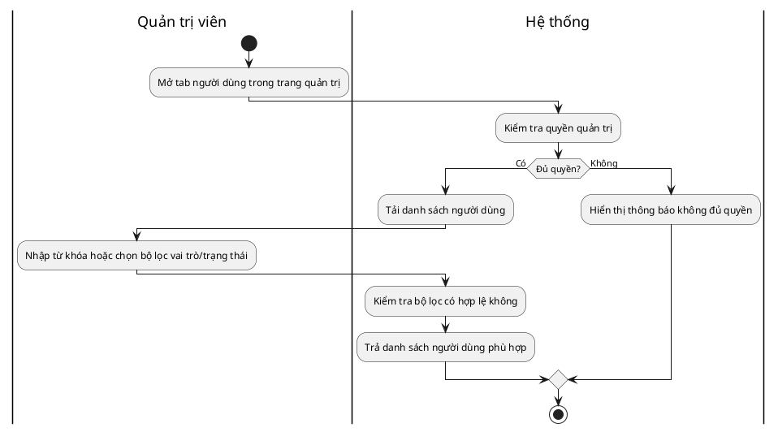
```plantuml
@startuml
|Quản trị viên|
start
:Mở tab người dùng trong trang quản trị;
|Hệ thống|
:Kiểm tra quyền quản trị;
if (Đủ quyền?) then (Có)
  :Tải danh sách người dùng;
  |Quản trị viên|
  :Nhập từ khóa hoặc chọn bộ lọc vai trò/trạng thái;
  |Hệ thống|
  :Kiểm tra bộ lọc có hợp lệ không;
  :Trả danh sách người dùng phù hợp;
else (Không)
  :Hiển thị thông báo không đủ quyền;
endif
stop
@enduml
```

## UC39 - Xóa người dùng
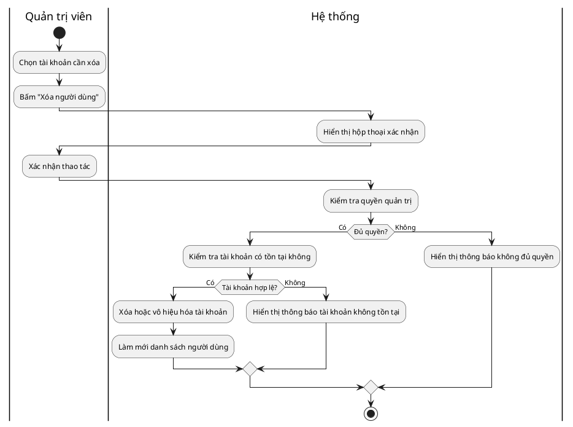
```plantuml
@startuml
|Quản trị viên|
start
:Chọn tài khoản cần xóa;
:Bấm "Xóa người dùng";
|Hệ thống|
:Hiển thị hộp thoại xác nhận;
|Quản trị viên|
:Xác nhận thao tác;
|Hệ thống|
:Kiểm tra quyền quản trị;
if (Đủ quyền?) then (Có)
  :Kiểm tra tài khoản có tồn tại không;
  if (Tài khoản hợp lệ?) then (Có)
    :Xóa hoặc vô hiệu hóa tài khoản;
    :Làm mới danh sách người dùng;
  else (Không)
    :Hiển thị thông báo tài khoản không tồn tại;
  endif
else (Không)
  :Hiển thị thông báo không đủ quyền;
endif
stop
@enduml
```
